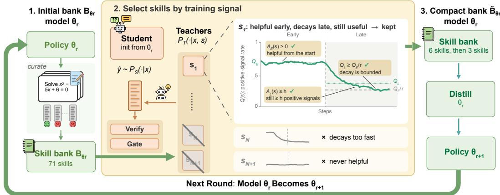
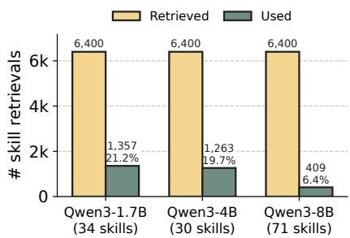
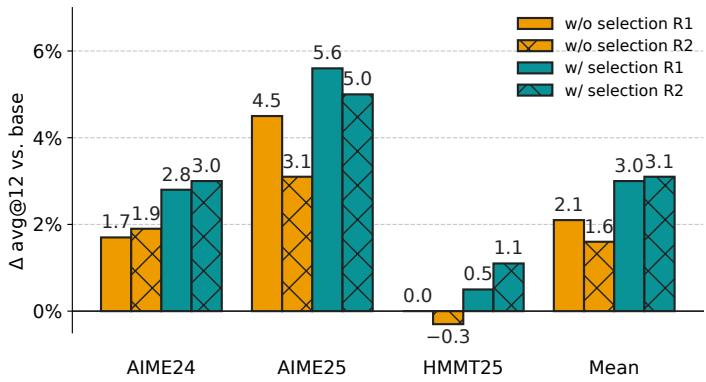

# WHICH SKILL TO DISTILL? SGUID : SELECTING A COMPACT SKILL BANK FOR MODEL–SKILL CO-EVOLUTION

Yuhan Liu1, Xiyao Ma2, Zhongkai Sun2, Xu Han2, Chengyuan Ma2, Benjamin Z. Yao2, Chenlei Guo2

New York University1, Amazon2

yl13579@nyu.edu

## ABSTRACT

Skills, reusable procedural guidance added at inference, can substantially improve LLM downstream performance (Li et al., 2026). Prior work retrieves skills from a bank by semantic relevance, then uses them as inference-time patches or for model distillation. The individual utility of each skill, however, is largely neglected. We first show that, in on-policy distillation where skill-conditioned policies serve as teachers, fewer than 25% of retrieved skills provide useful distillation signals. We then propose SGUID, a method for selecting a compact subset of skills for distillation. SGUID retains a skill only if it consistently yields effective learning signals during training. The selected skills are then distilled to produce a better model. Our results show that not all skills are worth distilling. Across four models from the Olmo and Qwen families, distilling 6 selected skills matches or exceeds full-bank distillation in mean avg@12 on three of the four models, and on all four after a second round that distills 3 newly selected skills, while the full banks are up to 11× larger. Importantly, SGUID supports stable model–skill co-evolution: after a distillation round, a new candidate bank is curated from the updated model’s rollouts, and SGUID selects which skills to internalize next. In the second round, this loop selects 3 new skills and improves Qwen3-8B from 64.3% to 66.3%. The selection step is essential for stability: on Qwen3-4B, naively updating the model with unfiltered skills degrades performance, including a 0.3 percentage point drop on HMMT25, whereas SGUID improves HMMT25 by 0.5 points after the first round and 1.1 points after the second. These results identify skill selection as the key mechanism for stable model–skill co-evolution.1

## 1 INTRODUCTION

LLMs have demonstrated strong potential to advance challenging real-world domains, varying among reasoning (Liu et al., 2024; Georgiev et al., 2025; Balunovic et al., 2026; Dekoninck et al., 2026; Labiad et al., 2026), coding (Jimenez et al., 2024; Yang et al., 2024; Merrill et al., 2026; Ivison et al., 2026; Yang et al., 2026a), and multi-turn interactions (Barres et al., 2025; Lyu et al., 2026), and more (Phan et al., 2025; Shao et al., 2025). Skills, reusable pieces of knowledge, serve as an intermediate layer between LLMs and downstream tasks. They assist the LLMs by augmenting the prompt with cognitive shortcuts (Didolkar et al., 2025), task procedures, common mistake patterns, or structured packages of code and resources (Anthropic, 2026; Li et al., 2026; Shi et al., 2026). Such task-specific knowledge can be curated from human expertise, the model’s own successes and failures, or a mixture of both (Ni et al., 2026; Yang et al., 2026b; Tang et al., 2026), and can be retrieved on request by task relevance (Li et al., 2025; Xia et al., 2026). Skills are shown to be powerful tools that complement model strengths, bridging general-purpose capabilities and downstream expertise (Li et al., 2026; Xie et al., 2026; Didolkar et al., 2025; Ouyang et al., 2026; Xia et al., 2026; Ni et al., 2026; Yang et al., 2026b).

Though skills patch model behavior, the improvements are often averaged over a bank of skills. Yet the individual utility is largely understudied. It is unclear if such gains are driven by all skills or only a fraction of them. In SWE tasks, for example, Han et al. (2026) find that only 7 out of 49 coding skills yield meaningful improvements, while many others have little effect or even degrade performance. This raises two coupled challenges for jointly improving the models and skill banks: how to develop and select non-trivial skills that enter the bank, and how to internalize skill-induced capabilities into the model.

Prior work addresses parts of this picture. Systems that maintain a skill bank select rather than accumulate, keeping only the skills whose usefulness is validated rather than assumed from relevance (Fu et al., 2026; Shi et al., 2026). Meanwhile, on-policy self-distillation has been used to internalize skill-induced behavior into model weights, producing stronger LLMs that no longer require skill patches at inference (Huang et al., 2026a; Wang et al., 2026a). However, it remains open how to identify the skills that are worth distilling, and whether internalizing those can support stable model–skill co-evolution.

To this end, we study skill selection and co-evolution via on-policy self-distillation, where skills serve as privileged context for teacher policies. We first find that across three Qwen models of varying sizes, fewer than 25% of skills provide active learning signals. This suggests that most retrieved skills are not effective teachers for the current student. We then propose SGUID (skill Selection GUIded by training Dynamics), a method that builds a compact skill bank by observing the training dynamics throughout the distillation. In detail, SGUID takes on one distillation run with the whole skill bank, keeping the retrieved skill that produces a consistent and verifier-aligned distillation signal from early to late training. Those skills then form the compact bank used to update the student policy later. The updated model in turn samples rollouts from which a new candidate bank is curated. This whole procedure allows the skill bank and the model to evolve together.

We evaluate SGUID on four models (Olmo-3-7B, Qwen3-1.7B, Qwen3-4B, and Qwen3-8B), with AIME24, AIME25, and HMMT25 benchmarks. SGUID distills only 6 skills, yet matches or exceeds full-bank distillation in mean avg@12 on three of the four models, while the full banks are up to 11× larger. On Qwen3-4B, using SGUID instead of full-bank distillation improves performance from 64.2% to 65.1%. Using SGUID to distill 3 skills for a second round yields further gains: Qwen3-8B’s performance rises from 64.3% to 66.3%. Ablations further show that the improvements come from selecting useful and persistent skills rather than merely compressing the bank. Moreover, SGUID is robust to the number of selected skills: compact banks with 4–12 skills remain competitive with, and sometimes outperform, the full bank. We also discuss whether SGUID can be applied over an early training window instead of a full run, which lowers the cost of skill selection.

## Our contributions are summarized as follows:

• We propose SGUID, a training-dynamics-based method for selecting compact skill banks for on-policy self-distillation. With only 6 skills, SGUID matches or exceeds full-bank distillation in mean avg@12 on three of the four models, while the full banks are up to 11× larger.

• We show that selected skills enable model–skill co-evolution. Using SGUID for a second round improves Qwen3-8B mean avg@12 from 64.3% to 66.3%, while co-evolution without skill selection hurts HMMT25 performance.

• We validate the selection signal through ablations on bank size, skill ranking, and the training-dynamics window. Compact banks with 4–12 skills remain competitive, topranked skills by our selection signals are most reliable, and training statistics from a 25- step run provide a promising but scale-dependent proxy for standard skill selection with SGUID.

## 2 BACKGROUND

## 2.1 PROBLEM SETTING

We study skill-guided self-distillation for verifiable tasks. Suppose we have a problem x and a reference solution y⋆. A language model with parameters θ defines an autoregressive policy pθ(y |

$\begin{array} { r } { x ) = \prod _ { n = 1 } ^ { | y | } p _ { \theta } ( y _ { n } \mid x , y _ { < n } ) } \end{array}$ . A skill bank $B _ { \theta }$ can be curated from the current policy $\theta ^ { * } \mathrm { s }$ rollouts, verified by the provided ground truth $y ^ { \star }$ . Informally, for ${ \hat { y } } \sim p _ { \theta } ( \cdot \mid x )$ ,

$$
B _ { \theta } = \operatorname { C u r a t e } ( \{ ( x , y ^ { \star } , \hat { y } ) : \hat { y } \sim p _ { \theta } ( \cdot \mid x ) \} ) .\tag{1}
$$

Each skill $s \in B _ { \theta }$ is a compact natural-language procedure, heuristic, or failure-mode description. Skills from the bank are retrieved to serve as training-time context for the teacher (Huang et al., 2026a; Wang et al., 2026a), or as inference-time patches (Yang et al., 2026b; Ni et al., 2026).

## 2.2 ON-POLICY SELF-DISTILLATION

On-Policy Self-Distillation (OPSD) turns privileged information into a dense training signal (Zhao et al., 2026; Hubotter et al., 2026). Given¨ $( x , y ^ { \star } )$ , the teacher $P _ { T } ,$ , initialized from $\theta ,$ additionally conditions on $y ^ { \star }$ , to judge the student $P _ { S }$ . This is calculated over responses sampled from the student $\hat { y } = ( \hat { y } _ { 1 } , \dots , \hat { y } _ { | \hat { y } | } ) \sim P s ( \cdot \mid x )$ . Teacher and student therefore share same parameters and differ only in what they condition on. The relation holds at initialization; during training the teacher is either frozen at that copy or kept synchronized with the student, and we report which choice each method uses in Table 5.

$$
\begin{array} { c } { { P _ { S } ( y _ { n } \mid x , \hat { y } _ { < n } ) = p _ { \theta } ( y _ { n } \mid x , \hat { y } _ { < n } ) , } } \\ { { P _ { T } ( y _ { n } \mid x , y ^ { \star } , \hat { y } _ { < n } ) = p _ { \theta } ( y _ { n } \mid x , y ^ { \star } , \hat { y } _ { < n } ) . } } \end{array}\tag{2}
$$

OPSD then minimizes the average next-token divergence (e.g., KL) between these two distributions over positions:

$$
\mathcal { L } _ { \mathrm { O P S D } } ( \boldsymbol { \theta } ) = \mathbb { E } _ { ( \boldsymbol { x } , \boldsymbol { y } ^ { \star } ) } \mathbb { E } _ { \hat { \boldsymbol { y } } \sim P _ { S } ( \cdot \vert \boldsymbol { x } ) } \left[ D ( P _ { T } \Vert P _ { S } ) ( \hat { \boldsymbol { y } } \mid \boldsymbol { x } , \boldsymbol { y } ^ { \star } ) \right] .\tag{3}
$$

The divergence $D$ can be further written in terms of the teacher–student log-probability gap. For a vocabulary token $v ,$ let

$$
\Delta _ { T , S } ( v ; x , y ^ { \star } , \hat { y } _ { < n } ) : = \log P _ { T } ( v \mid x , y ^ { \star } , \hat { y } _ { < n } ) - \log P _ { S } ( v \mid x , \hat { y } _ { < n } ) .\tag{4}
$$

Then

$$
D ( P _ { T } \| P _ { S } ) ( \boldsymbol { \hat { y } } \mid \boldsymbol { x } , \boldsymbol { y } ^ { \star } ) = \frac { 1 } { | \boldsymbol { \hat { y } } | } \sum _ { n = 1 } ^ { | \boldsymbol { \hat { y } } | } \mathbb { E } _ { \boldsymbol { v } \sim \boldsymbol { q } _ { n } } \left[ \Delta _ { T , S } ( \boldsymbol { v } ; \boldsymbol { x } , \boldsymbol { y } ^ { \star } , \boldsymbol { \hat { y } } _ { < n } ) \right] ,\tag{5}
$$

where $q _ { n }$ is a distribution over tokens at position $n . ^ { ~ 2 }$

## 2.3 ON-POLICY SELF-DISTILLATION WITH SKILLS

Researchers find that skill-guided teachers $p _ { \theta } ( \cdot \mid x , s )$ provide better learning signals than answerguided ones $p _ { \theta } ( \cdot \mid x , y ^ { \star } )$ (Wang et al., 2026a; Huang et al., 2026a). Here, a skill s is retrieved based on the semantic distance between the problem x and skill descriptions.

Both policies score the student rollout. For each sampled token ${ \hat { y } } _ { n }$ , we can compute the teacher–student log-probability gap in equation 4, with the skill s instead of $y ^ { \star } \colon \Delta _ { n } ( s ; \hat { y } ) \ : =$ $\Delta _ { T , S } ( \hat { y } _ { n } ; x , s , \hat { y } _ { < n } )$ ). A positive gap means that the skill-conditioned teacher favors the sampled token more than the student. The plain support score

$$
a ( s , \hat { y } ) = \frac { 1 } { | \hat { y } | } \sum _ { n = 1 } ^ { | \hat { y } | } \Delta _ { n } ( s ; \hat { y } )\tag{6}
$$

summarizes the teacher’s stance on the rollout. In practice, SGSD (Huang et al., 2026a) uses a robust estimate $\tilde { a } ( s , \hat { y } )$ , obtained by masking irrelevant tokens and clipping extreme gaps before averaging.

The reference solution is used to verify the student’s rollout in order to reverse the sign of the teacher signal when it disagrees with the verifier. Let $r ( x , y ^ { \star } , \hat { y } ) = + 1$ if the verifier returns correct, and −1 otherwise. We write the resulting verifier-aligned teacher sign as Verify:

$$
\mathrm { V e r i f y } ( s , \hat { y } , y ^ { \star } ) = \mathrm { s i g n } ( r ( x , y ^ { \star } , \hat { y } ) \tilde { a } ( s , \hat { y } ) ) .\tag{7}
$$

  
Figure 1: Overview of SGUID at co-evolution round $r _ { \ast }$ (1) Curate: the current policy $\theta _ { r }$ rolls out on training problems, the rollouts are checked against the reference solutions $y ^ { \star }$ to curate a candidate skill bank $B _ { \theta _ { \tau } }$ (the bank size shown is that of Qwen3-8B). (2) Select skills by training signal: the student $P _ { S } ( \cdot \mid x )$ , initialized from $\theta _ { r } ,$ , generates a rollout yˆ that is scored by privileged teachers ${ P _ { T } ( \cdot \mid x , s _ { i } ) }$ , each conditioned on a retrieved skill $s _ { i }$ . Skills that contribute early, still produce at least $h$ positive events late, and whose contribution rate decreases by at most a factor of τ are kept; skills whose signal decays too fast, stays at zero, or that are never retrieved are discarded. (3) Internalize: restarting from $\theta _ { r } .$ , the compact bank $\widetilde { B } _ { \theta _ { \tau } }$ with $| \widetilde { B } _ { \theta _ { r } } | = K \ll | B _ { \theta _ { r } } |$ is distilled into the model, producing $\theta _ { r + 1 }$ , which becomes the policy for the next round.

A gate then filters out weak signals whose support-score magnitude $| \tilde { a } ( s , \hat { y } ) |$ is at most a confidence threshold $\kappa > 0$

$$
\mathrm { G a t e } _ { \kappa } ( \tilde { a } ( s , \hat { y } ) ) = \mathbf { 1 } [ | \tilde { a } ( s , \hat { y } ) | > \kappa ] ,\tag{8}
$$

Using the same teacher–student divergence D as in equation 3, now with the teacher conditioned on $s ,$ the single-skill form of the skill-guided self-distillation objective is

$$
\mathcal { L } _ { \mathrm { S G S D } } ( \theta ) = \mathbb { E } _ { ( x , y ^ { \star } ) } \mathbb { E } _ { \hat { y } \sim P _ { S } ( \cdot \vert x ) } \left[ \mathrm { V e r i f y } ( s , \hat { y } , y ^ { \star } ) \mathrm { G a t e } _ { \kappa } ( \tilde { a } ( s , \hat { y } ) ) D ( P _ { T } \| P _ { S } ) ( \hat { y } \mid x , s ) \right] .\tag{9}
$$

This formulation generalizes the original SGSD objective (Huang et al., 2026a), which uses a particular bounded teacher–student discrepancy.

## 3 METHOD

Figure 1 summarizes SGUID as a three-stage model–skill co-evolution loop. Given a policy $\theta _ { r }$ and its candidate skill bank $B _ { \theta _ { r } }$ , our method selects a compact subset $\smash { \widetilde { B } _ { \theta _ { r } } \subseteq B _ { \theta _ { r } } }$ , retaining skills that consistently provide verifier-aligned teacher signals across training. We then distill this compact bank to obtain an updated policy $\theta _ { r + 1 }$

Motivation Retrieval surfaces potentially relevant skills, but it does not guarantee an active learning signal on a student rollout. Figure 2 shows that, among 6,400 logged retrievals per model, only 21.2% for Qwen3- 1.7B, 19.7% for Qwen3-4B, and 6.4% for Qwen3-8B are actually used for distillation, while the rest are zeroed out by the gate. This motivates us to ask whether a compact bank suffices, including only persistently active skills. We hypothesize that persistently useful skills should be identified using both semantic relevance and the model’s own training dynamics.

Skill Selection To identify skills that provide useful and persistent signals, we collect statistics during a training run with the full candidate skill bank $B _ { \theta _ { \tau } }$ of the current policy $\theta _ { r }$ . Let $\mathcal { X } = \{ ( x _ { i } , y _ { i } ^ { \star } ) \} _ { i = 1 } ^ { N }$ denote the training data. For each $( x , y ^ { \star } ) \in \mathcal { X }$ , the student samples a rollout $\hat { y } \sim P _ { S } ( \cdot | \mathit { x } )$ . For each skill $s \in B _ { \theta _ { r } }$ , we define its retrieval indicator as $I _ { \mathrm { r e t } } ( s , x ) : = \mathbf { 1 } [ s$ is retrieved for x]. When $I _ { \mathrm { r e t } } ( s , x ) =$ 1, we compute its signed training coefficient as

  
Figure 2: Skill retrieval does not guarantee active teacher signals. $< 2 5 \%$ of skills are active.

$$
c ( s ; x , y ^ { \star } , \hat { y } ) = \mathrm { V e r i f y } ( s , \hat { y } , y ^ { \star } ) \mathrm { G a t e } _ { \kappa } ( \widetilde { a } ( s , \hat { y } ) ) .\tag{10}
$$

We anticipate that a retrieved skill s provides a useful contribution on an example when $c ( s ; x , y ^ { \star } , \hat { y } ) \ > \ 0$ . A positive coefficient indicates that the skill-conditioned teacher provides an active signal aligned with the verifier.

We split the distillation into early and late phases, $p \in \{ \mathrm { E } , \mathrm { L } \}$ . For each skill s, let $N _ { p } ( s )$ denote its number of retrievals in phase p, and let $A _ { p } ( s )$ count the retrievals that produce a positive, verifieraligned coefficient $c > 0$ . Whenever $\hat { N _ { p } } ( s ) > 0$ , its conditional contribution rate is $Q _ { p } ( s ) =$ $A _ { p } ( s ) / N _ { p } ( s )$

We retain skills that contribute in the early phase, produce at least h positive signals in the late phase, and whose contribution rate decreases by at most a factor of $\tau > 1$

$$
\mathcal { F } _ { \theta _ { r } } = \left\{ s \in B _ { \theta _ { r } } : A _ { \mathrm { E } } ( s ) > 0 , A _ { \mathrm { L } } ( s ) \geq h , Q _ { \mathrm { L } } ( s ) \geq \frac { Q _ { \mathrm { E } } ( s ) } { \tau } \right\} .\tag{11}
$$

Positive contribution counts imply positive retrieval counts, so both rates are well defined for every skill in $\mathcal { F } _ { \boldsymbol { \theta } _ { r } }$ . The late-phase count threshold avoids decisions based on sparse events, while the rate constraint removes skills whose useful signal fades during training. Finally, we select the K candidates with the largest $A _ { \mathrm { L } } ( s )$ , breaking ties by $Q _ { \mathrm { L } } ( s )$ , to obtain $\widetilde { B } _ { \theta _ { r } }$

Skill Internalization and Evolution After selecting $\widetilde { B } _ { \theta _ { r } }$ , we restart from the same policy $\theta _ { r }$ and train using only the compact bank. Let Distill(θ, B) denote the parameters obtained by running the skill-conditioned gated distillation procedure from θ with bank B; the compact-bank update is

$$
\boldsymbol { \theta } _ { r + 1 } = \operatorname { D i s t i l l } ( \boldsymbol { \theta } _ { r } , \widetilde { \boldsymbol { B } } _ { \boldsymbol { \theta } _ { r } } ) .\tag{12}
$$

To continue the co-evolution, we repeat the same procedure with the updated policy $\theta _ { r + 1 }$ . Specifically, we sample and verify rollouts from $\theta _ { r + 1 }$ and curate a new candidate bank $B _ { \theta _ { r + 1 } }$ using equation 1. Starting from $\theta _ { r + 1 }$ , we apply the same selection criterion based on training dynamics to obtain a new compact bank $\widetilde { B } _ { \boldsymbol { \theta } _ { r + 1 } }$ , and distill only the newly selected skills:

$$
\boldsymbol { \theta } _ { r + 2 } = \operatorname { D i s t i l l } ( \boldsymbol { \theta } _ { r + 1 } , \widetilde { \boldsymbol { B } } _ { \boldsymbol { \theta } _ { r + 1 } } ) .\tag{13}
$$

## 4 EXPERIMENTS

## 4.1 EXPERIMENTAL SETUP

Models and Datasets We train four models from two families, Olmo-3-7B, Qwen3-1.7B, Qwen3-4B, and Qwen3-8B, on DAPO-Math-17K (Yu et al., 2026), following Wang et al. (2026b) and Huang et al. (2026a), and evaluate them on three math reasoning benchmarks: AIME24, AIME25, and HMMT25.

Baselines We compare against two types of methods: (1) Learning w/ correct answers only: GRPO (Shao et al., 2024) compares the student’s answer against the ground-truth answer to obtain a scalar reward. OPSD (Zhao et al., 2026) conditions the teacher policy on the ground truth to provide supervision for the student. (2) Learning w/ correct answers and skills: SGSD (Huang et al., 2026a) conditions the teacher on a retrieved skill from a large bank to judge the student outputs. The teacher’s supervision signal is then verified with the ground-truth answer. Following their setup, we train the models for 200 steps and report the checkpoint with the best avg@12.

Implementation Details We follow Huang et al. (2026a) to build the initial skill bank. The candidate skills are generated by the student’s own base model rather than by a stronger external model.

Table 1: Main results across three math reasoning benchmarks. We report the avg@12 accuracy for the best checkpoint according to the average performance on AIME24, AIME25, and HMMT25 across 200 training steps. Bold marks the best and underline the second best. # Distilled Skills is the number of skills the teacher can retrieve from; for SGSD we follow the original banks in Huang et al. (2026a). R1 and R2 denote the first and second co-evolution rounds of SGUID (ours). The skills selected for each model and round are listed in Appendix B.
<table><tr><td>Model</td><td>Method</td><td># Distilled Skills</td><td>AIME24</td><td>AIME25</td><td>HMMT25</td><td>Mean</td></tr><tr><td rowspan="6">Olmo-3-7B</td><td>Base</td><td></td><td>53.1</td><td>39.4</td><td>26.9</td><td>39.8</td></tr><tr><td>GRPO</td><td>一</td><td>53.6</td><td>42.5</td><td>25.8</td><td>40.6</td></tr><tr><td>OPSD</td><td>一</td><td>42.5</td><td>37.5</td><td>20.8</td><td>33.6</td></tr><tr><td>SGSD</td><td>38</td><td>54.4</td><td>41.1</td><td>24.4</td><td>40.0</td></tr><tr><td>SGUID, R1</td><td>6</td><td>55.0</td><td>42.2</td><td>25.6</td><td>40.9</td></tr><tr><td>SGUID, R2</td><td>3</td><td>55.0</td><td>42.8</td><td>26.1</td><td>41.3</td></tr><tr><td rowspan="6">Qwen3-1.7B</td><td>Base</td><td>一</td><td>50.6</td><td>35.6</td><td>23.1</td><td>36.4</td></tr><tr><td>GRPO</td><td>一</td><td>49.2</td><td>36.9</td><td>24.7</td><td>36.9</td></tr><tr><td>OPSD</td><td>一</td><td>56.4</td><td>41.7</td><td>27.5</td><td>41.9</td></tr><tr><td>SGSD</td><td>34</td><td>55.6</td><td>46.1</td><td>27.2</td><td>43.0</td></tr><tr><td>SGUID, R1</td><td>6</td><td>55.3</td><td>43.1</td><td>28.6</td><td>42.3</td></tr><tr><td>SGUID, R2</td><td>3</td><td>56.9</td><td>43.3</td><td>28.9</td><td>43.0</td></tr><tr><td rowspan="6">Qwen3-4B</td><td>Base</td><td>一</td><td>73.9</td><td>65.8</td><td>46.7</td><td>62.1</td></tr><tr><td>GRPO</td><td></td><td>76.1</td><td>66.7</td><td>45.3</td><td>62.7</td></tr><tr><td>OPSD</td><td>一 一</td><td>77.8</td><td>68.9</td><td>46.1</td><td>64.3</td></tr><tr><td>SGSD</td><td>30</td><td>75.6</td><td>70.3</td><td>46.7</td><td>64.2</td></tr><tr><td>SGUID, R1</td><td>6</td><td>76.7</td><td>71.4</td><td>47.2</td><td>65.1</td></tr><tr><td>SGUID, R2</td><td>3</td><td>76.9</td><td>70.8</td><td>47.8</td><td>65.2</td></tr><tr><td rowspan="6">Qwen3-8B</td><td>Base</td><td></td><td></td><td></td><td></td><td></td></tr><tr><td>GRPO</td><td>一</td><td>77.5</td><td>67.2</td><td>43.9</td><td>62.9</td></tr><tr><td></td><td>一</td><td>76.9</td><td>68.1</td><td>45.3</td><td>63.4</td></tr><tr><td>OPSD</td><td>一</td><td>78.1</td><td>69.7</td><td>48.1</td><td>65.3</td></tr><tr><td>SGSD SGUID, R1</td><td>71</td><td>77.2 75.3</td><td>67.2 71.9</td><td>47.2 45.6</td><td>63.9</td></tr><tr><td>SGUID, R2</td><td>6 3</td><td>78.3</td><td>73.9</td><td>46.7</td><td>64.3 66.3</td></tr></table>

During training, the thinking mode is disabled for the student and enabled for the teacher, following common practice (Zhao et al., 2026; Huang et al., 2026a); at evaluation time, the thinking mode is enabled. All experiments are conducted on 4 H200 GPUs with LoRA (Hu et al., 2021). The bank size is fixed in advance and shared by every model: we retain K = 6 skills in round 1 and K = 3 in round 2, motivated by training statistics showing that fewer skills continue to provide persistent signals after the first round of skill internalization. K is never tuned per model, per benchmark, or against test performance, and the selection thresholds are set from training-time statistics alone; the ablation over K in Table 3 is a post-hoc sensitivity check on a single model rather than the procedure used to choose the default. More experimental details are in Appendix A.

## 4.2 MAIN FINDINGS

A selected skill bank matches or outperforms the full bank. Table 1 reports the main comparison on AIME24, AIME25, and HMMT25. GRPO yields only modest improvements over the base models, likely because trajectory-level rewards provide sparse supervision. On the Qwen3 models, OPSD and SGSD provide denser token-level supervision and yield larger gains than GRPO. Notably, SGUID achieves comparable or better performance while distilling a much smaller skill bank. In round 1, SGUID (R1) conditions the teacher on only 6 selected skills and already outperforms full-bank distillation (SGSD) across all three benchmarks on both Olmo-3-7B and Qwen3-4B; compared with SGSD, the mean scores improve from 40.0% to 40.9% and from 64.2% to 65.1%, respectively. On Qwen3-4B, SGUID (R1) also improves the base model mean from 62.1% to 65.1% and outperforms OPSD by 0.8 points. The advantage becomes clearer in the second round of co-evolution: with only 3 skills, SGUID (R2) obtains the best mean score on Olmo-3-7B, Qwen3-4B, and Qwen3-8B, and matches SGSD on Qwen3-1.7B. These results suggest that distilling a small set of well-selected skills can outperform distilling the full retrieved bank of 30–71 skills, which contains up to 11× more skills than the selected 6-skill bank.

  
Figure 3: Two rounds of model–skill co-evolution on Qwen3-4B. Without selection (distilling the full bank), the mean gain shrinks from round one to round two; in contrast, SGUID (w/ selection) improves the model steadily over rounds.

Table 2: Qwen3-1.7B and Qwen3-4B avg@12 when the compact bank is selected using training statistics from the full 200-step run (SGUID (full)) or only the first 25 steps (SGUID (25 steps)). The 25-step proxy matches the full run on 1.7B but is less reliable on 4B.
<table><tr><td>Model</td><td>Method</td><td>AIME24</td><td>AIME25</td><td>HMMT25</td><td>Mean</td></tr><tr><td rowspan="3">Qwen3-1.7B</td><td>Base</td><td>50.6</td><td>35.6</td><td>23.1</td><td>36.4</td></tr><tr><td>full, 200 steps</td><td>55.3</td><td>43.1</td><td>28.6</td><td>42.3</td></tr><tr><td>25 steps</td><td>56.1</td><td>43.9</td><td>27.5</td><td>42.5</td></tr><tr><td rowspan="3">Qwen3-4B</td><td>Base</td><td>73.9</td><td>65.8</td><td>46.7</td><td>62.1</td></tr><tr><td>full, 200 steps</td><td>76.7</td><td>71.4</td><td>47.2</td><td>65.1</td></tr><tr><td>25 steps</td><td>72.5</td><td>70.8</td><td>46.9</td><td>63.4</td></tr></table>

Qwen3-8B benefits most from the second co-evolution round. SGSD outperforms OPSD on Qwen3-1.7B (43.0% versus 41.9%), indicating that retrieved skills compensate for a teacher that is still weak when given the answer alone. However, the gap closes on Qwen3-4B and reverses on Qwen3-8B, where SGSD retains only a 1.0 point gain over the base model and falls behind answer-only OPSD by 1.4 points, consistent with the observation in Huang et al. (2026a). Once the answer-conditioned teacher is strong enough, skills retrieved from a large unfiltered bank appear to act as noise rather than guidance. In contrast, SGUID does not suffer from this reversal: SGUID (R2) outperforms OPSD at every scale. On Qwen3-8B, the second co-evolution round selects 3 new skills from the candidate bank curated from the updated model’s rollouts and improves the mean from 64.3% to 66.3%, surpassing OPSD by 1.0 points. This suggests that the degradation stems from which skills the teacher is conditioned on rather than from skill conditioning itself.

## 5 ABLATION STUDIES AND DISCUSSION

Skill selection is necessary for stable co-evolution. We isolate the effect of skill selection by comparing co-evolution with the full skill bank against co-evolution with the selected bank (Fig ure 3). With the full bank, the mean avg@12 improvement over the base model drops from 2.1 points in round 1 to 1.6 points in round 2, mainly because the gain decreases on AIME25 from 4.5 to 3.1 points and turns negative on HMMT25 by 0.3 points. In contrast, the selected bank gives stronger and more stable gains, improving the base model by 3.0 points in round 1 and 3.1 points

in round 2. This suggests that skill selection is not only a compression step: it stabilizes model– skill co-evolution by filtering stale, redundant, or conflicting skills before they are reused in later distillation rounds.  
Table 3: How compact should the bank be? Qwen3-4B avg@12 as the number of retained skills K varies. We use K = 6 by default in the first round. The last row keeps the same budget but ranks skills by $A _ { \mathrm { L } } ( s )$ alone, dropping the persistence constraint $Q _ { \mathrm { L } } ( s ) \geq Q _ { \mathrm { E } } ( s ) / \tau .$
<table><tr><td>Method</td><td>AIME24</td><td>AIME25</td><td>HMMT25</td><td>Mean</td></tr><tr><td>Base</td><td>73.9</td><td>65.8</td><td>46.7</td><td>62.1</td></tr><tr><td>OPSD</td><td>77.8</td><td>68.9</td><td>46.1</td><td>64.3</td></tr><tr><td>SGSD</td><td>75.6</td><td>70.3</td><td>46.7</td><td>64.2</td></tr><tr><td>K = 2</td><td>76.9</td><td>69.4</td><td>43.6</td><td>63.3</td></tr><tr><td>K = 4</td><td>75.6</td><td>70.8</td><td>46.9</td><td>64.4</td></tr><tr><td>K = 6</td><td>76.7</td><td>71.4</td><td>47.2</td><td>65.1</td></tr><tr><td>K = 12</td><td>75.8</td><td>68.9</td><td>49.2</td><td>64.6</td></tr><tr><td>K = 6, no persistence</td><td>73.3</td><td>67.8</td><td>45.8</td><td>62.3</td></tr></table>

SGUID is robust to the choice of bank size. We ablate the number of retained skills K on Qwen3-4B (Table 3). Banks of $K \ = \ 4 , \ 6 ,$ and 12 all match or improve over SGSD while using far fewer skills, and the default $\ : \ : K \ : \ : = \ : \ : 6 \ :$ is best on average, improving over the base model by 3.0 points. Only the very small bank $K \ = \ 2$ falls below SGSD, dropping on HMMT25, which suggests that too few skills lose

useful coverage. Selection therefore does not require precise tuning of K, although an extremely small bank can hurt robustness. The persistence constraint, in contrast, is not optional: ranking by late-phase positive count alone and dropping the decay bound admits two skills whose contribution rate collapses between the early and late phase, and the mean falls to 62.3%, 2.8 points below SGUID and barely above the base model. Selecting skills that are merely productive early is therefore not enough; they must keep contributing as the student improves.

Top-ranked skills give the most reliable gains. We next fix $K \ = \ 6$ and vary which 6 skills are retained on Qwen3-1.7B (Table 4), ranking the filtered candidates by their late-phase positive count $A _ { \mathrm { L } } ( s )$ and breaking ties by $Q _ { \mathrm { L } } ( s )$ The topranked bank is the best of the three variants on the mean and on AIME25 and HMMT25, coming within 0.7 points of full-bank SGSD while conditioning the teacher on 6 skills instead of 34. Random and bottomranked banks are harder to tell apart and neither matches the top-ranked bank on the mean, so the gain comes

Table 4: Qwen3-1.7B avg@12 with K = 6 held fixed, varying only which 6 skills are retained: the top-ranked, random (over 3 seeds for skill selection), or bottom-ranked (worst) 6 according to our selection signal. All skill selection baselines are trained for 100 steps. Bold marks the best value among the three K = 6 variants; Base and SGSD are reference rows.
<table><tr><td>Method</td><td>AIME24</td><td>AIME25</td><td>HMMT25</td><td>Mean</td></tr><tr><td>Base</td><td>50.6</td><td>35.6</td><td>23.1</td><td>36.4</td></tr><tr><td>SGSD</td><td>55.6</td><td>46.1</td><td>27.2</td><td>43.0</td></tr><tr><td>top-6</td><td>55.3</td><td>43.1</td><td>28.6</td><td>42.3</td></tr><tr><td>random-6 54.1 ±0.8</td><td></td><td>42.6±1.2</td><td>26.9 ±0.9</td><td>41.2 ±0.9</td></tr><tr><td>worst-6</td><td>55.6</td><td>42.8</td><td>26.1</td><td>41.5</td></tr></table>

from which skills are kept rather than from a smaller bank alone.

Can we identify which skills to distill at lower cost? By default, SGUID selects skills using training statistics collected over a full 200-step distillation run with the candidate bank. Table 2 asks whether this can instead be approximated from the first 25 training steps. This approximation works well for Qwen3-1.7B, where the 25-step selected skills slightly improve the mean score over the full-run bank (42.5% versus 42.3%). However, it is less reliable for Qwen3-4B: the 25- step bank remains above the base model on average but trails the full-run bank by 1.7 points (63.4% versus 65.1%). These results suggest that early training statistics contain useful information, but that reliably predicting the compact skill bank from a much earlier training stage remains an open direction for future work.

## 6 RELATED WORK

Developing and maintaining the skill bank. External skill banks can be built through expert curation, community repositories, or agent experience. Although curated skills often improve agent performance, their effects vary across tasks and models, and compact, focused skills can outperform larger bundles (Li et al., 2026). Accordingly, recent methods improve bank quality through large-scale retrieval (Li et al., 2025), trajectory consolidation (Ni et al., 2026), validation-guided editing (Yang et al., 2026b; Alzubi et al., 2026), persistent knowledge accumulation (Tang et al., 2026), or joint experience–skill memory (Jiang et al., 2026). These methods primarily optimize external artifacts for inference with a fixed model. SGUID instead closes the loop through the weights: the selected skills are internalized by distillation, and the updated model curates the next candidate bank, so selection is what carries improvement across rounds.

Skill internalization and model–skill co-evolution. On-policy distillation trains on studentgenerated trajectories with dense supervision signals from the teacher (Agarwal et al., 2024); selfdistillation constructs a teacher from the same student policy, where the teacher is allowed to condition on extra privileged information such as ground-truth answers, solutions or environmental feedback (Zhao et al., 2026; Hubotter et al., 2026). Recent work uses natural-language skills as¨ additional privileged context for the teacher: Skill-SD distills trajectory-derived skills through a synchronized teacher, while SGSD validates each skill-conditioned teaching signal against verifier outcomes (Wang et al., 2026a; Huang et al., 2026a). Complementary systems jointly evolve skill selection, utilization, and generation, or couple the skill bank with policy optimization, tools, persistent knowledge, verifiers, or self-play curricula (Shi et al., 2026; Zhang et al., 2026b; Wei et al., 2026; Zhang et al., 2026a; Tang et al., 2026; Huang et al., 2026b). SGUID builds on SGSD but shifts the focus from event-level distillation to bank-level curation: it aggregates verifier-aligned utility over training, selects a compact subset for a focused restart, and uses the updated model to seed the next skill bank.

## 7 CONCLUSION

Retrieval decides which skills a teacher sees, not which ones actually teach. We find that fewer than 25% of semantically retrieved skills produce active, verifier-aligned distillation signals, motivating SGUID for compact-bank selection. SGUID filters skills for persistent verifier-aligned contributions and then ranks the retained candidates by their late-phase positive contribution counts. Across four models, distilling 6 selected skills matches or exceeds full-bank distillation in mean avg@12 on three of the four models, while a second round with 3 newly selected skills does so on all four and improves Qwen3-8B from 64.3% to 66.3%. Selection also stabilizes co-evolution: on Qwen3-4B, selected banks preserve gains across rounds (+3.0 → +3.1 points), whereas unfiltered co-evolution decays (+2.1 → +1.6 points) and drops below the base model on HMMT25. These results show that skill selection is not merely bank compression, but a condition for stable model–skil co-evolution.

## 8 LIMITATIONS

We only test on single-turn math reasoning tasks. However, skills and distillation with skills via SFT have proven successful on various multi-turn agentic tasks (Ouyang et al., 2026; Xia et al., 2026; Li et al., 2026; Ni et al., 2026; Yang et al., 2026b), and we therefore expect that our proposed model– skill co-evolution with skill selection can be generalized to multi-turn agentic tasks. We also focus on whether skills can serve as useful teachers in the training process, and we do not discuss whether such skills can serve as a useful inference-time patch. Huang et al. (2026a) find that augmenting base models with skills used in distillation could harm model performance at inference; we hypothesize that this is due to a train-test mismatch, during training, the student has thinking disabled and a maximum output length of 1,024 tokens. Wu et al. (2026), however, find that conditioning on the math skills benefits math reasoning performance at inference time. We leave the co-evolution of skill sets that improve both training and inference to future work.

## AI USE STATEMENT

In this work, the authors only use generative AI to polish the text while the initial draft is written by humans. All AI-generated content is carefully verified by the authors. All research questions, experiments, and conclusions are developed and checked by the authors, without relying on AI assistants.

## REPRODUCIBILITY STATEMENT

All models (Olmo-3-7B, Qwen3-1.7B, Qwen3-4B, and Qwen3-8B), the training set (DAPO-Math-17K), and the evaluation benchmarks (AIME24, AIME25, and HMMT25) are publicly avail able. The SGUID selection rule is fully specified by Equations 10–11 in Section 3, with the corresponding thresholds (h, τ, the early/late split, and K) listed in Table 5. Training hyperparameters for all baselines and for SGUID, including the LoRA configuration, batch sizes, and hardware, are given in Appendix A; the evaluation protocol (avg@12 and thinking mode) is described in Section 4.1 and Appendix A. The compact skill banks selected in each round for every model are listed verbatim in Appendix B, so that the distillation stage can be reproduced without re-running selection. We will release the source code, the skill-bank curation prompts, and the full candidate banks upon acceptance.

## REFERENCES

Rishabh Agarwal, Nino Vieillard, Yongchao Zhou, Piotr Stanczyk, Sabela Ramos Garea, Matthieu Geist, and Olivier Bachem. On-policy distillation of language models: Learning from selfgenerated mistakes. In International Conference on Learning Representations, volume 2024, pp. 21246–21263, 2024.

Salaheddin Alzubi, Noah Provenzano, Jaydon Bingham, Weiyuan Chen, and Tu Vu. Evoskill: Automated skill discovery for multi-agent systems. arXiv preprint arXiv:2603.02766, 2026.

Anthropic. A complete guide to building skills for Claude. https://claude.com/blog/ complete-guide-to-building-skills-for-claude, January 2026.

Mislav Balunovic, Jasper Dekoninck, Ivo Petrov, Nikola Jovanovic, and Martin Vechev. Matharena:´ Evaluating llms on uncontaminated math competitions. Advances in Neural Information Processing Systems, 38, 2026.

Victor Barres, Honghua Dong, Soham Ray, Xujie Si, and Karthik Narasimhan. Tau2-Bench: Evaluating conversational agents in a dual-control environment. arXiv preprint arXiv:2506.07982, 2025.

Jasper Dekoninck, Nikola Jovanovic, Tim Gehrunger, K ´ ari R ´ ognvaldsson, Ivo Petrov, Chenhao Sun,¨ and Martin Vechev. Beyond benchmarks: Matharena as an evaluation platform for mathematics with llms. arXiv preprint arXiv:2605.00674, 2026.

Aniket Didolkar, Nicolas Ballas, Sanjeev Arora, and Anirudh Goyal. Metacognitive reuse: Turning recurring llm reasoning into concise behaviors. arXiv preprint arXiv:2509.13237, 2025.

Dayuan Fu, Mohan Jiang, Tongyu Wang, Dian Yang, Jiarui Hu, Liming Liu, Jinlong Hou, and Pengfei Liu. davinci-kernel: Co-evolving skill selection, summarization, and utilization via rl for gpu kernel optimization. arXiv preprint arXiv:2606.16497, 2026.

Bogdan Georgiev, Javier Gomez-Serrano, Terence Tao, and Adam Zsolt Wagner. Mathematical´ exploration and discovery at scale. arXiv preprint arXiv:2511.02864, 2025.

Tingxu Han, Yi Zhang, Wei Song, Chunrong Fang, Zhenyu Chen, Youcheng Sun, and Lijie Hu. Sweskills-bench: Do agent skills actually help in real-world software engineering? arXiv preprint arXiv:2603.15401, 2026.

Edward J Hu, Yelong Shen, Phillip Wallis, Zeyuan Allen-Zhu, Yuanzhi Li, Shean Wang, Lu Wang, and Weizhu Chen. Lora: Low-rank adaptation of large language models. arXiv preprint arXiv:2106.09685, 2021.

Jiazhen Huang, Xiao Chen, Xiao Luo, Yong Dai, Senkang Hu, and Yuzhi Zhao. Skill-conditioned gated self-distillation for LLM reasoning. arXiv preprint arXiv:2605.28791, 2026a.

Siyuan Huang, Pengyu Cheng, Haotian Liu, Tao Chen, Yihao Liu, Jingwei Ni, Shijie Zhou, Ziyi Yang, Gangwei Jiang, Mengyu Zhou, et al. Skill Self-Play: Pushing the frontier of LLM capability with co-evolving skills. arXiv preprint arXiv:2607.22529, 2026b.

Jonas Hubotter, Frederike L¨ ubeck, Lejs Behric, Anton Baumann, Marco Bagatella, Daniel Marta,¨ Ido Hakimi, Idan Shenfeld, Thomas Kleine Buening, Carlos Guestrin, et al. Reinforcement learning via self-distillation. arXiv preprint arXiv:2601.20802, 2026.

Hamish Ivison, Junjie Oscar Yin, Rulin Shao, Teng Xiao, Nathan Lambert, and Hannaneh Hajishirzi. Tmax: A simple recipe for terminal agents. arXiv preprint arXiv:2606.23321, 2026.

Guanyu Jiang, Zhaochen Su, Xiaoye Qu, and Yi R Fung. Xskill: Continual learning from experience and skills in multimodal agents. arXiv preprint arXiv:2603.12056, 2026.

Carlos E Jimenez, John Yang, Alexander Wettig, Shunyu Yao, Kexin Pei, Ofir Press, and Karthik Narasimhan. Swe-bench: Can language models resolve real-world github issues? In International Conference on Learning Representations, volume 2024, pp. 54107–54157, 2024.

Ismail Labiad, Matthieu Kowalski, Marc Schoenauer, Remi Munos, and Julia Kempe. Beyond´ repeated sampling: Learning search policies for llm reasoning. 2026. URL https://api. semanticscholar.org/CorpusID:292227599.

Fangzhou Li, Pagkratios Tagkopoulos, and Ilias Tagkopoulos. Skillflow: Scalable and efficient agent skill retrieval system. arXiv preprint arXiv:2504.06188, 2025.

Xiangyi Li, Yimin Liu, Wenbo Chen, Bingran You, Zonglin Di, Yifeng He, Shenghan Zheng, Kyoung Whan Choe, Jiankai Sun, Shuyi Wang, et al. SkillsBench: Benchmarking how well agent skills work across diverse tasks. arXiv preprint arXiv:2602.12670, 2026.

Aixin Liu, Bei Feng, Bing Xue, Bingxuan Wang, Bochao Wu, Chengda Lu, Chenggang Zhao, Chengqi Deng, Chenyu Zhang, Chong Ruan, et al. Deepseek-v3 technical report. arXiv preprint arXiv:2412.19437, 2024.

Yuanjie Lyu, Chengyu Wang, Haonan Zheng, Yuanhao Yue, Junbing Yan, Ming Wang, and Jun Huang. Agenticqwen: Training small agentic language models with dual data flywheels for industrial-scale tool use. In Proceedings of the 64th Annual Meeting of the Association for Computational Linguistics (ACL 2026), pp. 535–551, 2026.

Mike Merrill, Alexander Shaw, Nicholas Carlini, Boxuan Li, Harsh Raj, Ivan Bercovich, Lin Shi, Jeong Shin, Thomas Walshe, E Kelly Buchanan, et al. Terminal-bench: Benchmarking agents on hard, realistic tasks in command line interfaces. In International Conference on Learning Representations, volume 2026, pp. 40903–40986, 2026.

Jingwei Ni, Yihao Liu, Xinpeng Liu, Yutao Sun, Mengyu Zhou, Pengyu Cheng, Dexin Wang, Erchao Zhao, Xiaoxi Jiang, and Guanjun Jiang. Trace2Skill: Distill trajectory-local lessons into transferable agent skills. arXiv preprint arXiv:2603.25158, 2026.

Siru Ouyang, Jun Yan, I Hsu, Yanfei Chen, Ke Jiang, Zifeng Wang, Rujun Han, Long Le, Samira Daruki, Xiangru Tang, et al. Reasoningbank: Scaling agent self-evolving with reasoning memory. In International Conference on Learning Representations, volume 2026, pp. 94327–94354, 2026.

Long Phan, Alice Gatti, Ziwen Han, Nathaniel Li, Josephina Hu, Hugh Zhang, Chen Bo Calvin Zhang, Mohamed Shaaban, John Ling, Sean Shi, et al. Humanity’s last exam. arXiv preprint arXiv:2501.14249, 2025.

Yijia Shao, Humishka Zope, Yucheng Jiang, Jiaxin Pei, David Nguyen, Erik Brynjolfsson, and Diyi Yang. Future of work with ai agents: Auditing automation and augmentation potential across the us workforce. arXiv preprint arXiv:2506.06576, 2025.

Zhihong Shao, Peiyi Wang, Qihao Zhu, Runxin Xu, Junxiao Song, Xiao Bi, Haowei Zhang, Mingchuan Zhang, YK Li, Yang Wu, et al. Deepseekmath: Pushing the limits of mathemati cal reasoning in open language models. arXiv preprint arXiv:2402.03300, 2024.

Yaorui Shi, Yuxin Chen, Zhengxi Lu, Yuchun Miao, Shugui Liu, Qi Gu, Xunliang Cai, Xiang Wang, and An Zhang. Skill1: Unified evolution of skill-augmented agents via reinforcement learning. arXiv preprint arXiv:2605.06130, 2026.

Liyan Tang, Cyrus Rashtchian, Chun-Sung Ferng, Andrew Tomkins, Da-Cheng Juan, and Tu Vu. WikiSkill: Compiling agent experience into persistent knowledge for skill evolution. arXiv preprint arXiv:2608.27454, 2026.

Hao Wang, Guozhi Wang, Han Xiao, Yufeng Zhou, Yue Pan, Jichao Wang, Ke Xu, Yafei Wen, Xiaohu Ruan, Xiaoxin Chen, et al. Skill-SD: Skill-conditioned self-distillation for multi-turn LLM agents. arXiv preprint arXiv:2604.10674, 2026a.

Shenzhi Wang, Le Yu, Chang Gao, Chujie Zheng, Shixuan Liu, Rui Lu, Kai Dang, Xiong-Hui Chen, Jianxin Yang, Zhenru Zhang, et al. Beyond the 80/20 rule: High-entropy minority tokens drive effective reinforcement learning for llm reasoning. Advances in Neural Information Processing Systems, 38:115452–115486, 2026b.

Yangbo Wei, Zhen Huang, Shaoqiang Lu, Junhong Qian, Qifan Wang, Chen Wu, and Lei He. SkillSmith: Co-evolving skills and tools for self-improving agent systems. arXiv preprint arXiv:2606.01314, 2026.

Di Wu, Devendra Singh Sachan, Wen-tau Yih, and Mingda Chen. Procedural knowledge at scale improves reasoning. arXiv preprint arXiv:2604.01348, 2026.

Peng Xia, Jianwen Chen, Hanyang Wang, Jiaqi Liu, Kaide Zeng, Yu Wang, Siwei Han, Yiyang Zhou, Xujiang Zhao, Haifeng Chen, et al. Skillrl: Evolving agents via recursive skill-augmented reinforcement learning. arXiv preprint arXiv:2602.08234, 2026.

Yiqing Xie, Emmy Liu, Gaokai Zhang, Nachiket Kotalwar, Shubham Gandhi, Sathwik Acharya, Xingyao Wang, Carolyn Rose, Graham Neubig, and Daniel Fried. Hybrid-gym: Training coding agents to generalize across tasks. arXiv preprint arXiv:2602.16819, 2026.

John Yang, Carlos Jimenez, Alexander Wettig, Kilian Lieret, Shunyu Yao, Karthik Narasimhan, and Ofir Press. Swe-agent: Agent-computer interfaces enable automated software engineering. Advances in Neural Information Processing Systems, 37:50528–50652, 2024.

John Yang, Kilian Lieret, Jeffrey Ma, Parth Thakkar, Dmitrii Pedchenko, Sten Sootla, Emily McMilin, Pengcheng Yin, Rui Hou, Gabriel Synnaeve, Diyi Yang, and Ofir Press. Programbench: Can language models rebuild programs from scratch?, 2026a. URL https://arxiv. org/abs/2605.03546.

Yifan Yang, Ziyang Gong, Weiquan Huang, Qihao Yang, Ziwei Zhou, Zisu Huang, Yan Li, Xuemei Gao, Qi Dai, Bei Liu, et al. SkillOpt: Executive strategy for self-evolving agent skills. arXiv preprint arXiv:2605.23904, 2026b.

Qiying Yu, Zheng Zhang, Ruofei Zhu, Yufeng Yuan, Xiaochen Zuo, Yu Yue, Weinan Dai, Tiantian Fan, Gaohong Liu, Lingjun Liu, et al. Dapo: An open-source llm reinforcement learning system at scale. Advances in Neural Information Processing Systems, 38:113222–113244, 2026.

Hanrong Zhang, Shicheng Fan, Henry Peng Zou, Yankai Chen, Zhenting Wang, Jiayu Zhou, Chengze Li, Wei-Chieh Huang, Yifei Yao, Kening Zheng, et al. CoEvoSkills: Self-evolving agent skills via co-evolutionary verification. arXiv preprint arXiv:2604.01687, 2026a.

Zhiwei Zhang, Yudi Lin, Nikki Lijing Kuang, Linlin Wu, Xiaomin Li, Songtao Liu, and Fenglong Ma. Co-evolving skill generation and policy optimization. arXiv preprint arXiv:2606.08755, 2026b.

Siyan Zhao, Zhihui Xie, Mengchen Liu, Jing Huang, Guan Pang, Feiyu Chen, and Aditya Grover. Self-distilled reasoner: On-policy self-distillation for large language models. arXiv preprint arXiv:2601.18734, 2026.

## A EXPERIMENTAL DETAILS

Table 5: Training hyperparameters for each method. LoRA is applied to $\mathtt { q \mathrm { - } p r o \dot { ] } }$ , k proj, $\tt V \mathrm { - } \tt P \tt r \odot \dot { ] }$ o proj, gate proj, up proj and down proj in all runs. Dashes mark settings that do not apply.
<table><tr><td>Hyperparameter</td><td>GRPO</td><td>OPSD</td><td>SGSD</td><td>SGUID</td></tr><tr><td>Learning rate</td><td> $5 \times 1 0 ^ { - 6 }$ </td><td> $5 \times 1 0 ^ { - 6 }$ </td><td> $5 \times 1 0 ^ { - 6 }$ </td><td> $5 \times 1 0 ^ { - 6 }$ </td></tr><tr><td>Completion length</td><td>16000</td><td>1024</td><td>1024</td><td>1024</td></tr><tr><td>Prompt length</td><td>2048</td><td>20000</td><td>20000</td><td>20000</td></tr><tr><td>Temperature</td><td>1.2</td><td>1.1</td><td>1.1</td><td>1.1</td></tr><tr><td>Top-p / top-k</td><td>一</td><td>0.95 / 20</td><td>0.95 / 20</td><td>0.95 / 20</td></tr><tr><td>Generations per prompt</td><td>8</td><td>1</td><td>1</td><td>1</td></tr><tr><td>Teacher count per prompt</td><td></td><td>1</td><td>8</td><td>6 (R1) / 3 (R2)</td></tr><tr><td>Teacher update</td><td></td><td>fixed</td><td>live (synchronized) live (synchronized)</td><td></td></tr><tr><td>Skill retriever</td><td></td><td></td><td>Qwen3-Embedding-0.6B (cosine)</td><td></td></tr><tr><td>Gate threshold κ</td><td></td><td></td><td>0.05</td><td>0.05</td></tr><tr><td>Support clip δ</td><td></td><td></td><td>3.0</td><td>3.0</td></tr><tr><td>Early/late split step</td><td></td><td></td><td>一</td><td>75 / 100 (R1)</td></tr><tr><td>Min late-phase positives h</td><td></td><td></td><td>1</td><td>10 (R1)</td></tr><tr><td>Max rate decay τ</td><td></td><td></td><td>一</td><td>5 (R1)</td></tr><tr><td>Retained skills K</td><td>一</td><td>一</td><td>一</td><td>6 (R1) / 3 (R2)</td></tr><tr><td>Per-device batch</td><td>2</td><td>4</td><td>1</td><td>1</td></tr><tr><td>Gradient accumulation</td><td>4</td><td>2</td><td>4</td><td>4</td></tr><tr><td>Effective batch</td><td>32</td><td>32</td><td>16</td><td>16</td></tr><tr><td>Training steps</td><td>200</td><td>200</td><td>200</td><td>200</td></tr><tr><td>Max grad norm</td><td></td><td>0.1</td><td>0.1</td><td>0.1</td></tr><tr><td>LoRA rank r</td><td>64</td><td>64</td><td>64</td><td>64</td></tr><tr><td>LoRA α</td><td>128</td><td>128</td><td>128</td><td>128</td></tr><tr><td>LoRA dropout</td><td>0.05</td><td>0.05</td><td>0.05</td><td>0.05</td></tr></table>

Skill selection settings. Skills are retrieved by cosine similarity between the problem statement and the skill description. The compact-bank distillation run retrieves the K selected skills and disables dynamic update.

## B COMPACT SKILL BANKS

Tables 6–9 list the compact skill banks that SGUID selects for each model, in both co-evolution rounds. Each round curates its own candidate bank from the rollouts of the current policy, and skill identifiers are assigned within that bank. Identifiers are therefore local to a round: the same identifier in the round-1 and round-2 blocks of a table refers to two different skills.

Table 6: Compact skill banks selected for Qwen3-1.7B.
<table><tr><td>ID</td><td>Title</td><td>Principle</td></tr><tr><td colspan="3">Round 1 (K = 6)</td></tr><tr><td></td><td>ties</td><td>gen_007 Solve triangle inequali- Ensure sequences maintain triangle inequality conditions by en- forcing each term &lt; sum of two preceding terms.</td></tr><tr><td></td><td>ing</td><td>gen_017 Balanced parity count- When the number of even and odd elements are equal, the min- imum number of swaps required is half the total number of ele- ments.</td></tr><tr><td></td><td>gen_019 Count with constraints</td><td>Calculate the number of valid configurations under specified con- straints using combinatorial methods or factor pair analysis.</td></tr><tr><td>gen_021</td><td>sis</td><td>Integer factor pair analy- Identify valid integer factor pairs for area or perimeter constraints to determine dimensions.</td></tr><tr><td>gen_023</td><td>with digit analysis</td><td>Count under constraints Calculate the number of integers within a range that meet specific conditions, including multiples and digit patterns.</td></tr><tr><td></td><td>gen_025 Pythagorean triple gen- eration</td><td>Generate primitive Pythagorean triples using integer parameters m &gt; n and verify area-to-perimeter ratios.</td></tr><tr><td colspan="3">Round 2 (K = 3)</td></tr><tr><td></td><td></td><td>gen_0 0 7 Use Modular Arithmetic Leverage mathematical structures (e.g., prime factorizations, digit sums) and modular arithmetic to narrow candidate sets and vali- date constraints.</td></tr><tr><td></td><td>gen_0 09 Compute 3D Distances</td><td>Calculate distances from points to lines in 3D using vector cross products: |a × b|/|b|.</td></tr><tr><td></td><td>gen_026Number-Theoretic Analysis</td><td>Apply modular arithmetic, prime factorization, or parity checks to evaluate divisibility, congruence, or primality properties.</td></tr></table>

Table 7: Compact skill banks selected for Qwen3-4B.
<table><tr><td>ID</td><td>Title</td><td>Principle</td></tr><tr><td colspan="3">Round  $I \left( K = 6 \right)$ </td></tr><tr><td></td><td>gen_002 Simplify Expressions</td><td>Decompose complex expressions or ratios into simpler compo- nents using algebraic techniques, factoring, or number theory to reduce complexity.</td></tr><tr><td></td><td>gen_001 Translate Constraints to Algebra</td><td>Convert geometric, number-theoretic, or combinatorial conditions into algebraic equations or expressions to isolate variables or de- rive relationships.</td></tr><tr><td></td><td>gen_006 Analyze Symmetries</td><td>Adjust counts or configurations by dividing total possibilities by symmetry group order to account for equivalent arrangements.</td></tr><tr><td></td><td>gen_010 Constraint Optimization</td><td>Maximize/minimize expressions or narrow down cases by analyz- ing variable relationships, parity, or integer properties under con- straints.</td></tr><tr><td></td><td>gen_007 Validate Solutions</td><td>Test candidate solutions against original constraints or edge cases to ensure consistency across scenarios.</td></tr><tr><td></td><td>sis</td><td>gen_018 Angle and Ratio Analy- Apply trigonometric identities or vector proportionality to resolve relationships between angles, directions, or ratios.</td></tr><tr><td colspan="3">Round 2 (K = 3)</td></tr><tr><td></td><td>timization</td><td>gen_0 0 6 Number Theory and Op- Apply properties of primes, factorials, or modular arithmetic to simplify constraints or optimize number constructions.</td></tr><tr><td></td><td>Reasoning</td><td>gen_011 Invariant and Recursive Identify invariants, thresholds, or recursive patterns to determine bounds, stability, or long-term behavior in sequences or systems.</td></tr><tr><td></td><td>ity Analysis</td><td>gen_0 01 Constraint and Probabil- Translate constraints into equations or logical conditions, and ap- ply combinatorial or probabilistic reasoning to evaluate outcomes under structured scenarios.</td></tr></table>

Table 8: Compact skill banks selected for Qwen3-8B.
<table><tr><td>ID</td><td>Title</td><td></td><td>Principle</td></tr><tr><td colspan="4">Round 1 (K = 6)</td></tr><tr><td>gen_045 Geometric</td><td>Modeling</td><td></td><td>Constraint Formulate algebraic equations from geometric relationships and properties.</td></tr><tr><td></td><td>gen_009 Number Theory</td><td></td><td>Apply divisibility rules, modular arithmetic, and prime factoriza- tion to analyze number properties and solve equations.</td></tr><tr><td></td><td>Derivation</td><td></td><td>gen_0 46 Tangency Relationship Use geometric perpendicularity properties to derive solution rela- tionships.</td></tr><tr><td></td><td></td><td></td><td>gen_024 Combinatorial Counting Systematically count configurations by iterating through con- straints or categorizing arrangements.</td></tr><tr><td></td><td>mization</td><td></td><td>gen_0 39 Integer Scaling Opti- Minimize target quantities by testing minimal integer scaling pa- rameters with common factors.</td></tr><tr><td></td><td>gen_042 Domain Constraint Ap- plication</td><td></td><td>Limit analysis to feasible domains using function bounds and vari- able constraints.</td></tr><tr><td colspan="4">Round 2 (K = 3)</td></tr><tr><td></td><td>gen_004Case Analysis</td><td></td><td>Systematically count solutions by bounding search spaces or split- ting into cases based on constraints.</td></tr><tr><td></td><td>gen_076 Combinatorial Counting</td><td></td><td>Count configurations using permutations, combinations, or recur- sive decomposition of constraints.</td></tr><tr><td></td><td>gen_039 Combinatorial Analysis</td><td></td><td>Systematically count configurations, permutations, and combina- tions with constraints using enumeration or algebraic techniques.</td></tr></table>

Table 9: Compact skill banks selected for Olmo-3-7B.
<table><tr><td>ID</td><td>Title</td><td>Principle</td></tr><tr><td colspan="3">Round 1 (K = 6)</td></tr><tr><td></td><td>with Parameterizationphantine conditions.</td><td>gen_027 Diophantine Analysis Analyze integer solutions by fixing parameters and applying Dio-</td></tr><tr><td></td><td>Qualitative Problems to ematical models or equations. Mathematics</td><td>gen_01 0 Translate Verbal or Convert non-technical or narrative problem statements into math-</td></tr><tr><td></td><td>Using Algebra and pression complexity. Number Theory</td><td>gen_002 Simplify Expressions Apply algebraic and number-theoretic techniques to reduce ex-</td></tr><tr><td></td><td></td><td>gen_0 0 7 Evaluate and Sum Series Apply closed-form formulas to compute or analyze arithmetic, ge- ometric, or power series.</td></tr><tr><td></td><td>Right Triangle Proper- angles to find areas or lengths. ties</td><td>gen_022 Geometric Mean and Apply geometric mean properties of inscribed squares in right tri-</td></tr><tr><td></td><td>for Simplification and large integers. Validation</td><td>gen_01 4 Use Modular Arithmetic Simplify calculations using modular arithmetic for divisibility and</td></tr><tr><td colspan="3">Round 2 (K = 3)</td></tr><tr><td></td><td>integer solutions</td><td>gen_11 4 Factorize and enumerate Use factorization of equations (e.g., quadratics) to enumerate valid integer parameters.</td></tr><tr><td></td><td>edge counting</td><td>gen_0 09 Planar triangulation and For a convex n-vertex polygon, the maximum number of internal triangles in a triangulation is T = 2n — 4.</td></tr><tr><td></td><td>to transform sum con- sums for divisibility by 3 or 9). straints</td><td>gen_076 Apply divisibility rules Convert divisibility requirements into sum conditions (e.g., digit</td></tr></table>