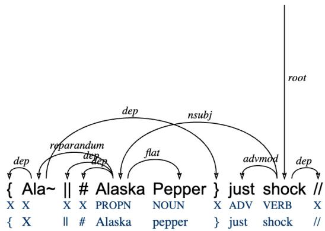
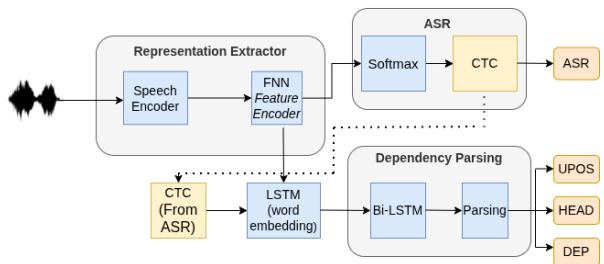
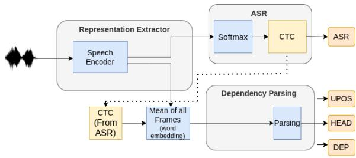
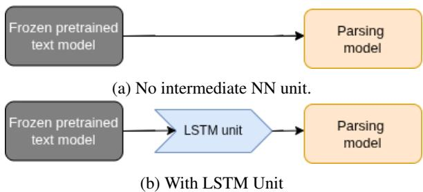
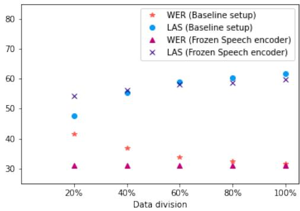
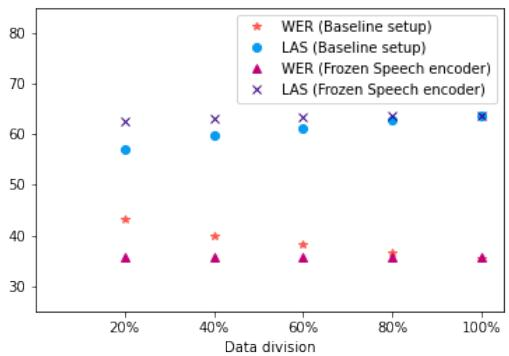
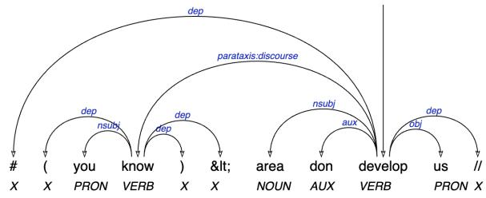
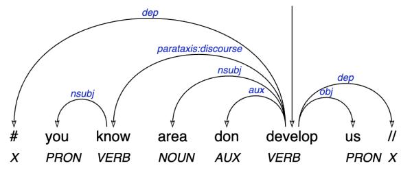

# When Can You Prune Your Network? A Study of Intermediate Neurons in Multilingual Speech Parsing

Minnie Kabra, Benjamin Lecouteux, Maximin Coavoux Univ. Grenoble Alpes, CNRS, Grenoble INP, LIG, 38000 Grenoble, France first.last@univ-grenoble-alpes.fr

## Abstract

End-to-end speech parsing, a task recently proposed, consists in predicting both the transcription and the syntactic tree for a spoken utterance. Existing architectures for speech parsing often utilise intermediate neural networks. In this work, we examine the effectiveness of intermediate neural networks (NN) for parsing, and, specifically, what role do they play. We introduce a simpler end-to-end architecture for speech parsing, where we remove these intermediate NN units, reducing the parameters by 12%, while achieving comparable or better performance than prior method on both automatic speech recognition (ASR) and parsing. We demonstrate that intermediate NN units help reduce the representational gap when the pretrained encoder is frozen. We do a comprehensive evaluation of speech parsing on French, and medium-low resource languages Slovenian and Naija. We further investigate the impact of the training data size and intermediate layers of the pretrained speech encoder on speech parsing.

## 1 Introduction

End-to-end architectures for speech parsing (Pupier et al., 2022; Kando et al., 2024) connect the pretrained speech and the parsing models using intermediate neural network (NN) units like feedforward neural network (FNN), recurrent neural network (RNN), and long short-term memory (LSTM) units. These units increase the computational training time. However, the impact of these units has not been yet studied for parsing.

Even though dependency parsing (Figure 1) has nowadays fewer applications in NLP, the design of accurate syntactic parsers is still relevant for applications to data-driven linguistics (Hüll and Dobrovoljc, 2025; Peck and Becker, 2024) whose analyses rely on syntactic annotations. However, treebanks of spontaneous speech, arguably the most naturalistic source of linguistic data, are scarcer than written treebanks.The parsing of spontaneous speech is currently not at a satisfactory level. Hence, high-quality speech parsers would open new perspectives for the study of syntax and for computational language documentation. More generally, besides these motivations, our work subscribes to the current necessity for the NLP community to focus more on speech as the most naturalistic source of linguistic data (Chrupała, 2023).

  
Figure 1: Dependency parsing tree from the NaijaNSC treebank. EN: Ala-... Alaska Pepper was shocked. The two lines under the wordform line are the sequence of POS and lemma tags respectively.

Wav2tree (Pupier et al., 2022) is an end-to-end architecture for spontaneous speech parsing where the pre-trained speech model is fine-tuned jointly with the downstream parsing model, with intermediary NN units inserted between the two models. It takes speech as input, and produces both the transcription and the syntactic tree as the output. Due to this joint fine-tuning setup, the representations learned by the speech encoder, as well as those produced by the intermediate NN units, is optimised for the downstream parsing model.

Our contributions are the following:

1. We examine the role of intermediate neural network (NN) units in Wav2tree:

• we introduce a new end-to-end architecture,

Simplified Wav2tree (Simplified W2T), for parsing speech to a dependency tree. It simplifies Wav2tree by removing these intermediate NN units, while generally matching or improving performance with greater efficiency.1

• When the pre-trained model (encoder) is frozen within a joint parsing architecture, its representation remains optimised for the pre-training objective, and not for the downstream parsing task. We refer to this phenomenon as the representational gap between the encoder and the parsing model. We demonstrate that intermediate neural network units help reduce this representational gap between the frozen encoder and the parsing model.

2. We carry out a comprehensive evaluation of dependency parsing of speech for the spoken treebanks of Naija, Slovenian, and French:

• We compare Simplified Wav2tree with baseline Wav2tree.

• We examine the performance of dependency parsing using representation from intermediate Wav2Vec2(Baevski et al., 2020) layers as the input to both ASR and parsing model in the Simplified architecture. The performance of parsing remains stable or improves, increasing the parameter efficiency of the architecture.

• We do a comparison with the pipeline approach and gold transcriptions. Except for Slovenian, the end-to-end parsing performs better than the pipeline.

3. We analyze the impact of scaling training data on dependency parsing of speech. Through a two-stage experimental setup, we assess the amount of speech data required by the parsing model to attain a near-optimal performance with the Simplified architecture.

4. We present language-specific analyses for Naija and Slovenian. For Naija, we assess the usefulness of segmentation annotations for parsing. Our experiments show that they do not lead to improvements as they do when parsing transcriptions. For Slovenian, we release the code1 to produce filtered UD\_Slovenian-SST v2.16 with a better speech-transcription alignment.

<table><tr><td>Dataset</td><td>Section</td><td>Duration</td><td>Trees</td><td>Speakers</td></tr><tr><td rowspan="3">Naija</td><td>Train</td><td>6.78h</td><td>7,268</td><td>67</td></tr><tr><td>Dev</td><td>0.87h</td><td>990</td><td>10</td></tr><tr><td>Test</td><td>0.91h</td><td>972</td><td>11</td></tr><tr><td rowspan="3">Slovenian</td><td>Train</td><td>4.88h</td><td>3,474</td><td>464</td></tr><tr><td>Dev</td><td>0.67h</td><td>400</td><td>80</td></tr><tr><td>Test</td><td>0.99h</td><td>358</td><td>36</td></tr><tr><td rowspan="3">ParisStories</td><td>Train</td><td>1.34h</td><td>1,265</td><td rowspan="3">N/A</td></tr><tr><td>Dev</td><td>0.58h</td><td>640</td></tr><tr><td>Test</td><td>0.59h</td><td>631</td></tr><tr><td rowspan="3">Orféo</td><td>Train</td><td>122.1h</td><td>158,778</td><td rowspan="3">2000+</td></tr><tr><td>Dev</td><td>11.57h</td><td>15,000</td></tr><tr><td>Test</td><td>11.62h</td><td>15,000</td></tr></table>

Table 1: Data statistics for the Naija-NSC treebank, Slovenian SST, ParisStories, and Orféo

## 2 Related work

Historically, speech parsing has mostly been addressed through parsing transcriptions, be the gold transcriptions or predicted transcriptions (e.g. Béchet et al., 2014). Early work on speech parsing aimed at jointly detecting (and sometimes removing) disfluencies and parsing (Charniak and Johnson, 2001; Jørgensen, 2007; Rasooli and Tetreault, 2013, 2014; Honnibal and Johnson, 2014; Yoshikawa et al., 2016; Jamshid Lou et al., 2019). The underlying motivation for removing the disfluencies is often to use the output tree as input to downstream NLP tools trained on written text and reduce the domain shift between speech and text. Prior work also proposed to include audio features in text parsers, as an extra source of information to improve disambiguation (Kahn et al., 2005; Dreyer and Shafran, 2007; Pate and Goldwater, 2013; Tran and Ostendorf, 2021). In contrast, instead of relying on transcriptions, we address speech parsing directly from the speech signal and perform automatic speech recognition jointly, in line with Pupier et al. (2022).

Only a few publications have dealt with speech parsing without relying on transcriptions (Pupier et al., 2022, 2024; Kando et al., 2024). They evaluate either on the French Orféo treebank (Benzitoun et al., 2016) for the first two, or Orféo and the English Switchboard treebank (Godfrey et al., 1992) for the last one. This paper focuses instead on lower-resource languages: Naija and Slovenian. A second major novelty compared to these three publications is that we introduce a much simpler deep learning architecture.

Our work is also connected to Lai et al. (2023); Tseng et al. (2023), who investigate grammar inference from the speech signal and visual cues on a multimodal dataset of images with read captions. However, the data they use consists of captions read aloud by speakers. Texts that are read aloud do not feature the phenomena that make speech recognition and analysis difficult (disfluencies, interruptions, overlapping speakers). Moreover, their syntax is similar to that of written texts. As a result, there is a wide domain shift between spontaneous and read speech. Our work focuses instead on corpora featuring realistic interactions.

## 3 Datasets

We conduct a multilingual evaluation of Simplified W2T on three spoken treebanks from Universal Dependencies (Nivre et al., 2020), covering three languages. The multilingual evaluation here refers to training and evaluating the architecture separately on these three languages. We additionally use the French Orféo treebank (Benzitoun et al., 2016) to assess the impact of scaling the training data on dependency parsing. The statistics of the datasets is presented in Table 1.

1. Naija - NaijaSynCor (Naija-SNC) treebank (Caron et al., 2019), released as part of Universal Dependencies (Nivre et al., 2020), was manually annotated using the Surface-Syntactic Universal Dependency (Gerdes et al., 2018, SUD) annotation scheme. Naija, officially named Nigerian Pidgin, is an English-based creole language, whose lexicon is influenced by Nigerian languages such as Yoruba, Hausa, and Igbo. The treebank recordings span life stories, speeches, radio programs, free conversations, cooking recipes, comments on the current state of affairs, etc.

2. Slovenian - Slovenian SST (Dobrovoljc and Nivre, 2016) was manually annotated using the Universal Dependencies (UD) annotation scheme. Its recordings cover multiple categories, including public informative and educational content, public entertainment, non-public non-private interactions, and non-public private conversations among friends or family members.

  
(a) Baseline Wav2tree (Pupier et al., 2024)

  
(b) Simplified Wav2tree (ours)  
Figure 2: Comparison of the original architecture (Pupier et al., 2024) and our proposed architecture.

3. UD French ParisStories2 - The dataset was annotated following the SUD guidelines and automatically converted to UD. Its recordings consist of personal life stories.

4. French Orféo treebank3 - Orféo is the only publicly available spoken treebank large enough for scaling experiments. It has multiple subcorpora, and the recordings span work meetings, interviews, public meetings, storytelling, narratives, and telephone conversations.

We observed speech noise in the Slovenian-SST dataset which we filtered out, and enhanced speechtranscription misalignment.We provide further details in Appendix C.

## 4 Background: Wav2tree Architecture

Wav2Tree (Pupier et al., 2022) is an end-to-end dependency parsing model whose only input is the raw speech signal. Its architecture is illustrated in Figure 2a, and performs speech recognition and parsing jointly. The Wav2tree architecture is composed of three modules: (i) a speech encoder that computes a vector representation for each frame in the speech signal, (ii) an ASR module that outputs both a transcription and the frame boundaries of each predicted token, (iii) a parsing module that uses the word boundaries to compute audio word embeddings and run a standard parsing algorithm on the sequence of embeddings. These modules are connected by three intermediate NN units.

The audio signal s is first passed to a pre-trained speech encoder (Wav2Vec2, Eq. 1) to obtain a sequence of frame vectors $\mathbf { F } ^ { ( 1 ) } \in \mathbb { R } ^ { \ell \times f }$ , where ℓ is the length of the signal in number of frames and $f$ is the output size of Wav2Vec2 representations. Then the obtained matrix is passed through the $1 ^ { \mathrm { s t } }$ intermediate NN unit - Feedforward neural network (feature encoder, Eq. 2).

$$
\mathbf { F } ^ { ( 1 ) } = \mathrm { W a v 2 v e c } ( \mathbf { s } ) ,\tag{1}
$$

$$
\mathbf { F } ^ { ( 2 ) } = \mathrm { F N N } ( \mathbf { F } ^ { ( 1 ) } ) .\tag{2}
$$

The speech recognition module applies a Connectionist temporal classification layer (Graves et al., 2006, CTC) to $\mathbf { F } ^ { ( 2 ) }$ . The granularity of the CTC prediction is at the character level: each frame is tagged with a character (or a special blank character representing a separation between two words).

To obtain transcriptions from CTC predictions, Wav2tree uses a greedy decoding algorithm4 (Eq. 3). It is a modification of the greedy decode from the SpeechBrain library (Ravanelli et al., 2021), which outputs a single transcription. Along with the transcription $\hat { t } ,$ the decoding algorithm outputs a mapping aˆ of the frames of Wav2Vec2 to the words, based on the character tagged on each frame. We provide an example of a mapping in Figure 5 in Appendix. The predicted word boundaries (start and end frames for each transcribed word) are extracted from this mapping.

$$
\hat { t } , \hat { a } = \mathrm { C T C } ( \mathbf { F } ^ { ( 2 ) } ) .\tag{3}
$$

The $2 ^ { \mathrm { n d } }$ intermediate NN unit LSTM then uses these predicted word boundaries to compute the ‘audio’ word embedding i.e., fixed-sized vectors for each predicted word $w _ { k } \left( k \in \left\{ 1 , \ldots n \right\} \right)$ with boundary indices $( i _ { k } , j _ { k } )$ . This process is akin to using a character LSTM to compute textual word embedding based on their internal structure. (Ling et al., 2015; Plank et al., 2016). Instead of a sequence of characters, spoken words are a sequence of frames (the output of thefeature encoder module).

$$
\mathbf { w } _ { k } = \mathrm { L S T M } ( \mathbf { F } _ { \cdot , i _ { k } : j _ { k } } ^ { ( 2 ) } ) .\tag{4}
$$

Next, Wav2tree computes contextualised audio word embedding by passing the sequence of embeddings $\left( \mathbf { w } _ { 1 } , \ldots , \mathbf { w } _ { n } \right)$ through the $\bar { 3 } ^ { \mathrm { r d } }$ intermediate NN unit - a bidirectional LSTM (Eq. 5):

$$
( \mathbf { h } _ { 1 } , \ldots , \mathbf { h } _ { n } ) = \mathrm { b i } \mathrm { - } \mathrm { L S T M } ( \mathbf { w } _ { 1 } , \ldots , \mathbf { w } _ { n } ) .\tag{5}
$$

The resulting word-level representations are passed to a generic dependency parsing algorithm, either a seq2label strategy (Strzyz et al., 2019) or a biaffine architecture (Dozat and Manning, 2017). The whole Wav2tree model is trained end-to-end with a multitask objective (ASR and parsing) to reduce the error propagation between the two tasks.

## 5 Experiments

The first set of experiments we conduct aims to answer the following research questions:

• RQ1: What is the role of the intermediate neural network units in end-to-end parsing, and when do they add value?

• RQ2: How is speech parsing accuracy affected by the size of the training data across two successive setups (i) when the ASR model is fine-tuned jointly with the parsing model, and (ii) when a pre-fine-tuned ASR model is used to control for the effect of ASR accuracy.

The second set of experiments provides a comprehensive evaluation of speech parsing across the three spoken treebanks.

## 5.1 RQ1: Role of Intermediate NN Units

When the pre-trained model is fine-tuned jointly with the parsing model, its representations become aligned with the downstream parsing task. Building on this observation, we propose two hypotheses regarding the role of intermediate neural network units in the parsing architecture.

• H1: When the pre-trained model is fine-tuned jointly with the parsing model, the intermediate NN units do not add an incremental value.

• H2: However, when the pre-trained model is frozen, the intermediate NN units help to reduce the representational gap between the frozen pretrained model and the parsing model.

## 5.1.1 (H1) Simplified Architecture

In Wav2tree (Figure 2a), the speech encoder is fine-tuned jointly with the CTC layer, the parsing model, and three intermediate NN units. We simplify the Wav2tree architecture by removing these intermediate NN units.

1. We removed thefeature encoder module. The representations from Wav2Vec2, learned via a self-supervised transformer-based architecture, largely encapsulate cross-segment dependencies without requiring further transformation. Therefore, in practice, we apply CTC directly to F(1).

2. For word-level representation, we directly use the representation from the speech model, by averaging all frames within each word. These representations are derived from a transformerbased encoder with self-attention, and thus integrate contextual information across the frames for a word. This suggests that the LSTM unit (Eq. 4) is redundant in this setting.

3. We hypothesize that the bi-LSTM module is used to align the speech encoder representation with the parsing model. Since the architecture is fine-tuned end-to-end, i.e., the weights of the speech encoder are fine-tuned for the downstream parsing task, the bi-LSTM (Eq 5) is not required in this setting.

The last two simplifications consist of feeding the sequence of vectors $( \mathbf { F } _ { \mathrm { m e a n } ( i _ { 1 } , j _ { 1 } ) } ^ { ( 1 ) } , \ldots \mathbf { \bar { F } } _ { \mathrm { m e a n } ( i _ { n } , j _ { n } ) } ^ { ( 1 ) } )$ to the parser, effectively bypassing Eq. 4 and 5.

The audio word embeddings $( \mathbf { h } _ { 1 } , \ldots , \mathbf { h } _ { n } )$ in our architecture are computed by the three following equations (that replace Eq. 1 to 5):

$$
\mathbf { F } ^ { ( 1 ) } = \mathrm { W a v 2 v e c } ( \mathbf { s } ) ,\tag{6}
$$

$$
\hat { t } , \hat { a } = \mathrm { C T C } ( \mathbf { F } ^ { ( 1 ) } ) ,\tag{7}
$$

$$
( \mathbf { h } _ { 1 } , \ldots , \mathbf { h } _ { n } ) = ( \mathbf { F } _ { \mathrm { m e a n } ( i _ { 1 } , j _ { 1 } ) } ^ { ( 1 ) } , \ldots \mathbf { F } _ { \mathrm { m e a n } ( i _ { n } , j _ { n } ) } ^ { ( 1 ) } ) ,\tag{8}
$$

where $\hat { a } = [ ( i _ { 1 } , j _ { 1 } ) , \dots ( i _ { n } , j _ { n } ) ]$ as previously mentioned, and $\mathbf { F } _ { \mathrm { m e a n } ( i _ { k } , j _ { k } ) } ^ { ( 1 ) }$ is the vector representation of the mean of all frames for a word k.

In all, the output of speech representation from the speech encoder now directly serves as the input to the parsing model (see Figure 2b). With this change, the parameter count is reduced by 12% in the simplified architecture, considering the hyperparameters used by Pupier et al. (2024).

  
Figure 3: Text parsing with frozen text encoder - with and without intermediate NN unit.

## 5.1.2 (H2) When Do Intermediate NN Units Add Value?

We evaluate hypothesis H2 using a text parsing model. The text parsing architecture we use is the same as the Simplified architecture for speech parsing, except that the speech encoder is replaced by a pretrained text encoder. To study and isolate the impact of intermediate NN units, we feed gold transcriptions into the text parser. We do two experiments across all three spoken treebanks:

1. Joint fine-tuning: We first evaluate the text parsing performance when the architecture is finetuned end-to-end, with and without an intermediate NN unit (LSTM).

2. Frozen pre-trained text model: Next, we freeze the pre-trained text model (Figure 3), and evaluate the text parsing performance with and without an intermediate NN unit.

We note that it is not possible to conduct the same experiment for speech parsing, as the underlying speech model (Wav2Vec2) requires fine-tuning for the target language.

## 5.2 RQ2: Scaling Training Data

We use the two largest spoken treebanks (Naija-SNC, 7h; Orféo, 122h) to assess the effect of the training set size. The training data was partitioned into five subsets for this experiment: 20%, 40%, 60%, 80%, and 100%. With the simplified speech parsing architecture, we assess the amount of speech required to achieve an optimal performance. We conduct two-stage experiments for it:

1. Baseline setup : We ran the Simplified W2T, without any modifications, across all data partitions.

2. Frozen Speech encoder: Since the input to parsing is the learned representation produced by the ASR model (speech encoder & CTC tagging),

ASR accuracy directly affects parsing performance. To isolate and precisely evaluate the effect of scaling training data on parsing, we use a pre-fine-tuned ASR system. The pre-fine-tuned model is obtained from step 1, when trained with 100% of the training data. Extending the finding from Section 5.1.2, we use an intermediate LSTM unit to align representation from the frozen ASR model to the parsing model.

## 5.3 Dependency Parsing Evaluation

Middle Layers of Wav2Vec2 On the simplified architecture and for all three spoken treebanks, we assess the impact of the middle layers of the Wav2Vec2 on dependency parsing, i.e., using the representation from intermediate layers as the input to both ASR and parsing. This is motivated by the observations of Shen et al. (2023) and Dugonjic´ et al. (2024) who found through probing experiments that syntax is best encoded in the middle layers of the pre-trained speech models.

Baseline experiments On all three spoken treebanks, we checked the performance of text-based dependency parsing using a PIPELINE and a GOLD approach:

• PIPELINE: The input to the text model is the predicted transcriptions from the pre-trained speech encoder of the Simplified architecture

• GOLD: The inputs to the text parser are gold transcriptions. This experiment is meant as an upper bound (ideal case with perfect ASR).

## 5.4 Segmentation Annotations in Naija

The Naija dataset contains syntactic and prosodic segmentation annotations materialized by punctuation marks that are included as tokens in the dependency trees (see the tree in Figure 1 for an illustration). Caron et al. (2019) found these markups useful for parsing, with gold transcriptions as the input. We found this is not the case when parsing the audio signal (details in Appendix B).

## 5.5 Training and Evaluation Details

End-to-End speech parsing We use wav2vec2-xls-r-300m,5 a multilingual Wav2Vec2 pre-trained acoustic model, as the speech encoder for both Naija-NSC treebank and Slovenian SST. It has Slovenian as medium-resource language (11k hours), and

Yoruba & Hausa (languages associated with Naija) as low-resource language (75 hours each) in its pre-training data. For UD French ParisStories, we use Speech\_Large\_fr\_114K, a data2vec (Baevski et al., 2022) pre-trained speech model trained on 114k hours of French speech (Le et al., 2026).

The parsing module is a biaffine graph-based parser (Dozat and Manning, 2017). The baseline Wav2tree results are produced with the original Wav2tree implementation.

Text parsing We use xlm-roberta-large6 (Conneau et al., 2020) as text encoder for all three languages. It has French as high-resource language (9.8 billion tokens), Slovenian as medium-resource language (1.7 billion tokens), and Hausa as lowresource language (56 million tokens) in its pretraining data.

We use the same hyperparameters across all architectures and datasets (see Table 5 in Appendix A for the full list). We select the best checkpoint on the development set in each setting, and report the results on the test set. Our implementation uses the speechbrain library (Ravanelli et al., 2021).

Evaluation metrics We use standard evaluation measures: Word Error Rate (WER) for speech recognition, POS accuracy (POS), Unlabeled Attachment Score (UAS), and Labeled Attachment Score (LAS) for dependency parsing. The dependency parsing measures require an alignment between the ground truth and the predicted sequences, which was performed following the procedure described by Pupier et al. (2024).

## 6 Results

## 6.1 RQ1: Role of Intermediate NN Units

(H1) Simplified architecture In Table 2, we show the comparison of baseline and simplified Wav2tree across all three spoken treebanks (1st and 2nd rows of each sub-table).

After removing the three intermediate NN units, parsing accuracy (LAS) improved for Slovenian and French (Paris Stories). In absolute terms, LAS increased by 1.2%, and 2.5% on Slovenian and French. There is a slight drop for Naija (LAS decreased by 0.95%). For Slovenian and French, the LAS improvement from the Baseline to the Simplified architecture is statistically significant (see Appendix D for details). For all three datasets,

<table><tr><td>Model</td><td>Wav2Vec2</td><td>Intermediate NN</td><td>WER↓ UPOS ↑</td><td></td><td>UAS ↑</td><td>LAS ↑</td><td>Parameters</td></tr><tr><td>Baseline W2T</td><td>24 layers</td><td>yes</td><td>31.4</td><td>77.8</td><td>70.2</td><td>62.7</td><td>315Mw+13Mi+4.5Mp</td></tr><tr><td>Simplified W2T</td><td>24 layers</td><td>no</td><td>31.8</td><td>79.1</td><td>69.1</td><td>61.8</td><td>315Mw+5Mp</td></tr><tr><td>Simplified W2T</td><td>21 layers</td><td>no</td><td>31.5</td><td>78.5</td><td>68.5</td><td>61.3</td><td>278M+5MP</td></tr><tr><td>PIPELINE</td><td>24 layers</td><td>no</td><td>31.8</td><td>77.9</td><td>68.0</td><td>61.2</td><td>315Mw+5MP+559Mr</td></tr><tr><td>GOLD</td><td>=</td><td>no</td><td>0.0</td><td>96.9</td><td>88.0</td><td>83.9</td><td>559M+5Mp</td></tr><tr><td colspan="8">(a) Evaluation on the Naija-NSC treebank.</td></tr><tr><td>Model</td><td>Wav2Vec2</td><td>Intermediate NN</td><td>WER↓</td><td>UPOS↑</td><td>UAS ↑</td><td>LAS↑</td><td>Parameters</td></tr><tr><td>Baseline W2T</td><td>24 layers</td><td>yes</td><td>33.2</td><td>73.0</td><td>46.6</td><td>37.7</td><td>315Mw+13Mi+4.5MP</td></tr><tr><td>Simplified W2T</td><td>24 layers</td><td>no</td><td>33.0</td><td>76.8</td><td>45.7</td><td>38.9</td><td>315M“+5Mp</td></tr><tr><td>Simplified W2T</td><td>18 layers</td><td>no</td><td>34.3</td><td>76.7</td><td>47.4</td><td>40.7</td><td>240Mw+5Mp</td></tr><tr><td>PIPELINE</td><td>24 layers</td><td>no</td><td>32.9</td><td>80.2</td><td>56.3</td><td>50.9</td><td>315M³+5MP+559Mr</td></tr><tr><td>GOLD</td><td></td><td>no</td><td>0.0</td><td>97.8</td><td>74.9</td><td>71.3</td><td>559M+5Mp</td></tr><tr><td colspan="8">(b) Evaluation on the Slovenian treebank.</td></tr><tr><td>Model</td><td>Speech_large_fr</td><td>Intermediate NN</td><td>WER↓</td><td>UPOS ↑</td><td>UAS ↑</td><td>LAS ↑</td><td>Parameters</td></tr><tr><td>Baseline W2T</td><td>16 layers</td><td>yes</td><td>38.2</td><td>72.1</td><td>58.4</td><td>50.9</td><td>313M9+13Mi+4.5Mp</td></tr><tr><td>Simplified W2T</td><td>16 layers</td><td>no</td><td>37.6</td><td>73.6</td><td>59.9</td><td>53.3</td><td>313M9+5Mp</td></tr><tr><td>Simplified W2T</td><td>11 layers</td><td>no</td><td>38.1</td><td>73.5</td><td>60.7</td><td>54.2</td><td>250Mª+5Mp</td></tr><tr><td>PIPELINE</td><td>16 layers</td><td>no</td><td>37.5</td><td>71.7</td><td>55.9</td><td>48.7</td><td>313M9+5MP+559Mr</td></tr><tr><td>GOLD</td><td>-</td><td>no</td><td>0.0</td><td>96.1</td><td>76.4</td><td>71.9</td><td>559M+5Mp</td></tr></table>

(c) Evaluation on the ParisStories treebank.  
Table 2: Evaluation on test dataset with settings described in Section 5.5. Parameter counts: wWav2vec, gSpeech\_Large\_fr\_114K, ffeedforward + LSTM, pparsing module, rRoberta module. W2T refers to Wav2tree. Best scores across end-to-end speech parsing highlighted in bold. Underlined refers to statistical significant results

ASR performance remains consistent across the Baseline and Simplified Wav2tree.

Based on this evaluation, we infer that the Simplified W2T, while being parameter-efficient (see Appendix E for the effect on training time), matches or improves parsing performance compared to Wav2tree. Our results support hypothesis H1 that intermediate NN units do not provide incremental value when the speech model is jointly fine-tuned with the parsing model.

(H2) When do intermediate NN units add value? In Table 3, we report the text parsing performance (LAS score) on all three treebanks across the combinations of (i) text parsing architectures with and without an intermediate NN unit (LSTM), and (ii) whether the pre-trained text model is frozen or finetuned jointly with the parsing model.

Across all three treebanks, when the pre-trained text model is fine-tuned jointly with the parsing model (1st and 2nd rows), LAS score is higher when there is no intermediate NN unit between the text encoder and the parsing model. This is consistent with our findings from the Simplified architecture.

When we freeze the pre-trained text model and feed its output directly to the parsing model (3rd row), the LAS score drops by at least 30% across all three treebanks. We attribute this to the representational gap between the frozen encoder and the parsing model. We then introduce an intermediate NN unit into this setup (4th row), and the LAS score increases by 15-20% across all three treebanks, bringing the performance closer to the joint fine-tuning setting. This suggests that intermediate NN unit helps to reduce the representational gap between the frozen pre-trained model and the parsing model.

We then measure the similarity between the text representation from the fine-tuned text model without any intermediate NN unit and (i) the representation from the frozen text model without any intermediate NN unit. The representation corresponds to the encoder output of the pre-trained model (ii) the representation from the frozen text model with an intermediate NN unit. The representation corresponds to the output of the intermediate NN unit.

We use linear Centered Kernel Alignment (Kornblith et al., 2019) as the similarity measure. Centered Kernel Alignment (CKA) is a widely used pairwise feature similarity for quantifying the similarity between two neural network representations. It measures the similarity between features from the two representations for each pair of examples using Hilbert-Schmidt Independence Criterion.

<table><tr><td>Text parsing architecture</td><td>Intermediate NN (LSTM)</td><td>LAS (Naija)</td><td>LAS (Slovenian)</td><td>LAS (ParisStories)</td><td># of parameters (fine-tuned)</td></tr><tr><td>Joint fine-tuning</td><td>no</td><td>83.9</td><td>71.3</td><td>72.0</td><td>559M+5Mp</td></tr><tr><td>Joint fine-tuning + LSTM</td><td>yes</td><td>81.7</td><td>66.1</td><td>69.8</td><td>559M+5MP+16Mi</td></tr><tr><td>Frozen pre-trained text model</td><td>no</td><td>51.5</td><td>40.9</td><td>44.8</td><td>5M™</td></tr><tr><td>Frozen pre-trained text model + LSTM</td><td>yes</td><td>74.6</td><td>55.4</td><td>62.9</td><td>5MP+16Mi</td></tr></table>

Table 3: Comparative analysis for RQ1 - LAS on the test dataset with and without intermediate NN unit for all 3 treebanks with experiments described in Section 5.1.2. Best scores across sections highlighted in bold.

The similarity is shown in Table 4. Across all three treebanks, the similarity between the representations from the fine-tuned and the frozen text model is higher with an intermediate NN unit than without.

Based on these two evaluations, we answer RQ1 and support the hypothesis H2 that the intermediate NN unit helps to reduce the representational gap between the frozen pre-trained model and the parsing model.

## 6.2 RQ2: Scaling Training Data

In Figure 4, we report the performance of Naija and French (Orféo) across the two setups described in Section 5.2. The WER is higher than usual for Orféo because of the nature of the speech corpus (spontaneous discussions, and lower recording quality for some sub-corpora).

Across all treebanks, in the first experiment (Baseline setup), the WER decreases and the LAS improves with a larger training set. In the subsequent experiment (Frozen ASR), where a pre-finetuned ASR is used across all data partitions, the LAS increases as the training data scales up, the magnitude of gains is reduced compared to the first experiment. Here, the LAS trend differs across the two spoken treebanks – the LAS remains relatively stable across all data partitions for Orféo, while it increases up to 80% of the training data for Naija. We attribute this to the difference in the amount of the training data of the two treebanks.

This analysis suggests that with a pre-fine-tuned ASR model, parsing accuracy gains diminish beyond 9-10 hours of training data with the Simplified W2T.

## 6.3 Dependency Parsing Evaluation

In Table 2, we report the evaluation for Wav2Vec2 intermediate layers, and the baseline results for all three spoken treebanks.

Intermediate layers The 3rd row in Table 2 corresponds to the performance when the intermediate layer of the Wav2Vec2 model is used to produce the speech representation, as described in Section 5.3. We report results (on the test dataset) for the layer which has highest LAS score on the development dataset. Across all three spoken treebanks, the LAS score remains stable or improved. This corresponds to a 12%-24% reduction in the parameters and 5- 9% speed up in training time. We conclude that intermediate layers of the speech encoder produce speech representations suitable for parsing.

Pipeline and GOLD The last two rows in Table 2 correspond to the Pipeline and the GOLD setups. Apart from the Slovenian treebank, the endto-end Simplified architecture performs better than the Pipeline approach on parsing, which also has 2.75× more parameters than the Simplified architecture, due to the use of two pre-trained models: an acoustic model for ASR and a pretrained text model for parsing.

WER for Naija We compare word error rate (WER) for tokens in Naija depending on whether they are in the Unix words English lexicon.7 We find that WER is substantially higher for tokens not belonging to the English vocabulary, as displayed in Table 7 in Appendix. This result is likely due to the limited size of Naija-related languages in its pretraining data, and illustrates the English bias of wav2vec2-xls-r-300m.

## 7 Conclusion and Further work

We investigate the role of intermediate neural network units in the parsing architecture and find that they provide incremental value when the pretrained model is frozen by reducing the representational gap between the pre-trained model and parsing model. We further introduce an end-toend parser for speech that is parameter-efficient while achieving comparable performance to the prior architecture. We evaluate the impact of scaling training data on the Simplified architecture, and find that gains in parsing accuracy diminish after the first 9-10h of training data.

<table><tr><td>Similarity between fine-tuned encoder &amp;</td><td>CKA Naija</td><td>CKA Slovenian</td><td>CKA French</td></tr><tr><td>Frozen encoder without intermediate NN unit</td><td>17%</td><td>21%</td><td>23%</td></tr><tr><td>Frozen encoder with intermediate NN unit</td><td>44%</td><td>32%</td><td>34%</td></tr></table>

Table 4: Similarity between representations from finetuned and frozen text encoder described in Section 6.1

We present baseline dependency parsing results for three spoken treebanks — Naija, Slovenian and French (ParisStories). We provide the first end-to-end speech parsing experiments for Naija and Slovenian. We assess the impact of speech representation from intermediate layers of Wav2Vec2 as the input to the parsing architecture, and find that the parsing performance remains stable. Lastly, we release the code to reproduce filtered UD\_Slovenian-SST v2.16 treebank with improved speech-transcription alignment

The analysis of intermediate neural network units can be extended to other neural architectures beyond parsing. As the future work we plan to examine two findings from this paper: (i) why the pipeline performs better than the end-to-end speech parser on the Slovenian treebank, and (ii) why parsing performance remains stable when using representations from the intermediate layer of the speech encoder as the input.

## Limitations

For all our experiments, we limited our hyperparameter search to learning rate due to computational resource constraints. We do not evaluate the proposed architecture on the English Switchboard corpus (Godfrey et al., 1992) because the audio recordings are not publicly available.

  
(a) Data Scaling - Naija

  
(b) Data Scaling - Orféo  
Figure 4: Scaling training data across 2 setups - Endto-End (Baseline) and Frozen ASR - as described in Section 5.2

## Acknowledgements

We gratefully acknowledge the support of the French National Research Agency (ANR) through project SynPaX (grant ANR-23-CE23-0017-01). We thank William Havard for feedback on an earlier version of this paper, as well as Rayan Ziane and Emmanuel Schang for fruitful discussions about this work.

## References

Alexei Baevski, Wei-Ning Hsu, Qiantong Xu, Arun Babu, Jiatao Gu, and Michael Auli. 2022. data2vec: A general framework for self-supervised learning in speech, vision and language. In Proceedings ofthe 39th International Conference on Machine Learning, volume 162 of Proceedings of Machine Learning Research, pages 1298–1312. PMLR.

Alexei Baevski, Yuhao Zhou, Abdelrahman Mohamed, and Michael Auli. 2020. wav2vec 2.0: A framework for self-supervised learning of speech representations. Advances in neural information processing systems, 33:12449–12460.

Frédéric Béchet, Alexis Nasr, and Benoit Favre. 2014.

Adapting dependency parsing to spontaneous speech for open domain spoken language understanding. In Interspeech 2014, pages 135–139.

Christophe Benzitoun, Jeanne-Marie Debaisieux, and Henri-José Deulofeu. 2016. Le projet ORFÉO: un corpus d’étude pour le français contemporain. Corpus, (15).

Bernard Caron, Marine Courtin, Kim Gerdes, and Sylvain Kahane. 2019. A surface-syntactic UD treebank for Naija. In Proceedings of the 18th International Workshop on Treebanks and Linguistic Theories (TLT, SyntaxFest 2019), pages 13–24, Paris, France. Association for Computational Linguistics.

Eugene Charniak and Mark Johnson. 2001. Edit detection and parsing for transcribed speech. In Second Meeting of the North American Chapter of the Associationfor Computational Linguistics.

Grzegorz Chrupała. 2023. Putting natural in natural language processing. In Findings of the Association for Computational Linguistics: ACL 2023, pages 7820–7827, Toronto, Canada. Association for Computational Linguistics.

Alexis Conneau, Kartikay Khandelwal, Naman Goyal, Vishrav Chaudhary, Guillaume Wenzek, Francisco Guzmán, Edouard Grave, Myle Ott, Luke Zettlemoyer, and Veselin Stoyanov. 2020. Unsupervised cross-lingual representation learning at scale. Preprint, arXiv:1911.02116.

Janez Demšar. 2006. Statistical comparisons of classifiers over multiple data sets. Journal of Machine learning research, 7(Jan):1–30.

Kaja Dobrovoljc and Joakim Nivre. 2016. The Universal Dependencies treebank of spoken Slovenian. In Proceedings of the Tenth International Conference on Language Resources and Evaluation (LREC’16), pages 1566–1573, Portorož, Slovenia. European Language Resources Association (ELRA).

Timothy Dozat and Christopher D. Manning. 2017. Deep biaffine attention for neural dependency parsing. In 5th International Conference on Learning Representations, ICLR 2017, Toulon, France, April 24-26, 2017, Conference Track Proceedings. Open-Review.net.

Markus Dreyer and Izhak Shafran. 2007. Exploiting prosody for PCFGs with latent annotations. In Interspeech 2007, pages 450–453.

Zdravko Dugonjic, Adrien Pupier, Benjamin Lecouteux,´ and Maximin Coavoux. 2024. What has LeBenchmark learnt about French syntax? In Proceedings of the 2024 Joint International Conference on Computational Linguistics, Language Resources and Evaluation (LREC-COLING 2024), pages 17493–17499, Torino, Italia. ELRA and ICCL.

Kim Gerdes, Bruno Guillaume, Sylvain Kahane, and Guy Perrier. 2018. SUD or surface-syntactic Universal Dependencies: An annotation scheme nearisomorphic to UD. In Proceedings of the Second Workshop on Universal Dependencies (UDW 2018), pages 66–74, Brussels, Belgium. Association for Computational Linguistics.

John J Godfrey, Edward C Holliman, and Jane Mc-Daniel. 1992. Switchboard: telephone speech corpus for research and development. In [Proceedings] ICASSP-92: 1992 IEEE International Conference on Acoustics, Speech, and Signal Processing, volume 1, pages 517–520 vol.1.

Alex Graves, Santiago Fernández, Faustino Gomez, and Jürgen Schmidhuber. 2006. Connectionist temporal classification: labelling unsegmented sequence data with recurrent neural networks. In Proceedings ofthe 23rd international conference on Machine learning, pages 369–376.

Matthew Honnibal and Mark Johnson. 2014. Joint incremental disfluency detection and dependency parsing. Transactions of the Association for Computational Linguistics, 2:131–142.

Nives Hüll and Kaja Dobrovoljc. 2025. Word order variation in spoken and written corpora: A crosslinguistic study of SVO and alternative orders. In Proceedings ofthe Eighth International Conference on Dependency Linguistics (Depling, SyntaxFest 2025), pages 150–155, Ljubljana, Slovenia. Association for Computational Linguistics.

Paria Jamshid Lou, Yufei Wang, and Mark Johnson. 2019. Neural constituency parsing of speech transcripts. In Proceedings of the 2019 Conference of the North American Chapter ofthe Associationfor Computational Linguistics: Human Language Technologies, Volume 1 (Long and Short Papers), pages 2756–2765, Minneapolis, Minnesota. Association for Computational Linguistics.

Fredrik Jørgensen. 2007. The effects of disfluency detection in parsing spoken language. In Proceedings ofthe 16th Nordic Conference ofComputational Linguistics (NODALIDA 2007), pages 240–244, Tartu, Estonia. University of Tartu, Estonia.

Jeremy G. Kahn, Matthew Lease, Eugene Charniak, Mark Johnson, and Mari Ostendorf. 2005. Effective use of prosody in parsing conversational speech. In Proceedings of Human Language Technology Conference and Conference on Empirical Methods in Natural Language Processing, pages 233–240, Vancouver, British Columbia, Canada. Association for Computational Linguistics.

Shunsuke Kando, Yusuke Miyao, Jason Naradowsky, and Shinnosuke Takamichi. 2024. Textless dependency parsing by labeled sequence prediction. In Interspeech 2024, pages 1340–1344.

Simon Kornblith, Mohammad Norouzi, Honglak Lee, and Geoffrey Hinton. 2019. Similarity of neural

network representations revisited. In International conference on machine learning, pages 3519–3529. PMlR.

Cheng-I Jeff Lai, Freda Shi, Puyuan Peng, Yoon Kim, Kevin Gimpel, Shiyu Chang, Yung-Sung Chuang, Saurabhchand Bhati, David Cox, David Harwath, Yang Zhang, Karen Livescu, and James Glass. 2023. Audio-visual neural syntax acquisition. Preprint, arXiv:2310.07654.

Phuong-Hang Le, Valentin Pelloin, Arnault Chatelain, Maryem Bouziane, Mohammed Ghennai, Qianwen Guan, Kirill Milintsevich, Salima Mdhaffar, Aidan Mannion, Nils Defauw, Shuyue Gu, Alexandre Daniel Audibert, Marco Dinarelli, Yannick Estève, Lorraine Goeuriot, Steffen Lalande, Nicolas Hervé, Maximin Coavoux, François Portet, and 11 others. 2026. Pantagruel: Unified self-supervised encoders for french text and speech. In Proceedings of the Fifteenth Language Resources and Evaluation Conference (LREC 2026), pages 10168–10191, Palma, Mallorca, Spain. European Language Resources Association (ELRA).

Wang Ling, Chris Dyer, Alan W Black, Isabel Trancoso, Ramón Fermandez, Silvio Amir, Luís Marujo, and Tiago Luís. 2015. Finding function in form: Compositional character models for open vocabulary word representation. In Proceedings of the 2015 Conference on Empirical Methods in Natural Language Processing, pages 1520–1530, Lisbon, Portugal. Association for Computational Linguistics.

Joakim Nivre, Marie-Catherine de Marneffe, Filip Ginter, Jan Hajic, Christopher D. Manning, Sampoˇ Pyysalo, Sebastian Schuster, Francis Tyers, and Daniel Zeman. 2020. Universal Dependencies v2: An evergrowing multilingual treebank collection. In Proceedings ofthe Twelfth Language Resources and Evaluation Conference, pages 4034–4043, Marseille, France. European Language Resources Association.

John K Pate and Sharon Goldwater. 2013. Unsupervised dependency parsing with acoustic cues. Transactions of the Association for Computational Linguistics, 1:63–74.

Naomi Peck and Laura Becker. 2024. Syntactic pausing? re-examining the associations. Linguistics Vanguard, 10(1):223–237.

Barbara Plank, Anders Søgaard, and Yoav Goldberg. 2016. Multilingual part-of-speech tagging with bidirectional long short-term memory models and auxiliary loss. In Proceedings of the 54th Annual Meeting of the Association for Computational Linguistics (Volume 2: Short Papers), pages 412–418, Berlin, Germany. Association for Computational Linguistics.

Vineel Pratap, Andros Tjandra, Bowen Shi, Paden Tomasello, Arun Babu, Sayani Kundu, Ali Elkahky, Zhaoheng Ni, Apoorv Vyas, Maryam Fazel-Zarandi, Alexei Baevski, Yossi Adi, Xiaohui Zhang, Wei-Ning

Hsu, Alexis Conneau, and Michael Auli. 2023. Scaling speech technology to 1,000+ languages. Preprint, arXiv:2305.13516.

Adrien Pupier, Maximin Coavoux, Jérôme Goulian, and Benjamin Lecouteux. 2024. Growing trees on sounds: Assessing strategies for end-to-end dependency parsing of speech. In Proceedings ofthe 62nd Annual Meeting ofthe Associationfor Computational Linguistics (Volume 2: Short Papers), pages 225–233, Bangkok, Thailand. Association for Computational Linguistics.

Adrien Pupier, Maximin Coavoux, Benjamin Lecouteux, and Jerome Goulian. 2022. End-to-end dependency parsing of spoken French. In Interspeech 2022, pages 1816–1820.

Mohammad Sadegh Rasooli and Joel Tetreault. 2013. Joint parsing and disfluency detection in linear time. In Proceedings of the 2013 Conference on Empirical Methods in Natural Language Processing, pages 124–129, Seattle, Washington, USA. Association for Computational Linguistics.

Mohammad Sadegh Rasooli and Joel Tetreault. 2014. Non-monotonic parsing of fluent umm I mean disfluent sentences. In Proceedings of the 14th Conference of the European Chapter of the Association for Computational Linguistics, volume 2: Short Papers, pages 48–53, Gothenburg, Sweden. Association for Computational Linguistics.

Mirco Ravanelli, Titouan Parcollet, Peter Plantinga, Aku Rouhe, Samuele Cornell, Loren Lugosch, Cem Subakan, Nauman Dawalatabad, Abdelwahab Heba, Jianyuan Zhong, Ju-Chieh Chou, Sung-Lin Yeh, Szu-Wei Fu, Chien-Feng Liao, Elena Rastorgueva, François Grondin, William Aris, Hwidong Na, Yan Gao, and 2 others. 2021. Speechbrain: A generalpurpose speech toolkit. Preprint, arXiv:2106.04624.

Gaofei Shen, Afra Alishahi, Arianna Bisazza, and Grzegorz Chrupała. 2023. Wave to syntax: Probing spoken language models for syntax. In Interspeech 2023, pages 1259–1263.

Michalina Strzyz, David Vilares, and Carlos Gómez-Rodríguez. 2019. Viable dependency parsing as sequence labeling. In NAACL 2019.

Trang Tran and Mari Ostendorf. 2021. Assessing the use of prosody in constituency parsing of imperfect transcripts. In Proc. Interspeech 2021, pages 2626– 2630.

Yuan Tseng, Cheng-I Jeff Lai, and Hung-Yi Lee. 2023. Cascading and direct approaches to unsupervised constituency parsing on spoken sentences. In ICASSP 2023 - 2023 IEEE International Conference on Acoustics, Speech and Signal Processing (ICASSP), pages 1–5.

Masashi Yoshikawa, Hiroyuki Shindo, and Yuji Matsumoto. 2016. Joint transition-based dependency parsing and disfluency detection for automatic speech

recognition texts. In Proceedings of the 2016 Conference on Empirical Methods in Natural Language Processing, pages 1036–1041, Austin, Texas. Association for Computational Linguistics.

## A Hyperparameters

We provide the full list of hyperparameters for our experiments in Table 5.

## B Punctuation in Naija

The main punctuation marks in Naija dataset are:8

• // delimits illocutionary units (final token of each dependency tree)

• a bracketing with { } indicates a sequence of elements with the same syntactic function; elements in the sequence are delimited by a separator that depends on the type of the sequence. For example, in Figure 1, a disfluency with a false start is represented with the pattern { reparandum || repair } . Possible separators are || for reformulations and disfluencies, |c for coordination, |r for syntactic reduplication and |a for apposition.

• # denotes a short pause.

• < and > separate the central part of the utterance (nucleus) from the peripheral elements (adnuclei, see Caron et al., 2019, and Figure 6a).

We created three setups to investigate the impact of the punctuation marks for speech parsing.

1. Both training and evaluation datasets have markups.

2. Only training dataset has markups. During evaluation, markups are removed from the prediction before computing ASR and parsing measures

3. Neither training nor evaluation datasets have markups

We identify punctuation marks as characters that do not contain alphabetic characters or numbers. We first assess the utility of punctuation marks in the evaluation dataset (comparing the first 2 setups). This evaluation is aligned with the the comparison setting of Caron et al. (2019), who evaluated the parsing performance on treebank with and without markups. Table 6 shows this comparison (1st and 2nd rows). The LAS score drops by 4.1% (in absolute terms) if there are punctuation marks in the evaluation dataset.

We dig deeper into why the presence of segmentation annotations in the transcription have a negative impact on parsing. We find a correlation between the ASR punctuation recognition errors and parsing accuracy. Specifically, as the number of markups increases in the transcript, not all these markups are predicted by ASR, which impacts the performance of both ASR and parsing. Table 8 displays the performance of evaluation data with and without markups, stratified by the number of markups present in the ground truth transcript. As the number of markups in the transcript increases, ASR predicts fewer markups than present in the ground truth, and this degradation also affects LAS, as evidenced by the increasing widening gap between LAS with and without markups. Figure 6 shows a similar illustration by an example from the Naija treebank. We hypothesize that recognition errors for segmentation symbols arise because these markups do not correspond to identifiable sounds in the audio signal.

Caron et al. (2019) found the punctuation marks useful for parsing, which can be because they used gold transcriptions, an ideal case when parsing transcriptions.

We then assess if having punctuation in the training dataset helps parser to do a better demarcation (comparing the last 2 setups). The 2nd and 3rd rows in Table 6 show this comparison. The parsing performance remains same or improved with no punctuation marks in the training dataset, and thus we consider the Naija dataset without punctuation for all our evaluations.

## C Slovenian dataset

Learning from our findings on the Naija punctuation marks, we have removed the punctuations from the Slovenian dataset for our analysis. Using the current version of the UD Slovenian dataset, we observed a low parsing performance (30% LAS). After investigation, we identified two types of noise, which we filtered out. Additionally, we filtered out noisy recordings.

1. Speech misalignments noise: Multiple transcripts are sometimes associated with a single speech recording without start or end timestamps.

2. Transcription artefacts noise: The transcripts include placeholder tokens for personal names (eg: [name:personal], [name:surname]), which mislead the ASR system and consequently degrade parsing performance. The corresponding audio has beeps for it.

<table><tr><td>Architecture</td><td>Baseline Wav2tree (Pupier et al., 2024)</td><td>Simplified Wav2tree (ours)</td></tr><tr><td>Epoch</td><td>80</td><td>80</td></tr><tr><td>Batch size</td><td>4</td><td>4</td></tr><tr><td>Tuning parameters</td><td></td><td></td></tr><tr><td>Learning rate (ASR)</td><td>0.00005</td><td>0.00005</td></tr><tr><td>Learning rate (Remaining)</td><td>0.0003</td><td>0.0003</td></tr><tr><td>Optimizer</td><td>AdamW</td><td>AdamW</td></tr><tr><td>Model name</td><td>wav2vec2-xls-r-300m (Naija &amp; Slovenian)</td><td>wav2vec2-xls-r-300m (Naija &amp; Slovenian) PantagrueLLM/Speech_Large_fr_114K (ParisStories)</td></tr><tr><td></td><td>PantagrueLLM/Speech_Large_fr_114K (ParisStories)</td><td></td></tr><tr><td>Encoder Encoder layer</td><td>Present 3</td><td>N/A</td></tr><tr><td>Dropout</td><td>0.15</td><td></td></tr><tr><td>Encoder dim</td><td>1024</td><td></td></tr><tr><td>Activation</td><td>LeakyReLU</td><td></td></tr><tr><td></td><td></td><td></td></tr><tr><td>Fusion LSTM</td><td>Present 2</td><td>N/A</td></tr><tr><td>Layer Dim</td><td>500</td><td></td></tr><tr><td>Bidirectional</td><td>FALSE</td><td></td></tr><tr><td>Bias</td><td>TRUE</td><td></td></tr><tr><td></td><td></td><td></td></tr><tr><td>LSTM parser</td><td>Present</td><td>N/A</td></tr><tr><td>Layer</td><td>3</td><td></td></tr><tr><td>Dim Bidirectional</td><td>256</td><td></td></tr><tr><td></td><td>TRUE</td><td></td></tr><tr><td>Arc MLP</td><td></td><td></td></tr><tr><td>Dim</td><td>256</td><td>256</td></tr><tr><td>Layer</td><td>1</td><td>1</td></tr><tr><td>Linear head dim</td><td>256</td><td>256</td></tr><tr><td>Label MLP</td><td></td><td></td></tr><tr><td>Dim</td><td>256</td><td>256</td></tr><tr><td>Layer</td><td>1</td><td>1</td></tr><tr><td>Head dim</td><td>256</td><td>256</td></tr><tr><td>POS MLP</td><td></td><td></td></tr><tr><td>Dim</td><td>256</td><td>256</td></tr><tr><td>Linear head dim</td><td>Dependent on the data</td><td>Dependent on the data</td></tr></table>

Table 5: Hyperparameters across Wav2tree architecture (Pupier et al., 2024) and Simplified Wav2tree (ours).

<table><tr><td>0 0 0 0 0 0 0 0 0 0 1 1 0 0 2 2 2 2 0 0 3 3 3 0 0 4 4 4 4 4 4 4 4 4 4 4 4 4 4 4</td><td></td><td></td><td></td><td></td><td></td><td></td><td></td><td></td><td></td><td></td><td></td><td></td><td></td><td></td><td></td><td></td><td></td><td></td><td></td><td></td><td></td><td></td><td></td><td></td><td></td><td></td><td></td><td></td><td></td><td></td><td></td><td></td><td></td></tr><tr><td></td><td></td><td></td><td></td><td></td><td></td><td></td><td></td><td>ε J</td><td></td><td>J</td><td></td><td></td><td></td><td></td><td>AAAI</td><td></td><td></td><td></td><td>MON</td><td></td><td></td><td></td><td>C O O L L E L L È È G G U E E</td><td></td><td></td><td></td><td></td><td></td><td></td><td></td><td></td><td></td><td></td></tr></table>

Figure 5: Predicted word boundary and the corresponding uncollapsed sequence of the predicted transcription (in French) "J AI MON COLLÈGUE" (EN: I have my colleague). Symbols ϵ and \_ represents respectively the blank and space labels. Indices {1,2,3,4} refer to the word position in the output sequence.

<table><tr><td>Index</td><td>Punctuation presence</td><td>WER↓</td><td>UPOS ↑</td><td>UAS↑</td><td>LAS ↑</td></tr><tr><td>1</td><td>Train &amp; Eval data</td><td>34.4</td><td>76.5</td><td>62.8</td><td>57.6</td></tr><tr><td>2</td><td>Training data</td><td>32</td><td>78.5</td><td>68.8</td><td>61.8</td></tr><tr><td>3</td><td>None</td><td>31.8</td><td>79.1</td><td>69.1</td><td>61.8</td></tr></table>

Table 6: Simplified W2T results across different variations of Naija dataset. Best scores highlighted in bold.

(a) Gold annotation  
  
(b) Predicted annotation  
Figure 6: Gold and predicted transcription and trees for a Naija utterance (sent\_id: WAZL\_15\_MC\_Abi-MG\_\_180). The predicted annotation has all UAS, UPOS and LAS as 72.7. The scores are low because not all markups are predicted by ASR - ‘(’, ‘)’ and ‘<’(marked as ‘&lt’) are not predicted by ASR.

For unique recordings, the speech–transcript alignment is not fully accurate, and we used forced alignment (Pratap et al., 2023) for it.

## D Additional Results

## D.1 Statistical Significance

Along with the parsing measures comparison, we perform significance testing on the test dataset of all 3 treebanks. We use the non-parametric Wilcoxon signed rank test (Demšar, 2006) with the parsing measure LAS score as the measurement. We first check for the null hypothesis that there is no statistically significant difference between the performance of the simplified and the baseline architectures. The $1 ^ { \mathrm { s t } }$ row in Table 10 has the p-value for this null hypothesis. For Slovenian and ParisStories, we reject the null hypothesis at a confidence level of 5%, and conclude that there is a difference in the performance of 2 architectures. For Naija, this null hypothesis cannot be rejected.

<table><tr><td>English Vocab</td><td>Number of words</td><td>WER</td></tr><tr><td>1</td><td>8,991</td><td>24.5%</td></tr><tr><td>0</td><td>1,269</td><td>52.5%</td></tr></table>

Table 7: WER for tokens in Naija-NSC treebank.

For Slovenian and ParisStories, following that simplified and baseline architectures are statistically different, we checked for an alternative hypothesis that the LAS score of ‘simplified’ architecture is greater than the ‘baseline’ architecture $( 2 ^ { \mathrm { n d } }$ row in Table 10). Here, the null hypothesis is that the difference in LAS score between simplified and baseline is less than a distribution symmetrical about zero. For these 2 treebanks, this null hypothesis can be rejected at a confidence level of 5% , in favor of the alternative that the difference in LAS score between simplified and baseline architecture is greater than the distribution symmetric about zero.

## E Computational Time

All experiments were conducted on an NVIDIA H100 NVL GPU (96GB memory) with 64 cores. The total computational budget for this paper (including preliminary experiments) was 800 GPU hours.

The computation times for training and inference with the baseline and simplified Wav2tree on the Naija dataset are presented in Table 11. The simplified architecture (ours) demonstrates a significant reduction in training time compared to the baseline architecture (Pupier et al., 2024, Wav2tree). On the Naija corpus, and under identical hyperparameter settings, the simplified version requires only 60% of the training computational time needed by the baseline architecture. The inference time is also reduced by 20% with the simplified architecture.

Furthermore, with the simplified architecture, using intermediate layers of Wav2Vec2 (21 layers) results in an 5% reduction in training time compared to using the full set of layers.

<table><tr><td># of markups</td><td>Trees</td><td>Avg markups in ground_truth</td><td>Avg markups in prediction</td><td>LAS with markups</td><td>LAS without markups</td><td>LAS decrease</td></tr><tr><td>[0,2]</td><td>423</td><td>1.5</td><td>1.9</td><td>66.0</td><td>66.0</td><td>0.0</td></tr><tr><td>[3, 4]</td><td>232</td><td>3.4</td><td>3.5</td><td>63.0</td><td>64.5</td><td>-1.4</td></tr><tr><td>[5, 6]</td><td>137</td><td>5.4</td><td>4.8</td><td>57.1</td><td>61.1</td><td>-3.9</td></tr><tr><td>[7, 12]</td><td>139</td><td>8.7</td><td>7.1</td><td>54.2</td><td>60.3</td><td>-6.1</td></tr><tr><td>&gt;=13</td><td>41</td><td>16.5</td><td>12.6</td><td>44.0</td><td>54.0</td><td>-10.0</td></tr></table>

Table 8: Parsing results comparison with and without syntax-prosody segmentation annotations.

<table><tr><td rowspan="2"></td><td rowspan="2">Index Hypothesis p value</td><td rowspan="2">Naija</td><td rowspan="2">p value</td><td rowspan="2">p value ParisStories</td></tr><tr><td>Slovenian</td></tr><tr><td>1</td><td>Null</td><td>21.6%</td><td>0.2%</td><td>3.6%</td></tr><tr><td>2</td><td>Alternative</td><td></td><td>0.1%</td><td>1.8%</td></tr></table>

Table 9: Statistical significance testing between Simplified and Baseline architecture

<table><tr><td rowspan="2"></td><td rowspan="2">Index Hypothesis p value</td><td rowspan="2">Naija</td><td rowspan="2">p value</td><td rowspan="2">p value ParisStories</td></tr><tr><td>Slovenian</td></tr><tr><td>1</td><td>Null</td><td>21.6%</td><td>0.2%</td><td>3.6%</td></tr><tr><td>2</td><td>Alternative</td><td></td><td>0.1%</td><td>1.8%</td></tr></table>

Table 10: Statistical significance testing between Simplified and Baseline architecture

<table><tr><td>Wav2tree</td><td>Wav2Vec2</td><td>Training</td><td>Inference</td></tr><tr><td>Baseline</td><td>24 layers</td><td>676min</td><td>25s</td></tr><tr><td>Simplified</td><td>24 layers</td><td>403min</td><td>20s</td></tr><tr><td>Simplified</td><td>21 layers</td><td>381min</td><td>20s</td></tr></table>

Table 11: Computation time on the Naija corpus.