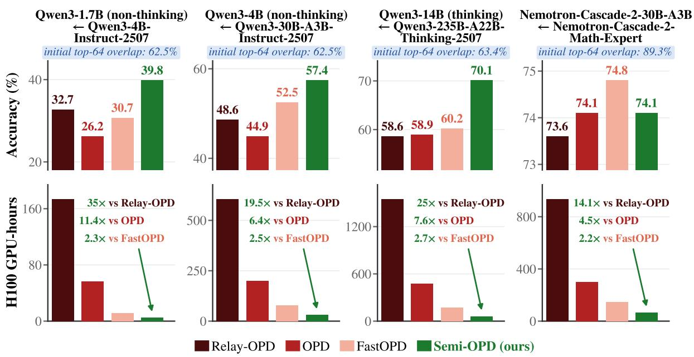  
Figure 1 | Accuracy & training cost of different distillation methods. Our Semi-OPD achieves much improved/comparable accuracy for teacher-student pairs with low/high overlap, respectively, while reducing training time by up to 11.4× over OPD. Accuracy is averaged over AIME 24/25/26 and HMMT Feb 26.

# When Do We Need On-Policy Distillation? Distilling on Offline Student Rollouts Is Often Better

Siyan Zhao\*†1, Yonggan Fu\*, Jindong Jiang, Shih-Yang Liu, Song Bian, Byung-Kwan Lee, Sharath Turuvekere Sreenivas, Wenliang Dai, Hanrong Ye, Aditya Grover¹, Pavlo Molchanov

On-policy distillation (OPD) has become increasingly popular for transferring teacher capabilities to student models. In this work, we ask a critical research question: Is on-policy sampling always beneficial for distilling arbitrary teacher-student pairs? We show that a simple alternative, Semi-OPD, which distills from offline rollouts generated by the initial student, can often outperform OPD in both accuracy and training efficiency. Across 17 teacher-student pairs ranging from 1.5B to 235B parameters, Semi-OPD outperforms OPD in 14 cases, with up to +13.6% accuracy and 11.4× training speedup. We further find that the choice between OPD and Semi-OPD depends on the alignment between the initial teacher and student, quantified by an output-token overlap ratio: OPD is beneficial only when the two are highly aligned with high overlap ratios. Our deeper investigation suggests that effective distillation requires on-policyness w.r.t. both the student and the teacher. For misaligned pairs, student rollouts can become increasingly off-policy w.r.t. the teacher as context length grows, weakening the distillation signal. In contrast, Semi-OPD is often more stable, as it distills on shorter contexts while covering full trajectories and exposing the student to more teacher-preferred tokens. Beyond proposing Semi-OPD as an efficient alternative, our work motivates the community to rethink when to use OPD and to study stronger OPD variants with meaningful teacher-student pairs.

## 1. Introduction

On-policy distillation (OPD) has emerged as an effective paradigm for transferring the capabilities of a teacher language model (LM) to a student

LM [1, 2, 3, 4, 5]. It mitigates the training-inference distribution mismatch, i.e., exposure bias, in traditional knowledge distillation by providing dense tokenlevel signals from the teacher LM on student rollouts obtained via on-policy sampling.

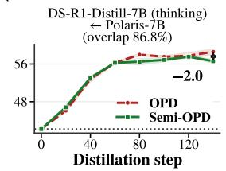

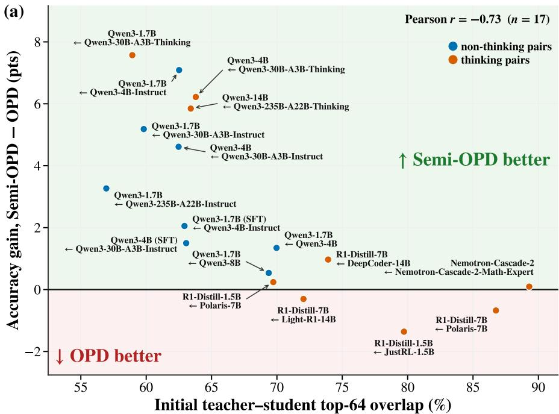

(b)  
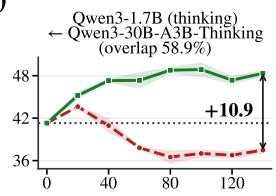  
Figure 2 | Semi-OPD outperforms standard OPD when the initial teacher-student overlap is low. (a) Accuracy gain vs. initial top-64 overlap across 17 pairs ranging from 1.5B to 235B, spanning thinking and non-thinking modes and multiple model families, with a Pearson correlation of $r = - 0 . 7 3$ Accuracy gain is the area between the Semi-OPD and OPD accuracy curves divided by their shared training horizon, averaged over AIME 24/25/26 and HMMT Feb 26. (b) Training curves for three pairs of increasing overlap (AIME 24/25 avg@32, mean of 3 seeds). At low overlap, Semi-OPD outperforms OPD which can even degrade; at high overlap, Semi-OPD can slightly lag behind.

Despite the promise, recent works reveal several artifacts of OPD: [6, 7, 8, 9] find that on-policy rollouts tend to grow longer and fall into self-correction loops, exhausting the generation budget without emitting an EOS token; [10, 11, 12] find that supervision on later tokens in student rollouts is often unhelpful and that truncating to a short prefix can suffice; and [13, 14] similarly finds that once the student commits to an incorrect reasoning direction, subsequent misdirected continuations elicit unreliable supervision and waste compute. These artifacts lead to our central question:

## Is on-policy sampling always beneficial for distilling arbitrary teacher-student pairs?

To answer this, we propose a simple and efficient alternative called semi-on-policy distillation (Semi-OPD), where rollouts are sampled once from the initial student before any training and reused throughout distillation, thus making both rollout and teacher logit generation offline. Although the source of rollouts is fixed, the objective is identical to OPD's, and the student's log-probabilities, and hence the per-token advantage, are recomputed using the current parameters at every step. We evaluate across 17 teacher-student pairs spanning 1.5B to 235B parameters and three model families in both thinking and non-thinking modes, covering the most commonly used studentteacher pairs in the OPD literature. We find that Semi-OPD outperforms OPD on 14 of them, with up to +13.6% accuracy and 11.4× training speedup as shown in Fig. 1, and achieves comparable performance (within a 0.1%–2.6% gap) on the remaining three. This phenomenon motivates our further investigation into how to choose between Semi-OPD and OPD and why Semi-OPD is often better.

How to choose between Semi-OPD and OPD. We find that the gain of Semi-OPD over OPD is strongly correlated with the alignment between the initial teacher and student, which can be quantified by the teacher-student top-k overlap ratio over output tokens, as shown in Fig. 2a. The accuracy evolution curves in Fig. 2b further show that (1) when this overlap ratio is low, continually regenerating rollouts from the evolving student can shift training toward increasingly teacher-misaligned trajectories, making strict on-policyness counterproductive; (2) OPD is only beneficial when the teacher and student are aligned with a high overlap ratio.

Why OPD often underperforms Semi-OPD. Our empirical study suggests that effective distillation requires “on-policyness" w.r.t. both the student and the teacher, where the former mitigates exposure bias and the latter determines the effectiveness of the distillation signal. OPD improves the former but may reduce the latter. Specifically, for misaligned pairs, student rollouts from OPD can become increasingly off-policy w.r.t. the teacher as context length grows. This cannot be addressed by simple truncation, as we empirically show the importance of covering supervision signals from different reasoning stages. In contrast, Semi-OPD on initial student rollouts usually distills over shorter contexts while covering full trajectories, making it more stable. In other words, Semi-OPD trades some student on-policyness for teacher on-policyness, which is also echoed by our observation that Semi-OPD exposes the student to more tokens preferred by the teacher.

We aim to inspire the community to rethink when to use OPD and to study stronger OPD variants under meaningful settings. The key takeaways of our work are summarized below:

• OPD is only useful for aligned teacher-student pairs with high overlap in output tokens; for misaligned pairs, Semi-OPD is a better alternative in both accuracy and training efficiency.

• Effective distillation requires both the onpolicyness of training rollout w.r.t. the student and closeness to the teacher; OPD prioritizes the former but may sacrifice the latter.

• Given the target domain and initial teacherstudent pair, the choice between OPD and Semi-OPD should be guided by the measured overlap ratio, rather than blindly choosing OPD.

• For future research on OPD, teacher-student pairs should be carefully selected to ensure a meaningful experimental setting.

## 2. An Efficient OPD Alternative: Semi-On-Policy Distillation

## 2.1. Preliminaries of OPD

Formally, given a prompt $x \sim \mathcal { D } .$ a student LLM πθ generates a response $y ~ = ~ ( y _ { 1 } , \ldots , y _ { T } )$ autoregressively, visiting prefix states $s _ { t } = ( x , y _ { < t } )$ . The underlying sequence-level objective is the reverse K $\operatorname { L } ( \pi _ { \theta } ( \cdot \textit { \textbf { | } } x ) \parallel \pi _ { T } ( \cdot \textit { \textbf { | } } x ) )$ with respect to a fixed teacher πT. In practice, a common approximation uses a local token-level objective that evaluates the teacher-student log-probability ratio only on tokens sampled by the student, avoiding a full-vocabulary comparison at every position [3, 15]. This yields the sampled-token objective:

$$
\mathcal { L } _ { O P D } ( \theta ) = \mathbb { E } _ { { x } \sim \mathcal { D } , { y } \sim \pi _ { \theta } ( \cdot \vert x ) } \left[ \sum _ { t = 1 } ^ { T } - A _ { t } \cdot \log \pi _ { \theta } ( y _ { t } \mid s _ { t } ) \right] ,\tag{1}
$$

where the advantage $A _ { t } = \log \pi _ { T } ( y _ { t } \mid s _ { t } ) - \log \pi _ { \theta } ( y _ { t }$ \_ $s _ { t } )$ is treated as a constant in the gradient.

As discussed in Sec. 1, recent work has identified several undesirable behaviors in OPD, such as repeated self-correction [6, 7, 8], ineffective supervision on later tokens [10, 11], and unreliable supervision once the student commits to an incorrect direction [13, 14]. To study the necessity of on-policy sampling for distillation, we propose a simple alternative, Semi-OPD, in Sec. 2.2.

## 2.2. Semi-OPD: Formulation

Let π0 denote the initial student and $\pi _ { \theta }$ the student being trained. OPD samples each training response from the current student, $y \sim \pi _ { \theta } ( \cdot \mid x )$ , so the training data changes as θ is updated. Semi-OPD instead samples responses once from the initial student before training begins,

$$
\mathcal { D } _ { 0 } = \{ ( x _ { i } , y _ { i } ) \} _ { i = 1 } ^ { N } , \qquad y _ { i } \sim \pi _ { 0 } ( \cdot \mid x _ { i } ) .\tag{2}
$$

Semi-OPD reuses this fixed set throughout training to minimize the same objective as OPD:

$$
\mathcal { L } _ { \mathrm { S e m i - O P D } } ( \theta ) = \mathbb { E } _ { ( x , y ) \sim \mathcal { D } _ { 0 } } \Big [ \sum _ { t = 1 } ^ { T } - A _ { t } \cdot \log \pi _ { \theta } ( y _ { t } \mid s _ { t } ) \Big ] .\tag{3}
$$

Although the rollouts are fixed, the student's logprobabilities, and hence the advantage $A _ { t } ,$ are computed using the current parameters θ at each step, so the supervision signal continues to evolve.

Training efficiency of Semi-OPD. Semi-OPD decouples data collection from optimization. We first generate all student rollouts from $\pi _ { 0 } ;$ after these responses are generated, we run the teacher only once to compute the teacher log-probabilities; finally, we train the student on the fixed dataset with fixed teacher log-probabilities, without performing either online rollout generation or teacher forward passes. In addition, rollout generation, teacher scoring, and student optimization are executed as separate phases, each of which can use the full GPU cluster rather than partitioning resources among concurrent student generation, teacher serving, and training.

Comparison with Lightning OPD. A prior work, Lightning OPD [16], starts from a base student model and (1) performs supervised fine-tuning (SFT) on teacher rollouts and (2) performs distillation on offline student rollouts. Because it always starts from a base model, which cannot generate high-quality rollouts, it needs to retain step (1). Our Semi-OPD essentially drops step (1) because we start from instruction-tuned student models, which aligns with real-world use cases. We show in Sec. 2.3/ 3 that Semi-OPD outperforms

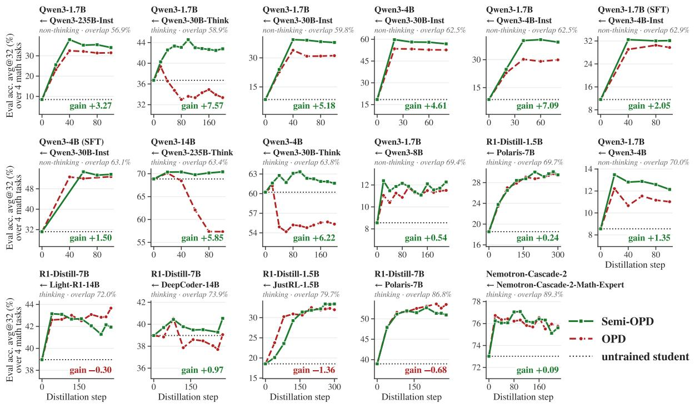  
Figure 3 | Semi-OPD vs. OPD across 17 model pairs. Each panel represents one student-teacher pair, with its title containing the pair's initial top-64 overlap. Accuracy is measured as the mean avg@32 over AIME 2024/2025/2026 and HMMT February 2026. The number in each panel is the gain plotted in Fig. 2a, defined as the area between the two curves divided by the training horizon.

Lightning OPD and that SFT on teacher rollouts has negative effects. In addition, we leverage our method to study when OPD should be used and the underlying reasons behind its failures, providing insights into best practices for OPD.

Top-K overlap ratio for measuring initial teacher-student alignment. To measure the alignment between teacher-student pairs and cover diverse combinations in our experiments, we follow [17] and compare the student's and teacher's top-K token sets at each response position of the initial student's rollouts. Specifically, let $S _ { K } ( t ) = \mathrm { T o p K } ( \pi _ { 0 } ( \cdot \mid s _ { t } ) )$ and $T _ { K } ( t ) = \mathrm { T o p K } ( \pi _ { T } ( \cdot \mid s _ { t } ) )$ denote the student's and teacher's top-K token sets, respectively. We define the top-K overlap ratio at position t as

$$
\mathrm { O v e r l a p @ K } ( t ) = \frac { | S _ { K } ( t ) \cap T _ { K } ( t ) | } { K } .
$$

Because both sets contain K tokens, this quantity is 1 when the two distributions have identical top-K supports and 0 when their supports are disjoint. We report the token-weighted mean over all response tokens. Unless otherwise noted, we use K = 64.

## 2.3. Benchmarking Semi-OPD vs. OPD and its Variants

Experiment setup. We conduct experiments on 17 student-teacher pairs (full model-pair names are provided in Tab. 3 in the appendix), spanning the Qwen3 [19], DeepSeek-R1-Distill [20], and Nemotron-Cascade-2 [21] families. Qwen3 students (1.7B, 4B, and 14B) are distilled from Instruct and Thinking teachers with up to 235B-A22B parameters, using either original or SFT-warm-started initializations; DeepSeek-R1-Distill students (1.5B and 7B) are distilled from RL-trained descendants of the same checkpoints, including JustRL [22], Polaris [23], Light-R1 [24], and DeepCoder [25]; and the Nemotron-Cascade-2 pair consists of the student checkpoint before OPD and its math-domain teacher used for the OPD step in [21]. The pairs cover both nonthinking and thinking modes, with training and evaluation matched within each pair. All models are distilled on DAPO-Math [26]. Mathematical capability is measured by avg@32 accuracy over AIME 2024–2026 and HMMT February 2026, using evaluation rollouts capped at 32k tokens (40k for Nemotron-Cascade-2), while cross-domain generalization is assessed on HumanEval and HumanEval+ [27]. More details are provided in Appendix A.

Semi-OPD vs. OPD across 17 model pairs. Fig. 3 visualizes the average accuracy evolution during training achieved by Semi-OPD and OPD across all 17 teacher-student pairs. We order the pairs by the overlap ratio of the initial teacher-student pair, which is annotated above each plot. We also report the average accuracy gain of Semi-OPD over OPD, defined as the area between the Semi-OPD and OPD learning curves divided by their shared training horizon.

Table 1 | Semi-OPD outperforms other OPD variants when the initial student-teacher overlap ratio is low, and remains comparable when the ratio is high. Results are reported as avg@32 at temperature 1.0, averaged over the checkpoints at steps 60/80/100. §Reported from [13].
<table><tr><td>Method</td><td>AIME24</td><td>AIME25</td><td>AIME26</td><td>HMMT Feb26</td><td>Avg@32</td></tr><tr><td colspan="4">Qwen3-1.7B (Non-think) ← Qwen3-4B-Instruct-2507</td><td colspan="2">Initial overlap ratio: 62.5%</td></tr><tr><td>Teacher</td><td>60.4</td><td>46.0</td><td>52.2</td><td>31.2</td><td>47.5</td></tr><tr><td>Student, untrained</td><td>12.6</td><td>9.6</td><td>7.4</td><td>6.3</td><td>9.0</td></tr><tr><td>Standard OPD§</td><td>35.8</td><td>25.5</td><td>23.3</td><td>20.1</td><td>26.2</td></tr><tr><td>Speculative KD [18]§</td><td>33.1</td><td>30.7</td><td>28.9</td><td>20.1</td><td>28.2</td></tr><tr><td>FastOPD [10]§</td><td>42.3</td><td>30.4</td><td>26.4</td><td>23.6</td><td>30.7</td></tr><tr><td>Lightning OD [16]</td><td>41.0</td><td>28.8</td><td>27.5</td><td>22.7</td><td>30.0</td></tr><tr><td>Relay-OPD [13]§</td><td>42.7</td><td>32.8</td><td>30.5</td><td>24.7</td><td>32.7</td></tr><tr><td>Semi-OPD (ours)</td><td>50.3</td><td>38.9</td><td>41.8</td><td>28.0</td><td>39.8</td></tr><tr><td colspan="6">Qwen3-4B (Non-think) ← Qwen3-30B-A3B-Instruct-2507 Initial overlap ratio: 62.5%</td></tr><tr><td>Teacher</td><td>72.9</td><td>62.0</td><td>72.8</td><td>40.6</td><td>62.1</td></tr><tr><td>Student, untrained</td><td>23.6</td><td>18.0</td><td>16.8</td><td>14.9</td><td>18.3</td></tr><tr><td>Standard OPD</td><td>55.1</td><td>45.3</td><td>49.1</td><td>30.0</td><td>44.9</td></tr><tr><td>FastOPD [10]</td><td>63.5</td><td>55.5</td><td>56.2</td><td>34.9</td><td>52.5</td></tr><tr><td>Lightning OD [16]</td><td>64.0</td><td>56.8</td><td>54.3</td><td>33.5</td><td>52.2</td></tr><tr><td>Relay-OPD [13]</td><td>61.1</td><td>48.1</td><td>52.5</td><td>32.8</td><td>48.6</td></tr><tr><td>Semi-OPD (ours)</td><td>66.4</td><td>63.1</td><td>62.9</td><td>37.4</td><td>57.4</td></tr><tr><td colspan="6">NM-Cascade-2-30B-A3B ← NM-Cascade-2-Math-Expert Initial overlap ratio: 89.3%</td></tr><tr><td>Teacher</td><td>82.8</td><td>80.0</td><td>76.4</td><td>58.2</td><td></td></tr><tr><td>Student, untrained</td><td>77.9</td><td>72.4</td><td>68.8</td><td>49.3</td><td>74.4 67.1</td></tr><tr><td>Standard OPD</td><td>83.0</td><td>80.1</td><td>75.8</td><td>57.5</td><td>74.1</td></tr><tr><td>FastOPD [10]</td><td>83.0</td><td>80.7</td><td>77.1</td><td>58.4</td><td>74.8</td></tr><tr><td>Lightning OD [16]</td><td>83.2</td><td>79.1</td><td>75.7</td><td>56.8</td><td>73.7</td></tr><tr><td>Relay-OPD [13]</td><td>83.2</td><td>80.1</td><td>73.3</td><td>57.7</td><td>73.6</td></tr><tr><td>Semi-OPD (ours)</td><td>83.0</td><td>79.7</td><td>77.0</td><td>56.8</td><td>74.1</td></tr></table>

We observe that Semi-OPD outperforms OPD on 14 of 17 pairs with improvements of up to \~13% over OPD at the last step, and the largest gains are generally achieved on pairs with lower initial overlap. On the remaining three pairs, Semi-OPD still achieves comparable performance, with gaps of 0.1– 2.6%. The difference is especially pronounced for Qwen3 thinking-mode pairs: OPD undergoes a substantial performance collapse during training, whereas Semi-OPD continues to improve.

Comparison with OPD variants in accuracy and training efficiency. In addition to standard OPD, we also compare Semi-OPD with recent OPD variants across three model pairs with different model sizes, overlap ratios, and reasoning modes in Tab. 1. We observe that (1) on the Qwen3-1.7B (non-thinking) and Qwen3-4B (non-thinking) students, which have low teacher-student overlap ratios, Semi-OPD outperforms all other baselines in accuracy while also being the most efficient, e.g., achieving +7.1% and +8.8% higher accuracy with 35× and 19.5× less training time than Relay-OPD on the two pairs, respectively, according to Fig. 1 and Tab. 4. (2) On the Nemotron-Cascade-2 pair, which has a high overlap ratio of approximately 89%, our Semi-OPD remains competitive with other OPD baselines and falls only slightly behind the best baseline by 0.7% accuracy, while reducing the training time by 2.2x as compared to FastOPD and 4.5x compared to OPD.

The overall accuracy-training-efficiency trade-off is shown in Fig. 1, where Semi-OPD achieves up to an 11.4× speedup over standard OPD and a 2.7× speedup over the fastest baseline, FastOPD. In contrast, another OPD variant, Relay-OPD, which also aims to make student rollouts closer to the teacher, requires interleaved teacher and student generation, resulting in lower efficiency.

## 3. How to Choose Between OPD and Semi-OPD?

As observed in Sec. 2.3 and Fig. 3, the relative performance of OPD and Semi-OPD is highly correlated with the teacher-student overlap ratio. It can therefore serve as an indicative metric for determining when to use OPD or Semi-OPD. We characterize this correlation more formally here.

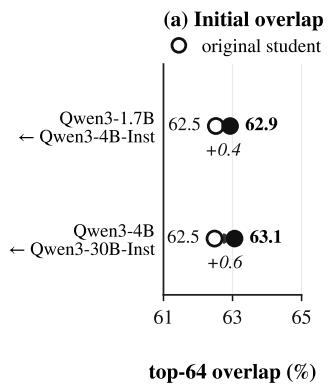

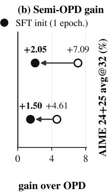

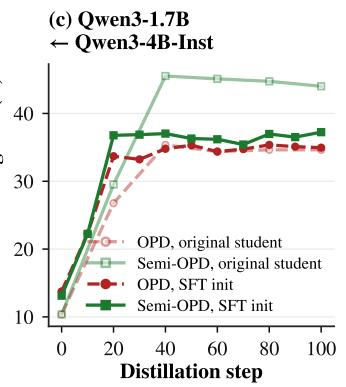

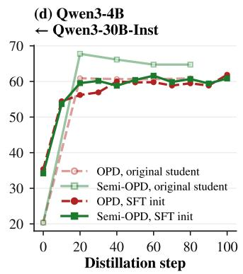  
Figure 4 | Teacher-rollout SFT improves overlap ratios but reduces final performance after Semi-OPD. (a) SFT on teacher rollouts slightly increases the initial top-64 overlap. (b) SFT on teacher rollouts followed by Semi-OPD still outperforms OPD but underperforms Semi-OPD alone. (c, d) SFT on teacher rollouts negatively impacts final performance when combined with Semi-OPD.

OPD is needed for teacher-student pairs with high overlap ratios; otherwise, Semi-OPD is better and faster. We compute the correlation between Semi-OPD's gain over OPD, measured as the area between their learning curves normalized by their shared training horizon, and the overlap ratio of each teacher-student pair in Fig. 2. The two quantities are strongly correlated (Pearson's r = -0.73 across 17 pairs): pairs with lower initial overlap ratios tend to benefit substantially more from Semi-OPD, while OPD is only needed for pairs with high overlap ratios.

This pattern implies that, when the student differs substantially from the teacher, repeatedly sampling from the evolving student policy can cause online rollouts to degrade (several examples are shown in Appendix E) and weaken the supervision signal; reusing rollouts from the initial student can provide a more stable distillation signal. We dive into the underlying reason in Sec. 4.

Key insights. The above phenomenon provides useful implications for the practical use and research of OPD: (1) Given a target teacher-student pair and target-domain prompts, determine whether to use OPD or Semi-OPD based on their overlap ratio, rather than blindly using OPD; (2) For future studies of improved OPD schemes in LM post-training pipelines, carefully select the teacher-student pair used as the experimental setting; otherwise, Semi-OPD can serve as a strong baseline.

Does SFT on teacher rollouts close the gap? We also experiment with two pairs in which the students undergo one epoch of SFT on teacher-generated rollouts, followed by OPD or Semi-OPD. This matches the setup of Lightning OPD [16]. As shown in Fig. 4, we observe that (1) SFT on teacher rollouts slightly increases teacher-student overlap ratios, while Semi-OPD still outperforms OPD on both pairs, albeit by a smaller margin; and (2) Our Semi-OPD without the additional teacher-rollout SFT stage can outperform Semi-OPD with this stage, indicating that SFT on teacher rollouts is unnecessary. We also note that, while [16] frames fixed rollouts primarily as an efficient approximation to OPD, our results show that freezing the rollout cache can improve distillation when the initial teacher-student overlap is low.

## 4. Why Does OPD Often Underperform Semi-OPD?

We further investigate why OPD underperforms Semi-OPD in low-overlap cases.

Our hypothesis. We hypothesize that effective distillation requires training data (i.e., rollouts) to satisfy two properties: (1) on-policyness w.r.t. the student to avoid exposure bias, and (2) high-quality supervision from the teacher, which is often determined by on-policyness w.r.t. the teacher distribution, i.e., how well the rollouts align with the teacher's own inference-time distribution. OPD prioritizes the former while struggling with the latter, especially for low-overlap teacher-student pairs; Semi-OPD trades off some student on-policyness for more effective supervision signals, as analyzed below.

More specifically, for low-overlap pairs, rollouts become increasingly longer during OPD and exhibit various artifacts [6, 7, 8]. This makes later tokens in a rollout increasingly off-policy w.r.t. the teacher's distribution, making teacher supervision on them unhelpful or even harmful [13, 14]. Truncating the rollouts and training only on the prefix can mitigate this issue [10, 11], but at the cost of removing supervision on later tokens. As demonstrated later, covering supervision signals across all reasoning stages in full trajectories is important for final performance. In contrast, Semi-OPD trains on rollouts from the initial student, which are usually shorter than on-policy rollouts, thereby better maintaining on-policyness w.r.t. the teacher while still covering full trajectories with all reasoning stages. We support the above analysis through the following study.

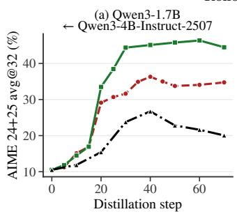

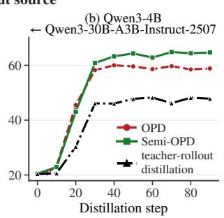

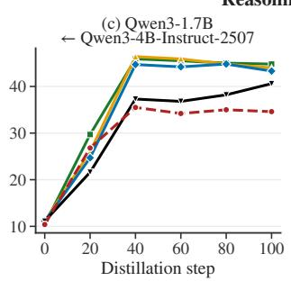

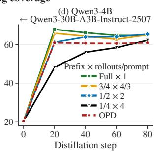  
Figure 5 |Both rollout source and reasoning coverage matter for distillation. (a, b) Semi-OPD outperforms teacher-rollout distillation (and OPD) on both pairs. (c, d) We compare Semi-OPD trained on the first 1/4, 1/2, 3/4, or all of each rollout, while keeping the total number of training tokens fixed by scaling the number of rollouts per prompt. Distillation on all stages performs best.  
Effect of the training rollout cap in OPD

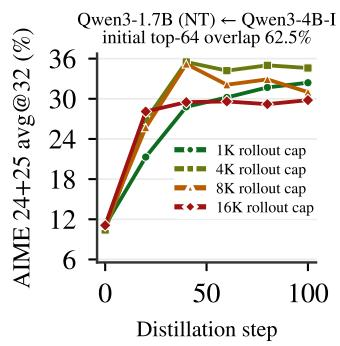

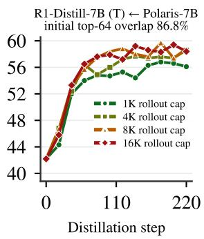  
Figure 6 | Longer rollouts hurt the low-overlap pair (left) but not the high-overlap pair (right).

Student on-policyness matters: Semi-OPD vs. teacher-rollout distillation. We study the importance of student on-policyness to Semi-OPD by replacing the initial-student rollout cache with teachergenerated rollouts while keeping all other settings unchanged. As shown in Fig. 5(a, b), Semi-OPD consistently outperforms teacher-rollout distillation. This indicates that the benefit of Semi-OPD does not come merely from using a fixed rollout cache. Rather, retaining student-generated trajectories to maintain student on-policyness is also important.

Training on longer rollouts can hurt OPD for low-overlap pairs. As shown in Fig. 6, we vary the rollout length (i.e., the rollout cap) used for OPD training and observe that increasing the rollout cap can hurt the low-overlap pair while benefiting the higher-overlap pair. We hypothesize that, for lowoverlap pairs, training on long rollouts that are offpolicy w.r.t. the teacher may tend to reinforce superficial reasoning patterns without sufficiently improving the underlying reasoning process, causing subsequent student rollouts to deteriorate (examples comparing rollouts are in Appendix E).

Supervision signals covering all reasoning stages are essential. If long rollouts can be harmful one simple solution is to truncate them, at the cost of dropping supervision from later reasoning stages. To isolate the value of reasoning-stage coverage, we perform an ablation by truncating the cached Semi-OPD traces to the first 1/4, 1/2, or 3/4 of their length while scaling the number of rollouts per prompt to keep the total training token budget fixed. As shown in Fig. 5(c, d), restricting supervision to the first quarter substantially slows convergence and reduces final accuracy, whereas training on full trajectories achieves the best peak accuracy. Thus, both covering all reasoning stages and maintaining on-policyness w.r.t. the teacher are important.

Semi-OPD exposes the student to more tokens preferred by the teacher. Semi-OPD exactly satisfies the above requirement by providing full trajectory coverage with shorter rollout lengths. To analyze the resulting distillation signal, we measure the percentage of training tokens with pT > ps, i.e., tokens that receive a positive reward due to higher probabilities assigned by the teacher. As shown in Fig. 7, Semi-OPD maintains a larger fraction of such tokens than OPD throughout training. This indicates that Semi-OPD exposes the student to more teacher-preferred tokens, i.e., more on-policy w.r.t. the teacher, whereas OPD more often produces signals that suppress the student's own sampled tokens. Importantly, Semi-OPD also outperforms OPD under top-k reverse KL, as shown in Fig. 8, indicating that its advantage is not specific to the sampled-token objective.

## Semi-OPD trains on more tokens with pT> ps

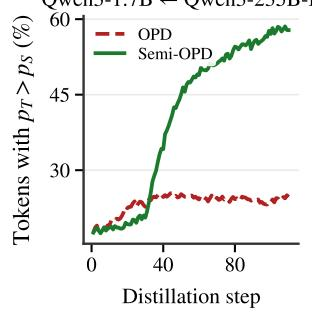

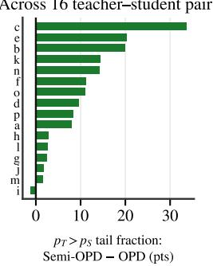  
Figure 7 | The percentage of tokens with positive rewards, i.e., fraction of training tokens with pT > ps under Semi-OPD and OPD.

Qwen3-1.7B (NT) ← Qwen3-4B-Instruct  
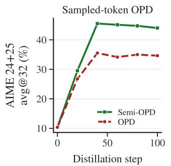

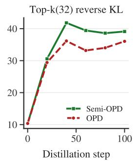  
Figure 8 | Semi-OPD vs. OPD under two distillation objectives, i.e., the sampled-token and top-k reverse KL objectives.

(a) Qwen3-1.7B (non-thinking) ← Qwen3-4B-Instruct-2507  
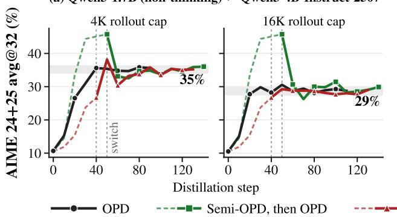  
(b) Qwen3-4B (non-thinking) ← Qwen3-30B-A3B-Instruct-2507

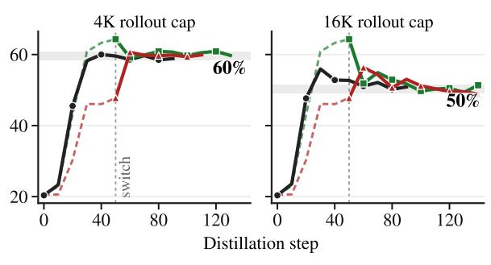  
Figure 9 |Switching to OPD converges toward a rollout-determined equilibrium, largely independent of initialization. OPD eval accuracy trajectories when initialized from the initial student, a Semi-OPD checkpoint, or a teacher-rollout distillation checkpoint. Switching to OPD can either decrease or improve performance (see Fig. 10), with trajectories approaching the performance level of OPD trained from scratch under the same rollout cap. Dashed lines indicate training before switching to OPD.

Together, these findings suggest that Semi-OPD benefits from preserving student-anchored rollouts that remain effective teacher supervision and broad coverage of the reasoning process. These advantages can outweigh the benefits of fully on-policy sampling under large teacher-student mismatch

## 5. More Intriguing Observations

Beyond the main comparison, we observe several interesting phenomena that provide a more complete picture of Semi-OPD versus OPD. More interesting observations are provided in the appendix.

OPD converges to a rollout-determined equilibrium, regardless of initialization. A natural question is whether OPD can further improve after Semi-OPD. We study this by initializing OPD from Semi-OPD or teacher-rollout distillation checkpoints as warm starts. As shown in Fig. 9, on low-overlap pairs, regardless of initialization, all runs eventually converge to the performance level reached by OPD initialized from the initial student model under the same rollout cap, while the warm start only affects the convergence trajectory. In contrast, for a high-overlap pair, as shown in Fig. 10, switching from Semi-OPD to OPD improves performance and closes most of the gap with OPD applied from scratch. This suggests that repeated on-policy sampling drives distillation toward an equilibrium determined by the online rollout data distribution rather than the initial checkpoint. Characterizing this equilibrium remains an interesting direction for future work.

The gains transfer beyond the training domain. As shown in Fig. 11, models distilled only on mathheavy datasets [26] also improve on HumanEval and HumanEval+, with Semi-OPD remaining ahead of OPD. This suggests that the gains are not limited to fitting the math training distribution but transfer to broader reasoning tasks.

Semi-OPD requires adequately strong initial rollouts. Since Semi-OPD trains only on rollouts from π0, the initial rollouts need to meet a minimum quality threshold for effective distillation. For example, as shown in Fig. 12, with a base student, the initial rollouts are too weak and Semi-OPD underperforms OPD; with an instruction-tuned student, Semi-OPD regains its advantage. Thus, Semi-OPD is most suitable when the initial student already produces meaningful trajectories.

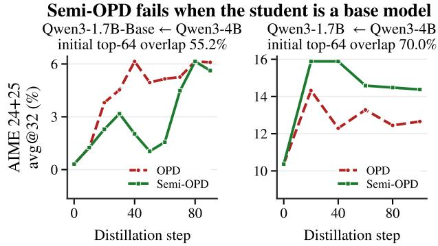

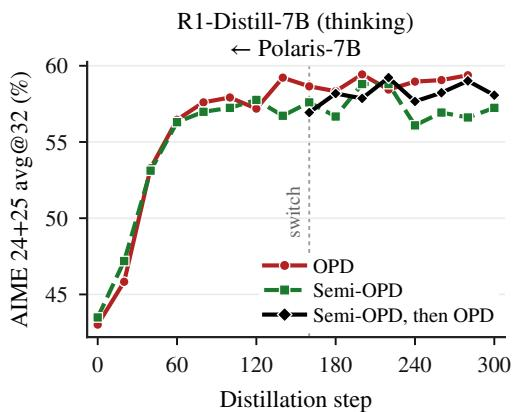  
Figure 10 | Switching from Semi-OPD to OPD on a high-overlap pair with an initial top-64 overlap ratio of 86.8% closes the gap with OPD applied from scratch.

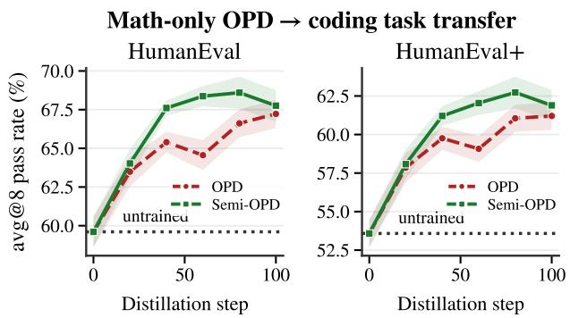  
Figure 11 | Transfer to coding. Code performance of models distilled on math only (Qwen3-1.7B ← Qwen3-4B-Instruct-2507).  
Figure 12 |Initial student competence. Semi-OPD vs. OPD with the same teacher, from base (left) and instruction-tuned (right) students.

## 6. Related work

On-Policy Distillation and Its Mechanics. OPD trains a student on trajectories sampled from its own policy, while a teacher provides dense supervision through reverse-KL or related objectives [1, 2, 3, 28]. By optimizing on the student's own visitation distribution, OPD mitigates the exposure bias of offline distillation [29, 30], an idea shared with interactive imitation learning methods such as DAgger [31]. OPD has recently become a popular post-training stage for reasoning models [4, 19, 5, 15], motivating recent work to better understand its underlying mechanics [32, 8, 33]. For example, successful OPD is linked to teacher-student compatibility [17], while even a single training example or 1% of tokens can recover much of full-data OPD [34, 35].

Failure Modes in OPD. Recent work has identified several failure modes of OPD: student rollouts can grow longer, fall into repeated self-correction, and fail to terminate [6, 7, 8, 9], and later portions of a rollout can drift away from the teacher distribution, yielding increasingly unreliable supervision [11, 13, 14, 36]. Existing methods mitigate these issues by truncating student rollouts [10, 11], letting the teacher intervene during generation [18, 13], refining student trajectories with the teacher [14], warm-starting OPD on teacher data [17], or constraining updates to a trust region [37, 38]. Other work relaxes strict onpolicyness for efficiency, using fixed rollouts from a teacher-SFT reference policy [16, 39] or policy-lagged student rollouts in asynchronous training [40]. We study the simplest form of this relaxation: rollouts are sampled once from the initial student, without any teacher-SFT stage, and no refreshing. Beyond efficiency gain, we find that freezing rollouts can also improve accuracy. Moreover, rather than focusing on a few model pairs, we evaluate 17 diverse model pairs and show that this benefit is strongly correlated with the initial teacher-student top-k overlap, with lower-overlap pairs benefiting more.

## 7. Conclusion

This work revisits when on-policy sampling is truly necessary for LM distillation. By systematically comparing OPD with the proposed Semi-OPD across diverse teacher-student pairs, we show that continually regenerating student rollouts is often unnecessary and can even be harmful, especially when the teacher and student are poorly aligned. Our analyses highlight a key principle: effective distillation requires balancing on-policyness w.r.t. both the student and the teacher with the initial teacher-student overlap serving as a practical indicator of when to use OPD or Semi-OPD. Beyond providing an efficient alternative to OPD, our findings motivate future work to rethink on-policy sampling as a design choice rather than a default, and to develop distillation methods that explicitly account for teacher-student alignment and rollout quality.

## References

[1] Rishabh Agarwal, Nino Vieillard, Yongchao Zhou, Piotr Stanczyk, Sabela Ramos Garea, Matthieu Geist, and Olivier Bachem. On-policy distillation of language models: Learning from self-generated mistakes. In The twelfth international conference on learning representations, 2024.

[2] Yuxian Gu, Li Dong, Furu Wei, and Minlie Huang. Minillm: Knowledge distillation of large language models. In ICLR, 2024.

[3] Kevin Lu and Thinking Machines Lab. On-policy distillation. Thinking Machines Lab: Connectionism, 2025. https://thinkingmachines.ai/blog/on-policydistillation.

[4] LLM-Core Xiaomi. Mimo-v2-flash technical report, 2026.

[5] Anyi Xu, Bangcai Lin, Bing Xue, Bingxuan Wang, Bingzheng Xu, Bochao Wu, Bowei Zhang, Chaofan Lin, Chen Dong, Chenchen Ling, et al. Deepseekv4: Towards highly efficient million-token context intelligence. arXiv preprint arXiv:2606.19348, 2026.

[6] Feng Luo, Yu-Neng Chuang, Guanchu Wang, Zicheng Xu, Xiaotian Han, Tianyi Zhang, and Vladimir Braverman. Demystifying opd: Length inflation and stabilization strategies for large language models. arXiv preprint arXiv:2604.08527, 2026.

[7] Yuxiao Yang, Tianrun Yu, Shangzhe Li, Kaixiang Zhao, Xuchao Zhang, Chetan Bansal, Huaxiu Yao, Taylor W Killian, and Weitong Zhang. When eos tokens disagree: Understanding length inflation in onpolicy distillation. arXiv preprint arXiv:2609.20511, 2026.

[8] Yuqian Fu, Haohuan Huang, Kaiwen Jiang, Jiacai Liu, Zhuo Jiang, Yuanheng Zhu, and Dongbin Zhao. Revisiting on-policy distillation: Empirical failure modes and simple fixes. arXiv preprint arXiv:2603.25562, 2026.

[9] Zichao Yu, Chengzhi Yu, Shengze Xu, Yujin Han, Bingqing Jiang, Xu Wang, and Difan Zou. Mismatch matters: On-policy distillation beyond token agreement. arXiv preprint arXiv:2608.09836, 2026.

[10] Dongxu Zhang, Zhichao Yang, Sepehr Janghorbani, Jun Han, Andrew Ressler II, Qian Qian, Gregory D Lyng, Sanjit Singh Batra, and Robert E Tillman. Fast and effective on-policy distillation from reasoning prefixes. In Findings of the Association for Computational Linguistics: ACL 2026, pages 25553–25569, 2026.

[11] Zhou Ziheng, Jiaqi Li, Huacong Tang, Ying Nian Wu, and Demetri Terzopoulos. Less is more: Early stopping rollout for on-policy distillation. arXiv preprint arXiv:2605.27028, 2026.

[12] Kaiyuan Liu, Ziyuan Zhuang, Yang Bai, Bing Wang, Rongxiang Weng, and Jieping Ye. Prefix teach, suffix fade: Local teachability collapse in strong-to-weak onpolicy distillation. arXiv preprint arXiv:2605.13643, 2026.

[13] Haolei Xu, Xiaowen Xu, Haiwen Hong, Zixuan Ni, Hongxing Li, Yiwen Qiu, Weiming Lu, and Yongliang Shen. Pass the baton: Trajectory-relayed on-policy distillation. arXiv preprint arXiv:2607.26057, 2026.

[14] Li Jiang, Haoran Xu, Yichuan Ding, and Amy Zhang. Trajectory-refined distillation. arXiv preprint arXiv:2606.08432, 2026.

[15] Kimi Team, Tongtong Bai, Yifan Bai, Yiping Bao, Jianfeng Cai, Xinyuan Cai, Peizhou Cao, Yuxuan Cao, Ziwei Chai, Y Charles, et al. Kimi k3: Open frontier intelligence. arXiv preprint arXiv:2607.24653, 2026.

[16] Yecheng Wu, Song Han, and Hai Cai. Lightning opd: Efficient post-training for large reasoning models with offline on-policy distillation. arXiv preprint arXiv:2604.13010, 2026.

[17] Yaxuan Li, Yuxin Zuo, Bingxiang He, Jinqian Zhang, Chaojun Xiao, Cheng Qian, Tianyu Yu, Huan-ang Gao, Wenkai Yang, Zhiyuan Liu, et al. Rethinking on-policy distillation of large language models: Phenomenology, mechanism, and recipe. arXiv preprint arXiv:2604.13016, 2026.

[18] Wenda Xu, Rujun Han, Zifeng Wang, Long Le, Dhruv Madeka, Lei Li, William Yang Wang, Rishabh Agarwal, Chen-Yu Lee, and Tomas Pfister. Speculative knowledge distillation: Bridging the teacher-student gap through interleaved sampling. In The Thirteenth International Conference on Learning Representations, 2024.

[19] An Yang, Anfeng Li, Baosong Yang, Beichen Zhang, Binyuan Hui, Bo Zheng, Bowen Yu, Chang Gao, Chengen Huang, Chenxu Lv, Chujie Zheng, Dayiheng Liu, Fan Zhou, Fei Huang, Feng Hu, Hao Ge, Haoran Wei, Huan Lin, Jialong Tang, Jian Yang, Jianhong Tu, Jianwei Zhang, Jianxin Yang, Jiaxi Yang, Jing Zhou, Jingren Zhou, Junyang Lin, Kai Dang, Keqin Bao, Kexin Yang, Le Yu, Lianghao Deng, Mei Li, Mingfeng Xue, Mingze Li, Pei Zhang, Peng Wang, Qin Zhu, Rui Men, Ruize Gao, Shixuan Liu, Shuang Luo, Tianhao Li, Tianyi Tang, Wenbiao Yin, Xingzhang Ren, Xinyu Wang, Xinyu Zhang, Xuancheng Ren, Yang Fan, Yang Su, Yichang Zhang, Yinger Zhang, Yu Wan, Yuqiong Liu, Zekun Wang; Zeyu Cui, Zhenru Zhang, Zhipeng Zhou, and Zihan Qiu. Qwen3 technical report. arXiv preprint arXiv:2505.09388, 2025.

[20] DeepSeek-AI. Deepseek-r1: Incentivizing reasoning capability in llms via reinforcement learning, 2025.

[21] Zhuolin Yang, Zihan Liu, Yang Chen, Wenliang Dai, Boxin Wang, Sheng-Chieh Lin, Chankyu Lee, Yangyi

Chen, Dongfu Jiang, Jiafan He, et al. Nemotroncascade 2: Post-training llms with cascade rl and multi-domain on-policy distillation. arXiv preprint arXiv:2603.19220, 2026.

[22] Bingxiang He, Zekai Qu, Zeyuan Liu, Yinghao Chen, Yuxin Zuo, Cheng Qian, Kaiyan Zhang, Weize Chen, Chaojun Xiao, Ganqu Cui, et al. Justrl: Scaling a 1.5 b llm with a simple rl recipe. arXiv preprint arXiv:2512.16649, 2025.

[23] Chenxin An, Zhihui Xie, Xiaonan Li, Lei Li, Jun Zhang, Shansan Gong, Ming Zhong, Jingjing Xu, Xipeng Qiu, Mingxuan Wang, and Lingpeng Kong. Polaris: A post-training recipe for scaling reinforcement learning on advanced reasoning models, 2025.

[24] Liang Wen, Yunke Cai, Fenrui Xiao, Xin He, Qi An, Zhenyu Duan, Yimin Du, Junchen Liu, Lifu Tang, Xiaowei Lv, Haosheng Zou, Yongchao Deng, Shousheng Jia, and Xiangzheng Zhang. Light-r1: Curriculum sft, dpo and rl for long cot from scratch and beyond, 2025.

[25] Michael Luo, Sijun Tan, Roy Huang, Ameen Patel, Alpay Ariyak, Qingyang Wu, Xiaoxiang Shi, Rachel Xin, Colin Cai, Maurice Weber, Ce Zhang, Li Erran Li, Raluca Ada Popa, and Ion Stoica. Deepcoder: A fully open-source 14b coder at o3-mini level. https: //pretty-radio-b75.notion.site/DeepCoder-A-Fully-0pen-Source-14B-Coder-at-03-mini-Level-1cf81902c14680b3bee5eb349a512a51, 2025. Notion Blog.

[26] Qiying Yu, Zheng Zhang, Ruofei Zhu, Yufeng Yuan, Xiaochen Zuo, Yu Yue, Tiantian Fan, Gaohong Liu, Lingjun Liu, Xin Liu, et al. Dapo: An open-source llm reinforcement learning system at scale, 2025. URL https://arxiv. org/abs/2503.14476, 2025.

[27] Mark Chen, Jerry Tworek, Heewoo Jun, Qiming Yuan, Henrique Ponde de Oliveira Pinto, Jared Kaplan, Harri Edwards, Yuri Burda, Nicholas Joseph Greg Brockman, Alex Ray, Raul Puri, Gretchen Krueger, Michael Petrov, Heidy Khlaaf, Girish Sastry, Pamela Mishkin, Brooke Chan, Scott Gray, Nick Ryder, Mikhail Pavlov, Alethea Power, Lukasz Kaiser, Mohammad Bavarian, Clemens Winter, Philippe Tillet, Felipe Petroski Such, Dave Cummings, Matthias Plappert, Fotios Chantzis, Elizabeth Barnes, Ariel Herbert-Voss, William Hebgen Guss, Alex Nichol, Alex Paino, Nikolas Tezak, Jie Tang, Igor Babuschkin, Suchir Balaji, Shantanu Jain, William Saunders, Christopher Hesse, Andrew N. Carr, Jan Leike, Josh Achiam, Vedant Misra, Evan Morikawa, Alec Radford, Matthew Knight, Miles Brundage, Mira Murati, Katie Mayer, Peter Welinder, Bob McGrew, Dario Amodei, Sam McCandlish, Ilya Sutskever, and Wojciech Zaremba. Evaluating large language models trained on code, 2021.

[28] Mingyang Song and Mao Zheng. A survey of onpolicy distillation for large language models. arXiv preprint arXiv:2604.00626, 2026.

[29] Geoffrey Hinton, Oriol Vinyals, and Jeff Dean. Distilling the knowledge in a neural network, 2015.

[30] Yoon Kim and Alexander M Rush. Sequence-level knowledge distillation. In Proceedings of the 2016 conference on empirical methods in natural language processing, pages 1317–1327, 2016.

[31] Stéphane Ross, Geoffrey Gordon, and Drew Bagnell. A reduction of imitation learning and structured prediction to no-regret online learning. In Proceedings of the fourteenth international conference on artifcial intelligence and statistics, pages 627–635. JMLR Workshop and Conference Proceedings, 2011.

[32] Woogyeol Jin, Taywon Min, Yongjin Yang, Dennis Wei, Yi Zhou, Swanand Ravindra Kadhe, Nathalie Baracaldo, and Kimin Lee. Entropy-aware on-policy distillation of language models. arXiv preprint arXiv:2603.07079, 2026.

[33] Mohammadreza Armandpour, Fatih Ilhan, David Harrison, Ajay Jaiswal, Duc NM Hoang, Fartash Faghri, Yizhe Zhang, Minsik Cho, and Mehrdad Farajtabar. Unmasking on-policy distillation: Where it helps, where it hurts, and why. arXiv preprint arXiv:2605.10889, 2026.

[34] Zixuan Fu, Bingxiang He, Yuxin Zuo, Haohuan Huang, Jinqian Zhang, Ruhang Xiao, Cheng Qian, Qinyu Luo, Huan-ang Gao, Yudong Wang, et al. Rethinking on-policy distillation of large language models ii: One training example. arXiv preprint arXiv:2609.04172, 2026.

[35] Huanxin Sheng, Zhiling Ye, Haonan Wang, Jian Wang, Jinjie Gu, and Jian Kang. 1% of tokens can be enough: On gradient estimation in on-policy distillation. arXiv preprint arXiv:2609.24432, 2026.

[36] Rui Wang, Hongru Wang, Yi Chen, Boyang Xue, Tianqing Fang, Wenhao Yu, and Kam-Fai Wong. Demystifying on-policy distillation: Roles, pathologies, and regulations. arXiv preprint arXiv:2607.13399, 2026.

[37] Xingrun Xing, Haoqing Wang, Boyan Gao, Ziheng Li, and Yehui Tang. Trust region on-policy distillation. arXiv preprint arXiv:2606.01249, 2026.

[38] Zhengpeng Xie, Li Lyna Zhang, Zeke Xie, and Mao Yang. Trust region policy distillation. arXiv preprint arXiv:2607.04751, 2026.

[39] Yecheng Wu, Song Han, and Han Cai. Lightning opd 2.0: Mitigating style bias in cross-teacher on-policy distillation for large reasoning models. arXiv preprint arXiv:2607.28449, 2026.

[40] Wonjun Kang, Kevin Galim, Seunghyuk Oh, Minjun Kang, Sanghyun Park, Donghoon Kim, Minjae Lee, Minseo Kim, Rishabh Tiwari, Yuchen Zeng, et al. Asyncopd: How stale can on-policy distillation be? arXiv preprint arXiv:2606.24143, 2026.

## A. Training and Evaluation Setup

Models. Tab. 3 lists all 17 teacher-student pairs used in our experiments. They cover three groups: (i) Qwen3 students (1.7B, 4B, 14B) to be distilled from Qwen3 Instruct-2507 and Thinking-2507 teachers of up to 235B-A22B parameters; (ii) DeepSeek-R1-Distill-Qwen students (1.5B, 7B) to be distilled from RL-trained models of the same checkpoints (JustRL, Polaris, Light-R1, DeepCoder); (iii) one Nemotron Cascade-2 math expert pair. Pairs (g) and (h) start from an SFT checkpoint of the student, after doing 1 epoch of SFT on the teacher generated rollouts. Reasoning mode (thinking T / non-thinking NT) is fixed and matched per pair. Both methods of a pair train and evaluate with the same chat template and thinking mode, and the evaluation mode always matches the training mode. The DeepSeek-R1-Distill chat templates always prefill <think>, so we treat those pairs as thinking-mode.

Training data and setup. All runs train on the prompts from the DAPO-Math-17K dataset (14,116 English prompts after deduplication), using 128 prompts per step and one rollout per prompt. One epoch is therefore around 110 steps. For Semi-OPD, we sample one response per prompt from the initial student π0 before training, using the same sampling parameters and response cap as OPD. OPD reads the prompts in the same order. As a result, the two methods see the same prompts at every step and differ only in which model generated the response. Both methods use the same sampled-token reverse-KL objective. They also share the teacher, learning rate, batch size and evaluation protocol. Tab. 2 lists the hyperparameters. Additionally, it is worth noting that in our work, Fast OPD is implemented with a training rollout limit of 4K, following [13]. For only the non-thinking pairs, we also adopt a 4K training rollout length for OPD in the comparisons shown in Fig. 3 and Fig. 2. In Table 1, however, OPD is trained with a 16K rollout limit for all pairs to clearly distinguish with Fast OPD. For exact rollout shape used during training can refer to Table 3 too. Note that this is for training rollout, for evaluation we all use 32k or 40k limit.

Table 2 | Training and evaluation hyperparameters.
<table><tr><td>Non-thinking pairs</td><td>Think/Long-CoT pairs</td></tr><tr><td>Optimization</td><td></td></tr><tr><td>Optimizer</td><td>AdamW (β1=0.9, β2=0.999, wd 0.01)</td></tr><tr><td>Learning rate</td><td>1 × 10−6, constant (no warm-up)</td></tr><tr><td>Gradient clipping</td><td>1.0</td></tr><tr><td>Precision</td><td>bfloat16</td></tr><tr><td>Prompts per step / rollouts per prompt</td><td>128 / 1</td></tr><tr><td>Global batch size</td><td>128</td></tr><tr><td>Rollouts</td><td>2,048</td></tr><tr><td>Max prompt length</td><td>4,096</td></tr><tr><td>Max response length (training)</td><td>16,384</td></tr><tr><td>Sampling temperature / top-p</td><td>1.0 / 1.0</td></tr><tr><td>Loss</td><td></td></tr><tr><td>Objective</td><td>Sampled-token reverse KL</td></tr><tr><td>Evaluation</td><td></td></tr><tr><td>Benchmarks</td><td>AIME24, AIME25, AIME26, HMMT Feb26</td></tr><tr><td>Metric</td><td>avg@32</td></tr><tr><td>Temperature / top-p</td><td>1.0 / 1.0</td></tr><tr><td>Max response length</td><td>32k (40k for Nemotron model)</td></tr></table>

Infrastructure. We train with NeMo-RL (DTensor backend) and generate rollouts and evaluation samples with vLLM. Runs use 1–8 nodes of 8× H100 GPUs, depending on the teacher size.

Table 3 | All 17 teacher-student pairs, sorted by AUC gain of Semi-OPD over OPD. Model names link to the exact Hugging Face checkpoints used. Mode: T = thinking / long chain-of-thought, NT = non-thinking. Cap: maximum response length of training rollouts, shared by both Semi-OPD and OPD. Overlap: top-64 overlap between the initial student and the teacher, in %. Last-step: Semi-OPD minus OPD at the last step both methods evaluated. AUC: signed area between the two accuracy curves over the steps both methods evaluated. divided by the length of that span. Gains are avg@32 points on the four-benchmark mean. R1-Distill = DeepSeek-R1-Distill-Qwen; Cascade-2 = Nemotron-Cascade-2 (SFT): the linked student after one epoch of SFT on teacher rollouts. †Evaluated with a 40,960-token response limit; all other pairs use 32,768.
<table><tr><td></td><td></td><td></td><td></td><td>Train Len</td><td>Init.</td><td colspan="2">Gain</td></tr><tr><td>#</td><td>Student</td><td>Teacher</td><td>Mode</td><td>Cap</td><td>Overlap</td><td>Last-step</td><td>AUC</td></tr><tr><td>n</td><td>Qwen3-1.7B</td><td>Qwen3-30B-A3B-Thinking</td><td>T</td><td>16K</td><td>58.9</td><td>+9.4</td><td>+7.57</td></tr><tr><td>a</td><td>Qwen3-1.7B</td><td>Qwen3-4B-Instruct-2507</td><td>NT</td><td>4K</td><td>62.5</td><td>+9.5</td><td>+7.09</td></tr><tr><td>p</td><td>Qwen3-4B</td><td>Qwen3-30B-A3B-Thinking</td><td>T</td><td>16K</td><td>63.8</td><td>+6.2</td><td>+6.22</td></tr><tr><td>0</td><td>Qwen3-14B</td><td>Qwen3-235B-A22B-Thinking</td><td>T</td><td>16K</td><td>63.4</td><td>+13.1</td><td>+5.85</td></tr><tr><td>b</td><td>Qwen3-1.7B</td><td>Qwen3-30B-A3B-Instruct-2507</td><td>NT</td><td>4K</td><td>59.8</td><td>+6.8</td><td>+5.18</td></tr><tr><td>f</td><td>Qwen3-4B</td><td>Qwen3-30B-A3B-Instruct-2507</td><td>NT</td><td>4K</td><td>62.5</td><td>+4.2</td><td>+4.61</td></tr><tr><td>C</td><td>Qwen3-1.7B</td><td>Qwen3-235B-A22B-Instruct-2507</td><td>NT</td><td>4K</td><td>56.9</td><td>+2.6</td><td>+3.27</td></tr><tr><td>g</td><td>Qwen3-1.7B (SFT)</td><td>Qwen3-4B-Instruct-2507</td><td>NT</td><td>4K</td><td>62.9</td><td>+2.4</td><td>+2.05</td></tr><tr><td>h</td><td>Qwen3-4B (SFT)</td><td>Qwen3-30B-A3B-Instruct-2507</td><td>NT</td><td>4K</td><td>63.1</td><td>+0.9</td><td>+1.50</td></tr><tr><td>d</td><td>Qwen3-1.7B</td><td>Qwen3-4B</td><td>NT</td><td>4K</td><td>70.0</td><td>+1.1</td><td>+1.35</td></tr><tr><td>m</td><td>R1-Distill-7B</td><td>DeepCoder-14B</td><td>T</td><td>16K</td><td>73.9</td><td>+1.5</td><td>+0.97</td></tr><tr><td>e</td><td>Qwen3-1.7B</td><td>Qwen3-8B</td><td>NT</td><td>4K</td><td>69.4</td><td>+0.8</td><td>+0.54</td></tr><tr><td>j</td><td>R1-Distill-1.5B</td><td>Polaris-7B</td><td>T</td><td>16K</td><td>69.7</td><td>+0.1</td><td>+0.24</td></tr><tr><td>q</td><td>Cascade-2-30B-A3B</td><td>Cascade-2-Math-Expert†</td><td>T</td><td>16K</td><td>89.3</td><td>-0.1</td><td>+0.09</td></tr><tr><td>1</td><td>R1-Distill-7B</td><td>Light-R1-14B</td><td>T</td><td>16K</td><td>72.0</td><td>-1.7</td><td>-0.30</td></tr><tr><td>k</td><td>R1-Distill-7B</td><td>Polaris-7B</td><td>T</td><td>16K</td><td>86.8</td><td>-2.6</td><td>-0.68</td></tr><tr><td>i</td><td>R1-Distill-1.5B</td><td>JustRL-1.5B</td><td>T</td><td>16K</td><td>79.7</td><td>+1.4</td><td>-1.36</td></tr></table>

## B. Training Dynamics Across All Pairs

We provide more training dynamics discussion in this section. Figures 13 to 17 track five properties of the training rollouts for 16 of the 17 pairs (all except the Nemotron-Cascade-2 pair).

Rollout length. As shown in Fig. 13, OPD's rollouts lengthen as training proceeds, while Semi-OPD's stay at the length of the initial student's rollouts by construction. Over the last 10 shared steps, OPD's rollouts are 7–113% longer than Semi-OPD's in 15 of 16 pairs. The growth is largest for the low-overlap non-thinking Qwen3 pairs, where OPD's rollouts often exceed the teacher's own length. The only exception is R1-Distill-1.5B ← JustRL-1.5B, whose OPD rollouts get shorter.

## Training rollout length over distillation

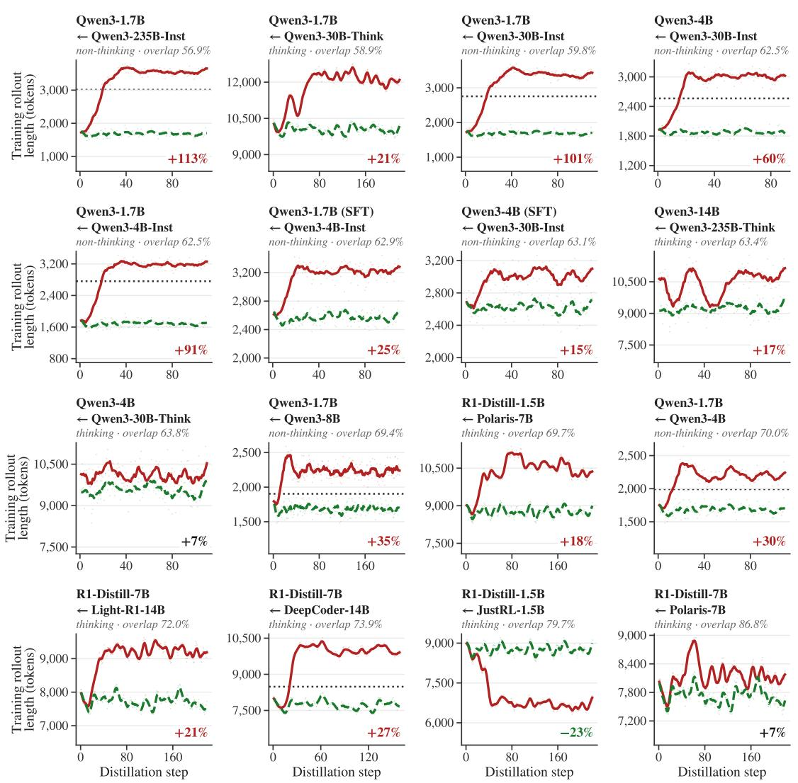  
Figure 13 | Training rollout length. Mean generated tokens per training rollout. The number in each panel is how much longer OPD's rollouts are than Semi-OPD's over the last 10 shared steps; the dotted line is the teacher's length, where available.

Positively supervised tokens. As shown in Fig. 14, Semi-OPD keeps a larger share of positively supervised tokens $\left( p _ { T } > p _ { S } \right)$ than OPD in 15 of 16 pairs. The exception is again R1-Distill-1.5B ← JustRL-1.5B.

Share of trained tokens with positive advantage $( p _ { T } > p _ { S } )$

\- . Semi-OPD (frozen π0 rollouts)  OPD (regenerated rollouts) number: Semi-OPD – OPD share (pts), last 10 shared steps

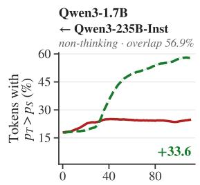

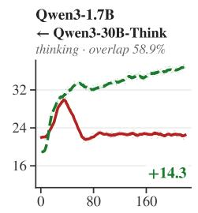

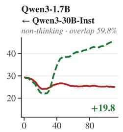

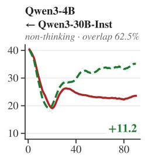

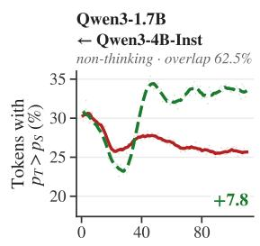

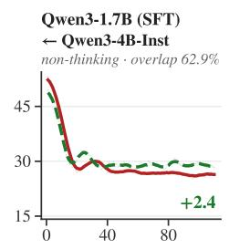

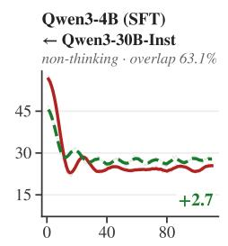

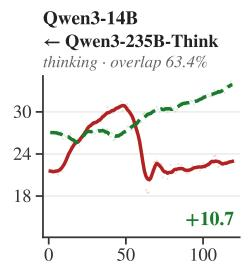

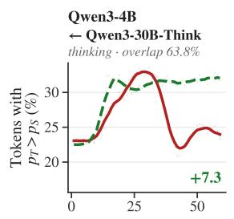

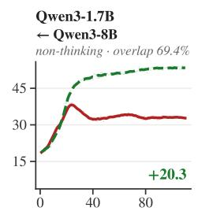

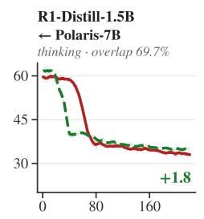

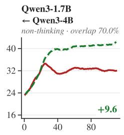

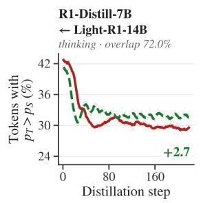

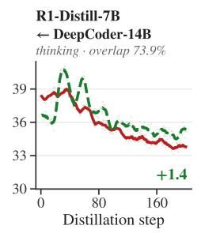

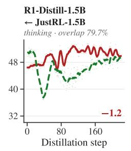

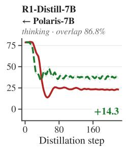  
Figure 14 | Positively supervised tokens. Share of training tokens with $p _ { T } > p _ { S }$ . The number in each panel is Semi-OPD minus OPD, in points, over the last 10 shared steps.

Student and teacher entropy. As shown in Figs. 15 and 16, on thinking pairs OPD drives both the student's and the teacher's next-token entropy on the training tokens well below Semi-OPD's in 7 of 8 pairs (the exception is R1-Distill-7B ← DeepCoder-14B), i.e., OPD increasingly trains on tokens that both models already predict with high confidence. On non-thinking pairs, student entropy stays similar between the two methods, while teacher entropy is usually higher under OPD, indicating that OPD's rollouts drift toward regions where the teacher is less certain.

## Student next-token entropy on trained tokens

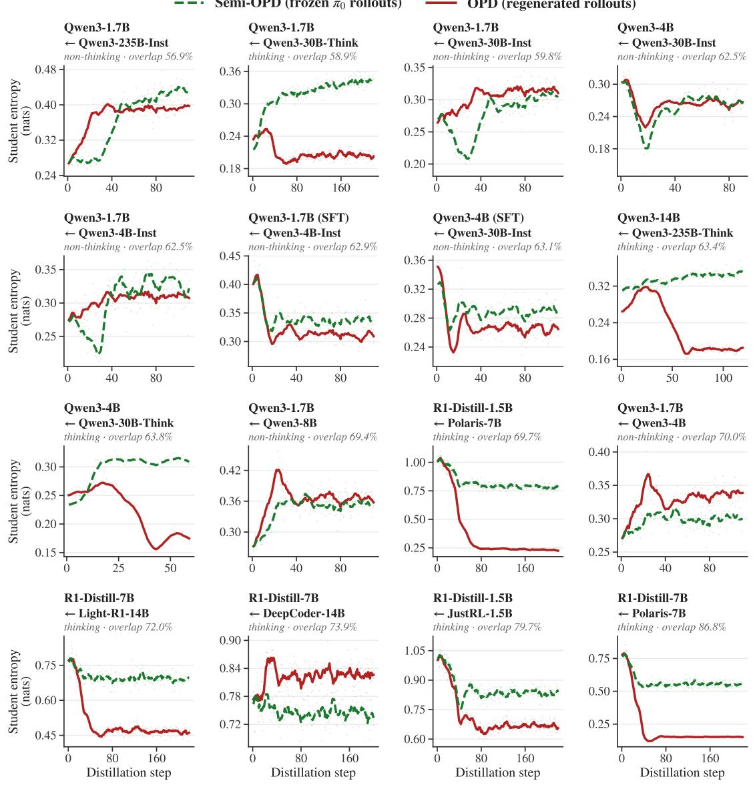  
Figure 15 | Student entropy. Mean next-token entropy of the student (nats) on the training tokens.

\- · Semi-OPD (frozen π0 rollouts)

## Teacher next-token entropy on trained tokens

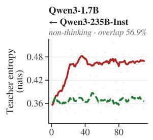

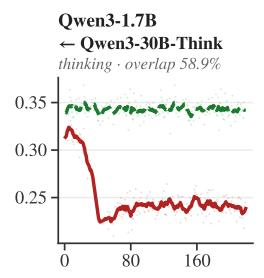

OPD (regenerated rollouts)

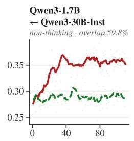

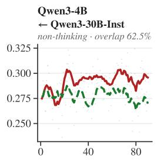

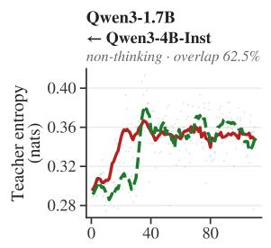

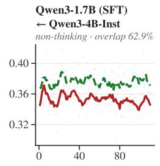

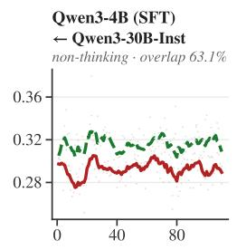

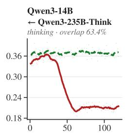


  
Figure 16 | Teacher entropy. Mean next-token entropy of the teacher (nats) on the same training tokens, i.e. how uncertain the teacher is on the rollouts it supervises.


Teacher-student overlap. As shown in Fig. 17, the top-64 overlap between the current student and the teacher on the training tokens generally rises under both methods as the student moves toward the teacher, but the ordering differs across different model pairs.

## Teacher-student top-64 overlap on the training rollouts

  
Figure 17 | Teacher-student overlap on the training rollouts. Top-64 overlap between the current student and the teacher, computed on each method's own training tokens with the same metric as the initial overlap in Section 2. The number in each panel is Semi-OPD minus OPD, in points, over the last 10 shared steps. For the two SFT-initialized pairs, overlap was measured only at initialization and at step 110.

## C. Training Cost Comparison

Semi-OPD is faster because rollout generation and teacher scoring are done once before training. Similar to Lightning OPD [16], this removes online rollout generation and teacher inference from the training loop, so all GPUs can be used for rollout generation, teacher log-probability scoring, and student training. For a fixed student, the same rollout cache can also be reused across different teachers; evaluating a new teacher only requires computing its log-probabilities on the cached rollouts. This can further reduce the cost of comparing or selecting teachers in practice. In contrast, Relay-OPD requires interleaved student and teacher generation throughout training, leading to higher training cost.

Table 4 | Training cost. H100 GPU-hours for 100 training steps, excluding evaluation. Semi-OPD's cost is the sum of rollout generation, teacher scoring, and student training. FastOPD is OPD with rollouts truncated to 4K tokens. Speedup is the method's GPU-hours divided by Semi-OPD's.
<table><tr><td>Method</td><td>GPU-hours Semi-OPD speedup</td></tr><tr><td>Qwen3-1.7B (non-thinking) ← Qwen3-4B-Instruct-2507†</td><td></td></tr><tr><td>Relay-OPD</td><td>173.3 34.7×</td></tr><tr><td>OPD</td><td>56.8 11.4×</td></tr><tr><td>FastOPD</td><td>11.7 2.3×</td></tr><tr><td>Semi-OPD</td><td>5.0</td></tr><tr><td></td><td>Qwen3-4B (non-thinking) ← Qwen3-30B-A3B-Instruct-2507†</td></tr><tr><td>Relay-OPD</td><td>604.4 19.5×</td></tr><tr><td>OPD</td><td>199.1 6.4×</td></tr><tr><td>FastOPD Semi-OPD</td><td>77.3 2.5×</td></tr><tr><td></td><td>31.0</td></tr><tr><td></td><td>Qwen3-14B (thinking) ← Qwen3-235B-A22B-Thinking-2507</td></tr><tr><td>Relay-OPD</td><td>1546.5 24.6×</td></tr><tr><td>OPD</td><td>480.0 7.6×</td></tr><tr><td>FastOPD</td><td>169.8 2.7×</td></tr><tr><td>Semi-OPD</td><td>63.0</td></tr><tr><td></td><td>Nemotron-Cascade-2-30B-A3B ← Nemotron-Cascade-2-Math-Expert</td></tr><tr><td>Relay-OPD 933.5</td><td>14.1×</td></tr><tr><td>OPD 301.4</td><td>4.5×</td></tr><tr><td>FastOPD</td><td>147.5 2.2×</td></tr><tr><td>Semi-OPD</td><td>66.4</td></tr></table>

†Semi-OPD uses 4K training rollouts on these pairs and OPD uses 16K; on the other two pairs both use 16K. Training rollout caps are listed in Table 3.

## D. Length and Self-Correction Inflation

Fig. 18 tracks two properties of the rollouts each method trains on: rollout length (mean generated tokens per rollout) and self-correction word density. Under OPD, the rollouts are regenerated by the current student at every step. Under Semi-OPD, they are frozen rollouts sampled from the initial student $\pi _ { 0 }$

Measuring self-correction. We measure self-correction with a lexical word density. We count caseinsensitive, whole-word occurrences of a fixed set of self-correction words, {wait, but, hmm, actually, hold, however, yet, oh, alternatively, no, ah, oops, well}, in the generated completion (prompt excluded). At each training step, we pool all 128 training rollouts and report $\textstyle { 1 0 0 0 \times \sum _ { i } { h _ { i } } } / \sum _ { i } { c _ { i } }$ , where $h _ { i }$ is the number of word hits and $c _ { i }$ the number of characters in rollout i. The teacher reference (dotted line) uses the same definition on 128 teacher samples $( T { = } 1 . 0 ,$ same rollout cap) on the final training step's prompts; rollout length for the teacher is measured on the same samples. Because the vocabulary includes common discourse words such as but and no, the metric is a proxy for reflective, hedging style rather than a count of verified corrections. We show more qualitative examples of rollout comparisons between OPD and Semi-OPD in Appendix E.


  
Figure 18 | On-policy rollouts inflate during OPD. Rollout length (left three panels) and self-correction word density (right three panels) of the training rollouts. OPD rollouts grow longer and use more self-correction words, eventually exceeding the teacher (dotted), while the frozen rollouts sampled once from the initial student $\pi _ { 0 }$ do not.

[... 6,594 tokens omitted ...]   
Sum of hundreds digits: 0+0+1+2+3+4+5+6+7 = 28   
Add carryover from tens: 28 + 4 = 32   
Hundreds digit of sum: 32 mod 10 = 2   
[... 2,658 tokens omitted ...]   
Now, the hundreds place of the sum is the second digit from the   
right, so 32 mod 100 is 32, so the hundreds digit is 3   
[... 2,458 tokens omitted ...]   
Ah! Here's the mistake: when I said the sum of the hundreds   
digits is 28, plus carryover from tens (4), that's the total sum for   
the hundreds place, which is 32. But the hundreds place of the   
sum is the digit we get from 32, which is the tens digit of 32, so   
2, and the carryover is 3 (from 32 to the thousands place).   
[... 3,097 tokens omitted ...]   
Wait, no. 32 is the sum of the digits in the hundreds place (plus   
carryover), which is the value of the hundreds place in the total   
sum. For instance, if the hundreds place sum is 32, it means   
that the total sum has a 3 in the hundreds place and 2 in the   
thousands place? No, the place values are:   
- If you have 32 as the sum for the hundreds place, it means that   
you have 3\*100 + 2\*1, so the hundreds digit is 3, and the tens   
digit is 2.   
[... 1,140 tokens omitted ...]   
For example, if the sum of the hundreds digits plus carryover is   
32, then the sum is 32\*100 + (remainder), so the hundreds digit   
is 2 (the 32's tens place).   
Wait, no: if the sum of the hundreds digits plus carryover is 32,   
then the total value contributed by the hundreds place is 32\*100.   
But in reality, when you add numbers, the hundreds place is the   
100s place, so the hundreds digit is the digit in the 100s place of   
the   
[generation cap reached; no final answer]

## E. Qualitative Examples: OPD versus Semi-OPD Training Rollouts

Example 1. Qwen3-1.7B ← Qwen3-30B-A3B-Thinking (thinking). OPD rollout at training step 201; Semi-OPD rollout from π0; generation cap 16,384 tokens.

[... 1,101 tokens omitted...]   
Now, take mod 1000: 205.   
Wait, so the total sum mod 1000 is 205? So the last three digits   
of the sum are 205. Therefore, the hundreds digit is 2. Is that   
correct?   
[... 2,535 tokens omitted ...]   
So total sum is 137,174,205.   
Now, the last three digits are 205, so the hundreds digit is 2. So   
that confirms it.   
[... 1,380 tokens omitted ...]   
Therefore, the hundreds digit of the sum is 2.   
Fiņal Answer   
2   
[... 550 tokens omitted ...]

## OPD (step 201): 16,384 tokens, 80 reflection words, hits the cap

## Example 2. DeepSeek-R1-Distill-Qwen-7B ← DeepCoder-14B (thinking). OPD rollout at training step 128; Semi-OPD rollout from π0; generation cap 16,384 tokens.

$$
\begin{array} { r } { \frac { 1 } { x ^ { 2 } - 1 0 x - 2 9 } + \frac { 1 } { x ^ { 2 } - 1 0 x - 4 5 } - \frac { 2 } { x ^ { 2 } - 1 0 x - 6 9 } = 0 . } \end{array}
$$

## Semi-OPD (frozen π0 rollout): 2,228 tokens, 10 reflection words, reaches an answer

[... 176 tokens omitted...]   
Let me let $y = x ^ { 2 } - 1 0 x$ Then, each denominator becomes $y - 2 9 ,$   
$y - 4 5 ,$ and $y - 6 9 . \mathrm { ~ S o } ,$ substituting that in, the equation becomes:   
$\begin{array} { r } { \frac { 1 } { y - 2 9 } + \frac { 1 } { y - 4 5 } - \frac { 2 } { y - 6 9 } = 0 . } \end{array}$   
[... 769 tokens omitted...]   
So, the equation reduces to:   
-64y +2496=0.   
[... 718 tokens omitted...]   
But the question asks for positive solution, so x=13.   
[... 438 tokens omitted ...]

OPD (step 128): 9,016 tokens, 117 reflection words,   
reaches an answer   
[... 124 tokens omitted ... ]   
Let's set $y = x ^ { 2 } - 1 0 x$ That seems like a smart substitution   
because each denominator can be written in terms of y.   
[... 1,916 tokens omitted ...]   
Wait, perhaps it's a perfect square? Let me check if 257,664 is a   
square.   
Well, 5082=258,064.   
5072=257,049.   
Subtract 257,664 -257,049=615.   
Not a perfect square. Hmm... Wait, perhaps 615 can be written   
as... Not sure.   
[... 735 tokens omitted ... ]   
Wait, perhaps the initial approach is getting me stuck because   
the square root is messy. Maybe I made a mistake in earlier   
calculation? Let me go back.   
Wait, hold on. Let me recap:   
[... 139 tokens omitted ...]   
Wait, hold on, perhaps I made a mistake in expanding the   
denominator?   
$\mathbf { W a i t } , ( \mathbf { y } \ - 2 9 ) ( \mathbf { y } \ - 4 5 ) = \mathbf { y } ^ { 2 } \ - 4 5 \mathbf { y } \ - 2 9 \mathbf { y } \ + 2 9 \times 4 5 = \mathbf { y } ^ { 2 } \ - 7 4 \mathbf { y } \ + 1 3 0 5 \uparrow$   
Wait, 29×45: 20×45=900, 9×45=405, total 1305, that's correct.   
Wait, could I make a mistake in cross-multiplying earlier? Let   
me double-check that.   
[... 5,172 tokens omitted ...]   
Therefore, okay, the logic is hold.   
So steps: substituted ${ \bf y } = { \bf x } ^ { 2 } { \bf \zeta } - 1 0 { \bf x } ,$ made the equation only in   
y, solved for y=39, found x=13 and x=-3, recognized which is   
required: positive.   
Hence, the positive solution is 13.   
[... 587 tokens omitted ...]

```perl
Example 3. Qwen3-1.7B ← Qwen3-30B-A3B-Instruct-2507 (non-thinking). OPD rollout at training step 90; Semi-OPD
rollout from π0; generation cap 4,096 tokens.
Problem. Let $\textstyle f ( x ) = { \frac { x + 1 } { x - 1 } }$ Then for ${ x ^ { 2 } \neq 1 }$ , find the expression for $f ( - x )$ . The original answer is in $\frac { k } { m }$ format, please give
the value of $k + m .$
```

Semi-OPD (frozen π₀ rollout): 308 tokens, 0 reflection OPD (step 90): 4,096 tokens, 87 reflection words, hits   
words, reaches an answer the cap   
[... 69 tokens omitted ...] [... 239 tokens omitted ... ]   
Step 1: Substitute -x into f(x) Step 3: Check if it's in the form $\frac { k } { m }$   
f(−x) = (−x)+1 This is not a constant, it's a rational function in x, but we are to   
(−x)−1 assume the form is $\textstyle { \frac { k } { m } } ,$ which is a constant. Wait — perhaps we   
Simplify numerator and denominator: misread?   
[... 156 tokens omitted ... ]   
We can factor out a negative sign from both the numerator and Wait — but f(−x) is not a constant function. Only when x is a   
denominator: constant — but x is a variable.   
$\textstyle f ( - x ) = { \frac { - ( x - 1 ) } { - ( x + 1 ) } } = { \frac { x - 1 } { x + 1 } }$ Unless — maybe the question is a trick?   
Step 2: Identify k and m Wait — let's recheck.   
We have: [... 151 tokens omitted ...]   
$\textstyle f ( - x ) = { \frac { x - 1 } { x + 1 } }$ Wait — maybe the question is not asking for $f ( - x ) .$ but rather   
the expression for f(-x) in a simplified form that becomes a   
This is already in the form ${ \frac { k } { m } } :$ where:   
constant?   
k = −1, m = 1 Wait — but $\textstyle f ( - x ) = { \frac { x - 1 } { x + 1 } }$ is not constant.   
Step 3: Compute k + m   
[... 510 tokens omitted ...]   
$k + m = - 1 + 1 = \boxed { 0 }$ Wait — maybe the original question has a typo?   
Final Answer: [... 531 tokens omitted...]   
0 Wait — press on.   
Wait — let's suppose that the original answer is $\textstyle { \frac { 1 } { 2 } }$   
[... 466 tokens omitted ...]   
Wait — finally! Let's suppose that the question is misworded.   
[... 1,658 tokens omitted .. . ]   
Wait — perhaps it was supposed to be the value of f(−x) at a   
specific x? But no.   
Wait — maybe the question is asking for the expression of $f ( - x )$   
in terms of f (x)?   
[... 100 tokens omitted...]   
[generation cap reached; no final answer]